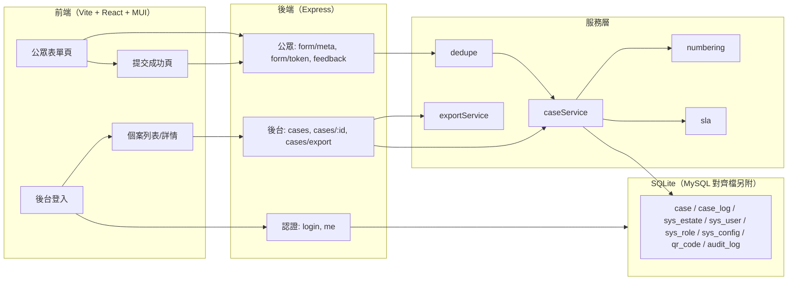

## 产品概述

依据《QRCode客戶意見反饋系統_功能規格書》V1.0，针对 **F-001 客户意见提交（公眾表單）／F-002 个案自动建立与编号／F-003 个案列表、筛选与汇出** 三个模块产出细部实施设计文档，并实现一套前后端分离、本机可运行、可扩展至投产的技术骨架。所有命名、字段、状态、编号、API 口径须与规格书一致；存在简化处须在「与规格书差异对照」中逐项列出。

## 核心功能（骨架实作范围）

- 公眾表单页：手机优先、繁中/英文双语、由 URL 带入住区代码、前端+后端双重验证、输入暂存防刷新遗失、重复提交提示原案号。
- 建案与编号：提交后即时建案，编号依 `{公司代码}/{业务代码SR}/{屋苑代码}/{YYMMDD}{3位流水}` 规则生成（每日由 001 起算、数据库唯一约束+冲突重试）；自动判定事件类型并计算首次回应与 7 天关闭 SLA；自动写入首笔 Case_Log(CREATE)。
- 防重复/二次投诉识别：10 分钟内同联络人同内容提示重复并回显原案号；24 小时内同客户同事项提交标记 `is_second_complaint` 并关联原案。
- 个案列表：多维筛选（屋苑/意见种类/状态/事件类型/日期区间/二次投诉）、分页、排序、状态色签、SLA 倒数与逾期标红、个案详情（含时间轴与状态机允许操作）。
- 汇出：目前筛选结果 CSV 与 Excel(.xlsx)，动作记录于审计日志（骨架为 stub）。
- 后台认证：Demo 级 JWT 登入 + 角色权限码（case:list/view/export）最小实现，预置演示账号。
- 交付物：细部设计文档（Markdown、繁体中文）+ 可运行骨架代码 + README（Windows 本机启动说明与验收方式）。

## 范围边界

- 公众提交不强制登入；F-004~F-010（分派/跟催、SLA 提醒、满意度、仪表板、QR 管理、用户管理完整功能）不实作，仅预留接口与数据结构。
- 确认电邮以邮件队列 stub（落库+console）呈现；SMTP 网关为投产预留。

## 技术选型

- 后端：Node.js 20 LTS + Express 4 + better-sqlite3（本机零设定即可跑）+ jsonwebtoken + bcryptjs；单元测试用 Node 内建 node:test。
- 数据库：本机运行用 SQLite；另附 `backend/db/mysql_schema_alignment.sql`（摘自规格书 7.4，投产对齐用），字段口径以规格书 7.3 为准。
- 前端：React 18 + TypeScript + Vite 5 + MUI v5（core 组件，表格手作排序/分页）+ react-router；开发期经 Vite proxy 转发 `/api` 至后端 3000 端口。
- 规格书 1.5 节声明技术中性；本选型为可运行骨架的合理默认，不改变字段语意、状态机与 API 契约。

## 实施方法（关键决策）

- 采用规格书既有 REST 契约与统一响应 `{code, message, data}`，错误码沿用 8.5 表（1001 重复提交、1002 表单验证、1003 token 无效、2001/2005 认证与权限、3001 个案不存在、5000/5001 等），前后端共用同一错误码语义。
- 编号产生器：事务内依「屋苑+日期」取当日流水（每日 001 起算），`case_id` 为 PK 唯一约束，撞号时重试（FR-002-03）；规则参数置于 `sys_config`（numbering.*），满足 F-009 预留。
- 防重复：`source_submission_id` 去重键 = 联络人(优先 email，其次电话) + 内容规范化 hash + 10 分钟时间窗；24 小时二次投诉以「同联络人+同 category_code」比对近 24 小时个案，命中则标记并关联原案（6.5 节）。
- SLA：事件类型依 6.3.2 由意见种类与关键字判定（URGENT/NORMAL/COMPLEX/INSTANT/N/A），映射规则存 `sys_config(category.event_mapping)`；`response_sla_due` 按类型加时、`closure_sla_due` = 建案日 + 7 天；时间存 UTC、输出 `+08:00`。
- 状态机：以规格书 6.1 的 7 状态建立转换矩阵模块；本骨架仅使用「提交→PENDING」自动转换，详情接口回传 `allowedActions`（依矩阵推导），其余转换接口保留为 F-004 起之扩展点，禁止直接改状态（避免架构返工）。
- 表单 token（防滥用）：HMAC 签署含 estate+时间戳的一次性 token，5 分钟有效，提交时校验（规格书 8.2 精神）；不引入 CAPTCHA（骨架注明为 F-009 开关预留）。
- 汇出：CSV 采 UTF-8 BOM 使 Excel 中文正常开启；XLSX 以 exceljs 串流产出；两者皆套用当前筛选条件并写 audit stub。
- 邮件/通知：email_outbox + notification 表落库 + logger 输出，不实作 SMTP（差异对照中注明）。

## 实施要点（防回归）

- 严守规格书口径：枚举值（PENDING~REOPENED、URGENT~N/A、QR、category_code、perm_code）与 7.3 栏位名不可自创；凡偏离处（SQLite 型态差异、SMTP stub、审计 stub、formToken 采 HMAC 而非 JWT、多意见种类时 intent 取主要类别）须写入设计文档「差异对照」。
- 不修改规格书原文；新文件全部置于新目录（docs/、backend/、frontend/），仅在工作区根目录新增 README.md。
- 列表性能：`case` 表对 `estate_code, case_status`、`created_at`、`category_code`、`is_second_complaint, created_at` 建索引；列表查询单次 COUNT + LIMIT/OFFSET，禁止 N+1（assigned_to 一次 JOIN 带入）。
- 日志：统一 logger（console + 可选文件），仅记操作摘要与案号，不落 PII 全文（客户内容仅存 DB，不入日志）。
- 编号与重复判定写入同一事务，避免并发下重复建案；提交接口套简单内存限流（防滥用 stub）。

## 架构设计

- 分层：routes（HTTP 契约）→ services（编号/查重/SLA/建案/汇出）→ db（schema/seed）；前端 pages/components → api client；两者仅经 REST 契约耦合。



## 目录结构

```
QRCode 客戶意見反饋/
├── docs/
│   └── F001-F003_細部設計.md   [NEW] 细部设计文档（繁体中文）：范围与边界、资料模型（SQLite DDL+与 7.3 差异）、API 契约（请求/响应范例+错误码）、状态机子集与转换矩阵、编号/查重/SLA 算法、页面线框、CSV/XLSX 规格、测试用例、与规格书差异对照。
├── backend/
│   ├── package.json            [NEW] 依赖与 script（dev/start/test）。
│   ├── .env.example            [NEW] PORT、JWT_SECRET、DB 路径、时区（默认 Asia/Hong_Kong）。
│   ├── db/
│   │   ├── schema.sql          [NEW] SQLite DDL：case/case_log/sys_estate/sys_user/sys_role/sys_permission 关联/sys_config/qr_code/audit_log/email_outbox，含索引与 CHECK 枚举约束，对齐规格书 7.3/6.1/6.2 口径。
│   │   ├── seed.js             [NEW] 种子：4 屋苑（CWC/YPR/CHNG/DAHF 与公司代码）、演示用户（admin/chng_manager/chng_handler，bcrypt 密码）、角色权限（case:list/view/export 等）、qr_code 样例（estate→URL 映射）、sys_config（SLA/编号/分类映射/表单文案）。
│   │   └── mysql_schema_alignment.sql [NEW] 摘自规格书 7.4 的 MySQL 8 对齐档（注明来源与版本，不做改动）。
│   ├── src/
│   │   ├── server.js           [NEW] 启动入口（加载 app、监听端口）。
│   │   ├── app.js              [NEW] Express 装配：JSON、路由挂载、错误处理中间件、限流 stub。
│   │   ├── config/constants.js [NEW] 错误码、状态/事件类型/意向枚举、编号格式、权限码常量（单一真源）。
│   │   ├── config/i18n.js      [NEW] zh-Hant/en 错误与文案字典（配合 Accept-Language）。
│   │   ├── db/connection.js    [NEW] better-sqlite3 连线与迁移执行（启动时自动建表+seed if empty）。
│   │   ├── middlewares/auth.js [NEW] JWT 校验 + RBAC 权限码守卫（demo 级）。
│   │   ├── middlewares/error.js[NEW] 统一错误处理，映射规格书 8.5 错误码。
│   │   ├── routes/public.js    [NEW] GET form/meta、POST form/token、POST feedback。
│   │   ├── routes/auth.js      [NEW] POST login、GET me（含权限清单）。
│   │   ├── routes/cases.js     [NEW] GET cases（筛选/分页/排序）、GET cases/:caseId（含时间轴与 allowedActions）、GET cases/export。
│   │   ├── services/numbering.js [NEW] 当日流水产生+事务内重试；对外 generateCaseId(company, estate, date)。
│   │   ├── services/dedupe.js  [NEW] 10 分钟重复检测与 24 小时二次投诉标记逻辑。
│   │   ├── services/sla.js     [NEW] 事件类型判定与 response/closure 到期时间计算（依 sys_config）。
│   │   ├── services/caseService.js [NEW] 建案（校验→查重→编号→SLA→写 case+case_log+email_outbox）、列表查询、详情查询。
│   │   ├── services/exportService.js [NEW] CSV（UTF-8 BOM）与 XLSX（exceljs）串流汇出，写 audit stub。
│   │   └── utils/logger.js     [NEW] 简洁结构化日志（避免 PII）。
│   └── test/
│       ├── numbering.test.js   [NEW] 编号格式/每日流水/唯一性冲突重试。
│       ├── dedupe.test.js      [NEW] 10 分钟重复、24 小时二次投诉、联络人识别顺序。
│       ├── sla.test.js         [NEW] 事件类型判定与到期时间（含 N/A）。
│       └── validation.test.js  [NEW] 表单字段验证与错误码 1002 映射。
├── frontend/
│   ├── package.json            [NEW] Vite/React/TS/MUI 依赖与 script。
│   ├── vite.config.ts          [NEW] dev proxy：/api → http://localhost:3000。
│   ├── index.html              [NEW] 入口 HTML（viewport、语言 meta）。
│   └── src/
│       ├── main.tsx / App.tsx  [NEW] 路由：/（公眾表單）、/success、/admin/login、/admin/cases、/admin/cases/:id。
│       ├── theme.ts            [NEW] MUI 主题（色板取自表单 style 参数主色）。
│       ├── i18n/zh.ts、en.ts   [NEW] 双语文案字典（与 form/meta 回传字段对应）。
│       ├── api/client.ts       [NEW] fetch 封装：统一信封解包、错误码映射、token 存储。
│       ├── pages/public/FormPage.tsx    [NEW] 手机优先表单：动态字段/即时验证/sessionStorage 暂存/防连点/双语切换。
│       ├── pages/public/SuccessPage.tsx [NEW] 成功页：服务承诺文案+案号回显+内容摘要。
│       ├── pages/admin/LoginPage.tsx    [NEW] 登入页（demo 账号提示）。
│       ├── pages/admin/CaseListPage.tsx [NEW] 筛选工具列（屋苑/种类/状态/日期等）+ 表格（状态色签/逾期红）+ 分页排序 + 汇出按钮。
│       ├── pages/admin/CaseDetailPage.tsx [NEW] 详情：案号/客户与内容摘要/SLA 时间/时间轴/允许操作提示。
│       └── components/StatusChip.tsx、FilterBar.tsx [NEW] 共用组件（状态色签、筛选栏）。
└── README.md                   [NEW] Windows 启动步骤（npm install、npm run dev 前后端）、演示账号、环境变量、验收步骤、与规格书差异摘要。
```

## 关键代码结构（契约层，避免口径漂移）

```ts
// 统一响应（规格书 8.1.1）与错误码（8.5）— 前后端共用语义
interface ApiEnvelope<T> { code: number; message: string; data: T | null }
const ERR = { OK:0, DUPLICATE:1001, VALIDATION:1002, FORM_TOKEN:1003,
  ESTATE_NOT_FOUND:1004, UNAUTH:2001, PERMISSION:2005, CASE_NOT_FOUND:3001,
  STATE_TRANSITION:3002, INTERNAL:5000, RATE_LIMIT:5001 } as const;

// 编号规则（规格书 6.2 / FR-002-02）
// generateCaseId(companyCode, estateCode, date) → "SMS/SR/CHNG/260903001"
// 实现要点：同事务 SELECT MAX(seq) FOR estate+date → seq+1；INSERT 撞 PK 即重试 ≤3 次。

// 状态机（规格书 6.1.2 转换矩阵）— 骨架仅允许 PENDING 建立，矩阵驱动 allowedActions
type CaseStatus = 'PENDING'|'ASSIGNED'|'IN_PROGRESS'|'WAITING'|'RESOLVED'|'CLOSED'|'REOPENED';
const TRANSITIONS: Record<CaseStatus, CaseStatus[]> = { /* 依 6.1.2 照抄 */ };
```

## 设计风格

- 双端两种气质：公眾表单走「信赖、温和」的屋苑服务风格，以表单 meta 回传的品牌主色（规格书示例 #1A5AA6）为基调；后台走「清爽、高效」的企业管理风格，浅灰背景+白卡+蓝主色，状态以彩色标签区分。
- 公眾表单页（手机优先）：单栏居中、最大宽度约 480px；顶区屋苑名称+语言切换（繁中/EN）；必填以 * 标示；错误即时红字提示；区块卡片分组（联络资料/意见内容/调查同意）；提交按钮主色全宽、提交中转圈防连点；所有输入在失焦即时校验并暂存 sessionStorage。
- 提交成功页：全屏居中、成功图示、服务承诺文案「感谢您的反馈，我们将于三个工作天内联系阁下」、案号以等宽字型大号显示并附一键复制、内容摘要卡片。
- 后台登入页：居中卡片、屋苑 Logo 区、演示账号提示条。
- 个案列表页（桌面为主、含窄屏响应）：顶部筛选条（屋苑/意见种类/状态/事件类型/日期区间/二次投诉）+ 重设与汇出按钮；表格列：案号（链接）、屋苑、种类、状态标签、事件类型、处理人员、提交时间、SLA 到期、剩余时间；逾期行整行淡红底、剩余时间红色；分页器 + 每页 10/20/50。
- 个案详情页：案号与状态横幅、SLA 信息卡、客户与内容卡、允许操作提示（依状态机）、时间轴（CREATE 起，垂直时间线样式）。
- 微交互：筛选变更后表格淡入更新、状态标签 hover 浮现说明、汇出按钮下载时 loading；全程无多余装饰，聚焦信息效率。

## Agent 扩展

### SubAgent

- **code-explorer**
- 用途：撰写细部设计文档阶段，从 1801 行规格书中精准提取 F-001~F-003、6.1/6.2/6.3、7.2~7.4、8.1~8.5 的字段、状态、编号与 API 口径，避免执行者自行臆造或遗漏。
- 预期产出：一份「口径核对清单」支撑 docs/F001-F003_細部設計.md，确保骨架与规格书零冲突。

### Skill

- **playwright-cli**
- 用途：最终端到端验收——启动前后端后，模拟公眾填写并提交表单、断言成功页案号，再以演示账号登入后台断言个案出现与汇出动作。
- 预期产出：跑通「提交→建案→后台可见→汇出」主链路的自动化验证记录；若浏览器环境受限则回退 API smoke 脚本并在 README 记录。