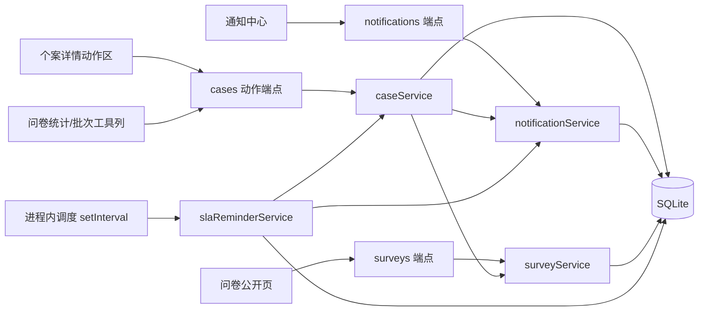

## 产品概述

围绕《QRCode客户意见反馈系统_功能规格书》第 5.4~5.7 节交付 F-004~F-007 的细部设计文档（含可运行骨架规格），并依文档把现有 backend 草稿补齐、前端补上操作界面，最终后端单测全绿、前端可构建运行，延续 F-001~F-003 既有骨架与文档风格（文档以现有草稿码为事实基准，先交付设计文档再依文档补齐）。

## 核心功能

- F-004 分派与跟进：建案自动建议分派对象（屋苑主管）、主管确认/改派、转派（须填原因并同时通知新旧处理人）、跟进时间轴（不可改删、更正另开纪录）、状态变更自动入时间轴、附件上传（jpg/png/pdf，≤10MB，私有存储鉴权下载）、handling_days 自动计算、首次回应 first_response_at 标记。
- F-005 到期提醒与预警：按事件类型提前量（URGENT 10 分钟、其余 30 分钟）与 7 天关案提前 1 天发提醒；逾期升级通知处理人+直属主管并标红；提醒写时间轴与通知中心可稽核；进程内排程（可配 1~5 分钟）＋手动触发 API。
- F-006 完结与回馈：完结申请（处理结果分类、无法解决须填原因）转 RESOLVED；主管审核通过转 CLOSED / 驳回转回 IN_PROGRESS（须填原因并通知）；自动计算 closure_sla_met 与 handling_days；关案后自动发感谢信，同意调查者另触发问卷；授权重开（标记二次投诉/跟进不足）并重新分派。
- F-007 满意度调查：一次性匿名 token 链接（14 天有效，逾期标 EXPIRED 不重发）、4 题 1~5 分＋开放意见选填、提交自动算均分、任一项 ≤2 分自动标记不满意并通知主管、电邮重发限 1 次（仅到期前）、繁中/EN 双语、按屋苑/意见种类/处理人统计回覆率与平均分。
- 前端界面四区：个案详情动作区、通知中心（未读徽章/列表/已读）、问卷公开页（含提交完成画面）、问卷统计页＋列表批次分派工具列（P1）。
- 交付验收：backend `npm test` 全绿、frontend `npm run build` 通过、手动走通"分派→提醒→完结申请→审核→感谢信＋问卷→提交→统计"路径。

## 技术栈

沿用 F001-F003 既有骨架，不引入新框架：

- 后端：Node.js 20 + Express 4 + better-sqlite3（SQLite 本机）；jsonwebtoken + bcryptjs；multer（附件）；`node:test` 单元测试；程序内 `setInterval` 排程（`scheduler.js`）。
- 前端：React 18 + TypeScript + Vite + MUI v5 + react-router；复用现有 api client、i18n（zh-Hant/en）、主题、AuthGuard、StatusChip。
- 邮件：维持 `email_outbox` 落库 + logger stub，不接 SMTP（与 F001-F003 一致）。

## 实现方案

分四阶段：① 事实审计——盘点既有 F-004~F-007 草稿（services/routes/test/schema/scheduler），跑 `npm test` 记录基线，确认缺口与失败用例根因；② 撰写设计文档 `docs/F004-F007_細部設計.md`（镜像 F001-F003 章节结构与风格，正体中文）；③ 依文档补齐后端与单测至全绿；④ 前端四区界面接入路由与 i18n 并构建通过。

### 关键决策与理由

1. 事实基准优先：以"现状＋补齐"描述文件与代码，避免与既有草稿双轨漂移；修 bug（如 survey 建置回 null、低分通知重复）而非重写。
2. 复用既有惯例：统一信封/错误码（规格书 8.5）/RBAC 中间件/路由顺序（`export` 先于 `:caseId`）；schema 以追加方式演进并同步 seed 与测试夹具，不破坏 F-001~F-003。
3. 调度防重复：扫描按 SLA due 区间＋状态过滤，以提醒水位（最近提醒时间/纪录存在性）保证不重复发，单实例防重入。
4. 附件私有化：存 `backend/data/uploads`，下载端点鉴权＋权限码，服务端校验扩展名与大小。
5. 性能与安全：复用 `ix_response_due/ix_closure_due/ix_assigned` 索引；扫描分页批次化避免全表扫；提醒/升级/重发写 `audit_log`，日志不打敏感字段。

## 架构设计



## 目录结构

```
docs/F004-F007_細部設計.md          [NEW] 细部设计文档（正体中文，镜像 F001-F003：范围/架构/DB/常量/API 契约/核心算法/页面线框/差异对照/测试/验收）
backend/src/db/schema.sql           [MODIFY] 追加 case_log_attachment、satisfaction_survey，case 补充 first_response_at/closed_at/closure_sla_met/handling_days 等（以审计为准）并同步 seed
backend/src/config/constants.js     [MODIFY] LOG_TYPE/问卷状态等枚举与新增权限码
backend/src/services/caseService.js [MODIFY] 建议分派/确认分派/转派/状态流转/跟进入档/附件登记/完结申请/审核/重开/批次分派
backend/src/services/slaReminderService.js [MODIFY] 临期提醒＋逾期升级扫描（水位防重复）
backend/src/services/surveyService.js       [MODIFY] 发送/提交/过期标记/重发限1次/低分通知/统计
backend/src/services/notificationService.js [MODIFY] 站内通知写入与已读
backend/src/routes/cases.js  [MODIFY] 动作与批次端点；surveys.js [MODIFY] 公开与管理端点
backend/src/app.js  [MODIFY] 挂载新路由、JSON/上传上限、附件私有下载
backend/src/scheduler.js、server.js [MODIFY] 启动排程并注册手动触发端点
backend/test/*.test.js [MODIFY] caseAction/reminder/resolve/survey 等修正补齐至全绿
frontend/src/pages/admin/CaseDetailPage.tsx [MODIFY] 动作区＋审核/重开对话框＋附件上传＋满意度状态卡
frontend/src/pages/admin/CaseListPage.tsx   [MODIFY] 行复选＋批次分派工具列
frontend/src/components/NotificationCenter.tsx [NEW] 顶栏铃铛未读徽章＋通知列表＋标已读
frontend/src/pages/public/SurveyPage.tsx       [NEW] 一次性匿名问卷页（繁中/EN）＋提交完成画面
frontend/src/pages/admin/SurveyStatsPage.tsx   [NEW] 回覆率/平均分/按屋苑·种类·处理人维度统计
frontend/src/App.tsx、src/admin/options.ts、src/api/、src/i18n/ [MODIFY] 路由/选项/API 方法/双语文案接入
```

## 执行要点

- 先 `npm test` 记录基线（约 18/25），修复失败用例时保持既有信封、错误码、RBAC 与路由注册顺序惯例。
- 调度间隔、提醒提前量自 `sys_config` 读取并允许测试注入时钟；提供手动触发 API 便于演示与测试；提醒/升级双通道写入 case_log＋notification。
- 邮件一律 `email_outbox` stub＋logger；附件仅记录元数据，下载走鉴权端点。
- 前端沿用 MUI 主题、AuthGuard、StatusChip 与现有页面布局；新页面注册到 App.tsx 并补齐 zh-Hant/en 文案。
- 回归：既有测试＋新增测试全绿，`npm run build` 通过，手动走通端到端验收路径。

## 设计风格

延续现有 MUI 后台骨架，新增界面统一为"沉稳专业＋状态可视"风格：卡片化布局、状态色签（沿用 PENDING 灰/ASSIGNED 蓝/IN_PROGRESS 橘/WAITING 紫/RESOLVED 青/CLOSED 绿/REOPENED 深灰红）、SLA 倒计时红字、逾期行淡红底；微交互（hover 抬升、操作对话框即时校验、提交按钮 loading）。问卷公开页为手机优先独立落地页，无后台导航，顶部品牌区＋双语切换＋渐变底纹，评分以星形/单选大触区呈现。

## 页面规划（共 5 屏）

1. 个案详情页动作区（admin）：状态横幅与满意度状态卡 → SLA 卡（首次回应/关案期限+倒计时）→ 操作区（按 allowedActions 渲染分派/转派/开始处理/等候/跟进/完结申请/审核/重开按钮与对话框）→ 客户与内容卡 → 附件清单＋上传 → 垂直时间轴（类型色点＋操作人＋时间，不可改删提示）。附件上传拖拽区校验 jpg/png/pdf≤10MB。
2. 个案列表批次工具列（admin）：顶部新增"已选 N 案"工具条，支持批次分派对话框（选屋苑用户＋指示）、批次更新状态；行复选与单选互不冲突，导出沿用现有按钮。
3. 通知中心（admin）：顶栏铃铛＋未读红点徽章；Popover/Drawer 列表按类型图标（提醒/升级/审核/问卷）分组，未读加粗，点项跳转个案并标已读；底部"全部已读"。
4. 问卷公开页（public）：手机居中卡片；4 题评分大按钮＋每题标签；开放意见 textarea；提交成功画面显示致谢与回覆编号；token 失效/已提交显示对应状态页；繁中/EN 即时切换。
5. 问卷统计页（admin）：KPI 卡（已发/回覆率/平均分/低分率）→ 维度筛选（屋苑/种类/处理人/日期）→ 按题均分条形图与逐案明细表（匿名）。

## Agent Extensions

### SubAgent

- **code-explorer**
- Purpose: 事实审计阶段盘点既有 F-004~F-007 草稿（schema、services、routes、test、scheduler 的实际行为与缺口），作为设计文档与实现的事实基准输入。
- Expected outcome: 输出结构化缺口清单（表/列、端点、服务函数、失败用例根因），供文档编写与后端补齐直接引用。