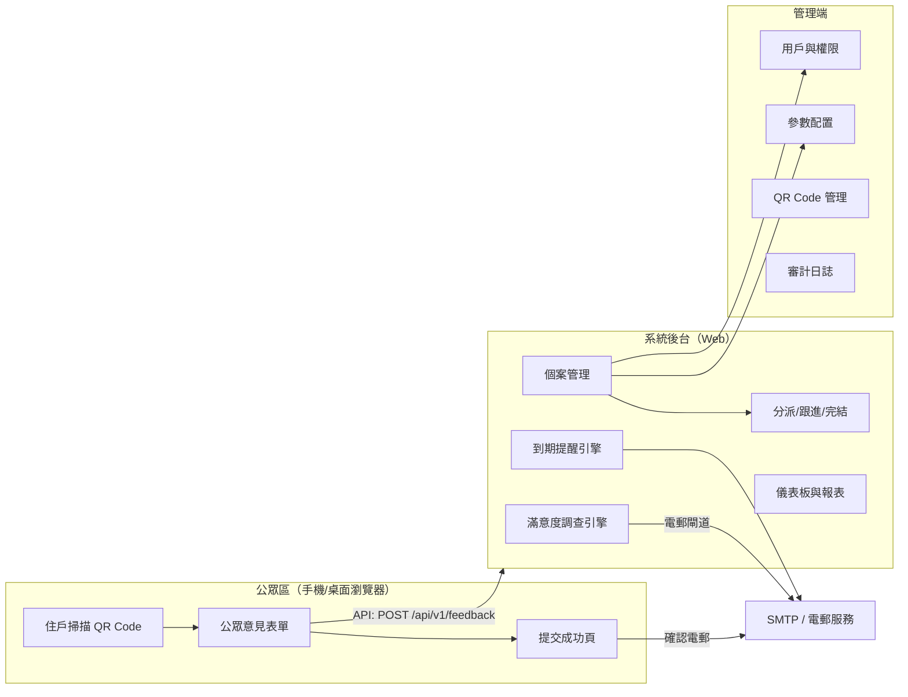
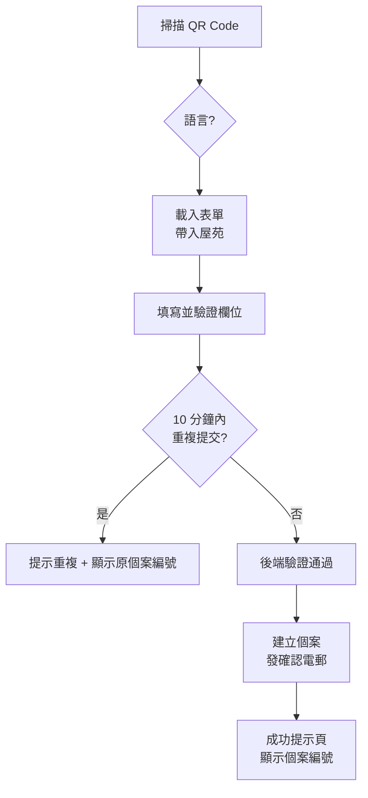
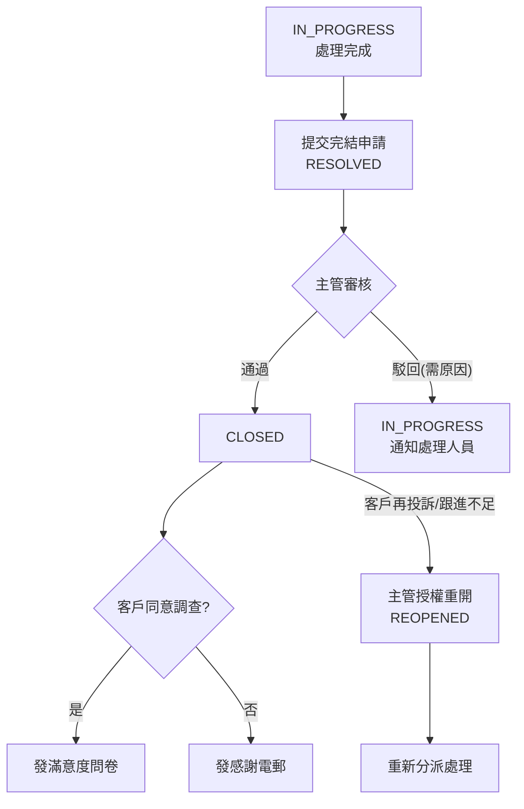
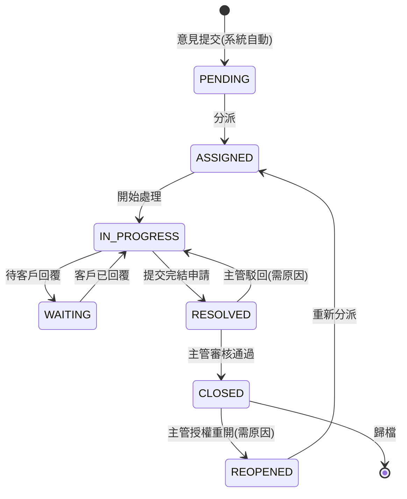
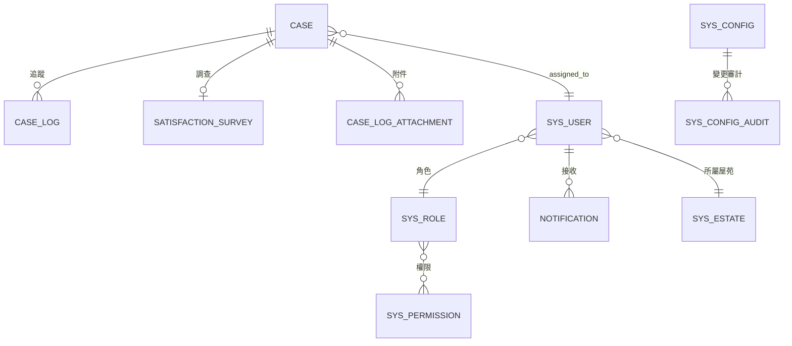
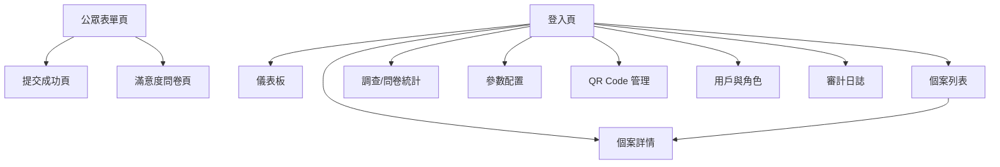

# QRCode 客戶意見反饋系統 — 功能規格書（V1.0）

> 子系統範圍：**僅 QR Code 客戶意見反饋管道**（公眾表單 + 個案管理後台）
> 上層系統：《多管道客戶意見反饋管理系統》（另見 V1.0 主規格書，本卷為其 QR 管道細化/落地版本）

| 項目 | 內容 |
|---|---|
| 文件編號 | QR-FEEDBACK-SPEC-2026-V1.0 |
| 版本 | V1.0（初稿） |
| 制訂日期 | 2026-09-03 |
| 制訂單位 | 客服組（精益提效項目） |
| 適用範圍 | 灣景中心、攸壆路、頌雅苑、大夫第（4 個試點屋苑）+ 客服中心（監察/支援角色） |
| 文件狀態 | Draft — 待審批 |
| 參考文件 | 詳見《12.5 附錄 E》REF-01 ~ REF-04 |

---

## 目錄

1. [概述](#1-概述)
2. [背景與現狀分析](#2-背景與現狀分析)
3. [系統目標與預期效益](#3-系統目標與預期效益)
4. [用戶角色與權限](#4-用戶角色與權限)
5. [系統功能需求](#5-系統功能需求)
6. [業務規則](#6-業務規則)
7. [資料庫設計](#7-資料庫設計)
8. [API 介面設計](#8-api-介面設計)
9. [頁面結構與線框](#9-頁面結構與線框)
10. [非功能需求](#10-非功能需求)
11. [驗收標準](#11-驗收標準)
12. [附錄](#12-附錄)

---

# 1. 概述

## 1.1 文件目的

本文件為「**QRCode 客戶意見反饋系統**」之功能規格書，用以：

1. 界定系統之**業務範圍**——住戶掃描屋苑張貼的 QR Code 提交客戶意見，系統自動建立個案，並於後台完成**分派、跟進、完結、滿意度調查、數據分析**之全流程閉環管理。
2. 作為**開發團隊直接落地**之依據——包含資料庫 Schema、REST API、頁面結構等技術規格。
3. 作為測試（功能/非功能/UAT）及驗收之基準。
4. 作為與上層《多管道客戶意見反饋管理系統》對接與未來擴充之參考。

## 1.2 系統定位與範圍聲明

### 1.2.1 系統定位

本系統為《多管道客戶意見反饋管理系統》之**第一階段（QR Code 管道）落地子集**。住戶可透過手機掃描張貼於屋苑大堂/公告欄等處之 QR Code，直接進入系統表單提交意見，免除現行以 Google Form 收集後再人手複製到潤工作（RWork）的繁複程序。

### 1.2.2 範圍內（In Scope）

| # | 範圍 | 說明 |
|---|---|---|
| 1 | 公眾意見表單 | QR Code 掃描落地、繁中/英文雙語、欄位驗證、防重複提交、成功提示與確認電郵 |
| 2 | 個案自動建立與編號 | 提交即自動建案、唯一編號、SLA 到期時間自動計算 |
| 3 | 個案管理後台 | 列表/篩選/匯出、詳情、分派/轉派、跟進時間軸、狀態流管理 |
| 4 | 到期提醒與預警 | SLA 到期提醒、逾期升級、7 天關閉期限提醒 |
| 5 | 完結與回饋 | 完結申請、主管審核、感謝電郵、個案重開 |
| 6 | 滿意度調查 | 自動發送問卷、14 天有效期、低分告警、統計分析 |
| 7 | 儀表板與報表 | 12 項 KPI、圖表、多維度分析、每週自動週報 |
| 8 | 系統管理 | 參數配置、用戶與權限（RBAC）、QR Code 生成管理、審計日誌 |

### 1.2.3 範圍外（Out of Scope，本版不實作，預留擴充點）

| # | 範圍 | 說明 |
|---|---|---|
| 1 | 客服熱線（CC）、現場（SITE）、App、電郵等其他管道之提交通道 | `case_source` 欄位預留 QR/CC/SITE/APP/EMAIL 之列舉，惟本版僅開放 QR |
| 2 | 潤工作（RWork）/ 現有 Google Form 之系統對接 | 本版以系統內建流程取代人手複製；對接介面於附錄 D 說明 |
| 3 | 單一登入（SSO）與第三方身分驗證 | 僅預留介面點 |
| 4 | 多管道報表整併 | 各管道維度欄位保留，報表本版僅統計 QR |

> 與上層主規格書之從屬關係及未來擴充，詳見《12.4 附錄 D》。

## 1.3 讀者對象

| 對象 | 用途 |
|---|---|
| 客服組 / 精益提效項目團隊 | 需求確認、評審、UAT |
| 開發團隊（前端/後端/測試） | 設計、開發、測試依據 |
| IT / 基礎設施 | 部署、環境、安全合規 |
| 屋苑主管 / 前線人員 | 使用者驗證、操作手冊參考 |

## 1.4 名詞與縮寫

| 縮寫/名詞 | 說明 |
|---|---|
| 個案（Case） | 客戶意見提交後由系統自動建立之處理記錄，含唯一編號與狀態 |
| SLA | Service Level Agreement，服務水平協議；本系統指「首次回應時限」及「7 天關閉期限」 |
| QR | Quick Response Code，快速回應碼 |
| RWork / 潤工作 | 現行公司內部工單/任務協作平台（現況流程使用） |
| RBAC | Role-Based Access Control，以角色為基礎之權限控制 |
| PDPO | 香港《個人資料（私隱）條例》Personal Data (Privacy) Ordinance |
| 屋苑代碼 | 見《12.2 屋苑代碼對照表》 |
| 意見種類代碼 | 見《12.3 意見種類代碼對照表》 |
| UAT | User Acceptance Test，用戶驗收測試 |

## 1.5 技術選型假設（中性聲明）

本規格書之資料庫 DDL 以 **MySQL 8.x（InnoDB）** 為相容基準；API 以 **RESTful / JSON** 為設計基準；頁面以**響應式 Web（支援手機瀏覽器）**為基準。實作時若採用其他資料庫或框架（如 SQL Server、PostgreSQL、Java/Node.js/前端框架），應保持**欄位語意、狀態機、SLA 規則與介面約定不變**，僅調整語法與技術元件。

## 1.6 系統邊界圖


# 2. 背景與現狀分析

## 2.1 現行作業流程（As-Is）

### 2.1.1 現況流程敘述

截至 **2026-07-16**，現行 QR Code 意見收集作業以「**Google Form + 人手轉錄**」為主：

1. 客服組預先於 Google Form 建立「客戶意見反饋」問卷，並將表單連結製作成 QR Code 貼紙。
2. 屋苑（灣景中心、攸壆路、頌雅苑、大夫第）將 QR Code 貼於大堂/公告欄。
3. 住戶掃碼後在 Google Form 填寫意見並提交。
4. **客服同事**每隔一段時間人手登入 Google Form 查閱新意見。
5. 客服同事**人手複製意見內容**，到潤工作（RWork）開立任務，**人手輸入個案編號、屋苑、分類、SLA 日期**。
6. 個案在 RWork 內分派及跟進，狀態更新亦靠人手維護。
7. 每週由同事**人手整理報表**，以 Excel 統計及呈報。

### 2.1.2 現況流程圖


### 2.1.3 現況數據（截至 2026-07-16）

| 指標 | 數值 | 備註 |
|---|---|---|
| 累計意見宗數 | 46 宗 | 頌雅苑等 QR 試點 |
| 平均結案時效 | 0.47 天 | 反映現行案件大多能快速處理 |
| 及時回應率 | 100% | 現行以人手控制 |
| 7 天關閉達標率 | 100% | 現行以人手控制 |
| 報表整理頻率 | 每週人手 | 約 4 小時/週 |

> 現況「及時回應率 / 7 天關閉達標率」雖然為 100%，惟**完全依賴人手紀律**，缺乏系統性預警與稽核，規模上升後將難以維持。

## 2.2 痛點分析（P1 ~ P6）

| 編號 | 痛點 | 現況描述 | 影響 |
|---|---|---|---|
| P1 | 資料無法自動派送 | 意見存於 Google Form，需客服人手複製到 RWork 才能分派 | 重複輸入、時效損耗、錯漏風險 |
| P2 | 個案編號易錯/重複 | 編號由人手輸入，規則繁複（公司/業務/屋苑/日期/序號） | 編號錯誤約 5%，影響追蹤與統計 |
| P3 | 狀態更新易遺漏 | 狀態靠人手在 RWork 更新，無強制流程 | 遺漏率約 3%，主管無法掌握即時進度 |
| P4 | 報表整理耗時 | 每週人手從多處整理資料 | 約 4 小時/週，且易出錯 |
| P5 | 資料分散 | 意見分散於 Google Form / RWork / 電郵 | 缺乏統一視圖與歷程紀錄 |
| P6 | 無到期提醒 | 無自動 SLA 預警，靠個人記憶 | 潛在逾期風險，無法確保 7 天關閉承諾 |

## 2.3 改進方向

以「**自動化 + 單一平台 + 流程化**」取代現行「Google Form + RWork 人手轉錄」：

1. 以系統內建**線上表單（QR Code 直達）**取代 Google Form。
2. 提交即**自動建案**，編號由系統產生，杜絕人手錯誤。
3. 系統內建**分派、跟進、狀態流、提醒、滿意度調查、報表**全流程，取代 RWork 人手作業。
4. 所有資料集中於系統資料庫，提供統一後台與儀表板。

---

# 3. 系統目標與預期效益

## 3.1 系統目標（G1 ~ G6，對應痛點）

| 編號 | 對應痛點 | 目標 | 目標描述 |
|---|---|---|---|
| G1 | P1 | 意見自動轉化為個案 | QR 提交即時自動建立個案，無需人手複製轉錄 |
| G2 | P2 | 編號自動產生且唯一 | 系統按規則自動生成唯一個案編號，不可修改 |
| G3 | P3 | 狀態全程系統化管理 | 狀態流由系統驅動並完整記錄，主管可即時掌握 |
| G4 | P4 | 報表自動化 | 儀表板即時統計 + 每週自動生成週報，免除人手整理 |
| G5 | P5 | 單一平台資料統一 | 意見、個案、跟進、滿意度集中管理，保留完整時間軸 |
| G6 | P6 | 到期自動提醒 | SLA 自動計算、臨期提醒、逾期升級，確保承諾達標 |

## 3.2 預期效益（量化）

| 指標 | 現況（As-Is） | 目標（To-Be） | 改善 |
|---|---|---|---|
| 個案受理時效 | 30 分鐘內（人手） | **5 分鐘內**（系統自動建案） | 提升至即時 |
| 個案編號錯誤率 | 約 5% | **0%**（系統自動） | 全面杜絕 |
| 每週報表整理工時 | 約 4 小時 | **約 0.5 小時**（自動週報 + 覆核） | 節省 87.5% |
| 個案遺漏率 | 約 3% | **0.5% 以下**（系統提醒/升級） | 降低 80%+ |
| 資料透明度 | 分散多處 | 單一後台即時可查 | 全面可視 |
| SLA 管控 | 人手記憶 | 系統自動預警/升級 | 制度化保障 |

## 3.3 KPI 指標總覽

系統將自動計算下列 KPI（詳細公式與目標值見《5.8 F-008 數據分析與儀表板》及《6.4 KPI 定義》），作為效益驗證之依據：

- KPI-01 累計意見宗數（QR）
- KPI-02 平均結案時效（天）
- KPI-03 已處理 / 處理中宗數
- KPI-04 QR 提交量（按月/屋苑）
- KPI-05 二次投訴宗數及比率
- KPI-06 首次回應及時率（≥95%）
- KPI-07 7 天關閉達標率（≥90%）
- KPI-08 滿意度問卷回覆率（≥30%）
- KPI-09 平均滿意度評分（≥4.0）
- KPI-10 低分（≤2 分）個案比率（≤5%）
- KPI-11 逾期 / 升級個案數
- KPI-12 個案分派處理時效

# 4. 用戶角色與權限

## 4.1 角色定義

系統採用 **RBAC（角色權限控制）**，預設 6 種角色，可按實際組織調整。

| 角色代碼 | 角色名稱 | 說明與職責（QR 範圍） | 人數建議 |
|---|---|---|---|
| `ADMIN` | 系統管理員 | 系統總覽、參數設定、用戶與權限管理、QR Code 生成與管理、審計查閱 | 1–2 |
| `CC_SUPERVISOR` | 客服中心主管 | 全屋苑 QR 個案監察、跨屋苑支援、轉派協調、個案審核/重開授權、報表呈報、滿意度低分跟進 | 1–2 |
| `CC_STAFF` | 客服中心人員 | 全屋苑個案查閱與分派支援、例外處理、週報覆核、客戶電郵/電話聯絡 | 2–3 |
| `ESTATE_SUPERVISOR` | 物業管理處主管 | 所屬屋苑個案分派、跟進督導、完結審核、SLA 達標責任人 | 每屋苑 1–2 |
| `ESTATE_STAFF` | 物業前線人員 | 處理被分派個案：聯絡客戶、到場處理、回覆、填寫跟進紀錄、提出完結申請 | 每屋苑 3–8 |
| `AUDITOR` | 審計管理人員 | 唯讀查閱全系統個案、日誌、報表，用於內部稽核 | 1–2 |

> 註：QR 管道之主要操作鏈路為「住戶提交 → 系統自動建案 → 屋苑主管分派 → 前線人員處理 → 屋苑主管/客服主管審核完結」。客服中心角色在 QR 範圍內以**監察、支援與審核**為主。

## 4.2 權限矩陣

> 圖例：● 完全權限 ｜ ◐ 部分權限（限數據範圍/條件）｜ ○ 唯讀 ｜ — 無權限

| 功能 / 模組 | ADMIN | CC_SUPERVISOR | CC_STAFF | ESTATE_SUPERVISOR | ESTATE_STAFF | AUDITOR |
|---|:---:|:---:|:---:|:---:|:---:|:---:|
| 儀表板與報表 | ● | ● | ◐ | ◐ | — | ○ |
| 個案列表（全屋苑） | ● | ● | ● | ◐ | ◐ | ○ |
| 個案詳情 / 時間軸 | ● | ● | ● | ◐ | ◐ | ○ |
| 個案分派 / 轉派 | ● | ● | ◐ | ● | — | — |
| 個案跟進（新增紀錄） | ● | ● | ● | ● | ● | — |
| 完結申請 | — | ◐ | — | ◐ | ● | — |
| 完結審核（通過/駁回） | — | ● | — | ● | — | — |
| 個案重開（授權） | — | ● | — | ● | — | — |
| 滿意度問卷查閱 | ● | ● | ○ | ◐ | — | ○ |
| 匯出 Excel / CSV | ● | ● | ◐ | ◐ | — | ○ |
| 參數設定（SLA/分類/屋苑） | ● | ◐ | — | — | — | — |
| QR Code 生成與管理 | ● | ◐ | — | ◐ | — | — |
| 用戶與角色管理 | ● | — | — | — | — | — |
| 審計日誌查閱 | ● | ◐ | — | — | — | ○ |
| 個案編號/狀態修改 | — | ◐ | ◐ | ◐ | — | — |

**數據範圍（Data Scope）說明**：

- `ESTATE_SUPERVISOR`、`ESTATE_STAFF`：預設僅可存取**所屬屋苑**之個案；跨屋苑需主管授權或走轉派流程。
- `CC_STAFF`：可存取全部屋苑個案，惟**不包含審計日誌**。
- `AUDITOR`：全系統唯讀，無任何寫入權限。
- `ADMIN`：系統層權限，個案處理操作依流程需要亦被允許（如代表支援）。

## 4.3 角色與權限技術需求（收斂至 F-010 用戶與權限管理）

| 需求編號 | 需求描述 |
|---|---|
| FR-010-01 | 系統提供角色管理功能，支援建立、修改、停用角色；停用採**軟刪除**（`is_active=0`）。 |
| FR-010-02 | 系統提供**細粒度權限**設定，權限粒度为「模組 / 操作 / 數據範圍」三層。 |
| FR-010-03 | 每個用戶可被賦予一或多個角色；權限採**聯集（OR）**合併，數據範圍取**最大交集以外最寬**之角色（取並集）。 |
| FR-010-04 | 用戶管理支援新增/修改/停用/重設密碼/鎖定解鎖；停用與鎖定皆非實體刪除。 |
| FR-010-05 | 密碼策略：最少 8 位，須同時包含大小寫字母與數字；90 天強制更換；連續 5 次錯誤鎖定帳戶 30 分鐘。 |
| FR-010-06 | 首次登入強制修改密碼並設定 1 題安全問題；忘記密碼可經安全問題/電郵重設。 |
| FR-010-07 | 支援以屋苑為單位之**數據範圍**設定；用戶建立時須指定所屬屋苑（`ALL` 表示全屋苑）。 |
| FR-010-08 | 預留 SSO / LDAP 介面點，本版不實作（見附錄 D）。 |

> 角色與權限之**功能細節編號沿用 FR-010-xx**，列於《5.10 F-010 用戶與權限管理》。

---

# 5. 系統功能需求

## 5.0 需求編號慣例

- 模組以 **F-001 ~ F-010** 編號。
- 模組內細項以 **FR-XXX-YY**（XXX = 模組序號，YY = 流水號）編號，不可重複。
- 需求優先級：`P0`（必備，本版必須）／`P1`（重要，建議本版）／`P2`（可延後，下版）。

| 模組 | 名稱 | 對應章節 |
|---|---|---|
| F-001 | 客戶意見提交（公眾表單） | 5.1 |
| F-002 | 個案自動建立與編號 | 5.2 |
| F-003 | 個案列表、篩選與匯出 | 5.3 |
| F-004 | 分派與跟進 | 5.4 |
| F-005 | 到期提醒與預警 | 5.5 |
| F-006 | 完結與回饋 | 5.6 |
| F-007 | 滿意度調查 | 5.7 |
| F-008 | 數據分析與儀表板 | 5.8 |
| F-009 | 系統參數配置與 QR 管理 | 5.9 |
| F-010 | 用戶與權限管理 | 5.10 |

---

## 5.1 F-001 客戶意見提交（公眾表單）

### 5.1.1 表單欄位定義

住戶掃描 QR Code 後進入表單，欄位如下：

| # | 欄位 | 型態/格式 | 必填 | 驗證規則 | 備註 |
|---|---|---|---|---|---|
| 1 | 屋苑（Estate） | 隱藏欄位 | ✔ | 由 QR Code 參數自動帶入，不可由用戶修改 | 例：`CHNG` |
| 2 | 稱謂（Title） | 下拉單選 | ✔ | 選項：先生／女士／小姐／太太／不願透露 | 多語言 |
| 3 | 姓名（Name） | 文字 | ✔ | 長度 ≤ 50 | |
| 4 | 個案日期（Incident Date） | 日期 | ✔ | 預設為當天，不可為未來日期 | 可回溯 |
| 5 | 個案時間（Incident Time） | 時間 | ✘ | HH:MM | 選填 |
| 6 | 電郵（Email） | 文字 | ✘ | 標準 email 格式驗證 | 未填則確認電郵無法寄送時以電話通知 |
| 7 | 電話（Phone） | 文字 | ✘ | 香港 8 位數字格式（`2/3/5/6/9` 開頭），支援 +852 | 電話/電郵至少一項必填 |
| 8 | 地址（Address） | 結構化欄位 | ✘ | 屋苑／座／樓層／單位 四欄（屋苑自動帶入） | 選填；涉及滋擾/安全事項強烈建議填寫 |
| 9 | 意見種類（Category） | 多選 + 其他 | ✔ | 至少選 1 項；可多選；選「其他」須填寫說明（≤ 50 字） | 選項依參數配置（見 5.9） |
| 10 | 意見內容（Content） | 多行文字 | ✔ | 長度 ≤ 1000 字 | |
| 11 | 是否接受滿意度調查（Survey Consent） | 單選 | ✔ | 願意／不願意 | 預設「願意」 |

> 表單展示選項（意見種類）與系統分類代碼之對應，見《6.3 意見種類與事件類型對應》。

### 5.1.2 功能需求

| 編號 | 優先級 | 需求描述 |
|---|---|---|
| FR-001-01 | P0 | 掃描 QR Code 進入表單，URL 帶入 `estate`（屋苑代碼）及 `lang`（語言）參數，系統自動填寫屋苑欄位並以對應語言顯示。 |
| FR-001-02 | P0 | 表單支援**繁體中文與英文**雙語，語言依瀏覽器/URL 參數自動切換，亦提供手動切換按鈕。 |
| FR-001-03 | P0 | 表單進行**前端 + 後端雙重驗證**：必填、格式（email／電話）、長度（姓名 50／內容 1000／其他 50）、日期不可為未來。 |
| FR-001-04 | P0 | 所有欄位輸入過程不遺失（含因驗證錯誤返回時保留已輸入內容）；防止誤觸重新整理遺失（sessionStorage 暫存）。 |
| FR-001-05 | P0 | **防重複提交**：(a) 10 分鐘內同一聯絡人（電郵/電話/姓名+電話）提交**相同內容**時，提示「閣下於 10 分鐘內已提交相同意見」，並顯示原個案編號（如有），不另建新案；(b) 按鈕提交中防連點（disabled + loading）。 |
| FR-001-06 | P0 | 提交成功顯示**成功提示頁**，訊息：「**感謝您的反饋，我們將於三個工作天內聯繫閣下**」，並顯示系統生成的**個案編號**與內容摘要。 |
| FR-001-07 | P0 | 系統自動向客戶發送**確認電郵**（如填寫電郵）：主旨含屋苑與個案編號；內容含個案編號、意見摘要、後續流程說明、服務承諾（三個工作天內聯繫）；電郵模板雙語。 |
| FR-001-08 | P1 | 表單具備「* 為必填」標示與即時錯誤提示；支援鍵盤操作與無障礙標籤（aria-label）。 |
| FR-001-09 | P1 | 表單樣式（顏色、Logo、宣傳語）可經參數配置（見 5.9），依屋苑可設定不同品牌圖樣。 |
| FR-001-10 | P1 | 提交內容與同意接受調查之選擇一併記錄於個案（`satisfaction_survey` 欄位）。 |
| FR-001-11 | P1 | 收集個人資料前顯示簡短私隱提示（PDPO），並在表單頁提供完整私隱政策連結。 |
| FR-001-12 | P0 | 表單於手機（iOS/Android 主流瀏覽器）與桌面瀏覽器均可正常使用與提交。 |

### 5.1.3 公眾表單流程



---

## 5.2 F-002 個案自動建立與編號

| 編號 | 優先級 | 需求描述 |
|---|---|---|
| FR-002-01 | P0 | 客戶意見提交成功後，系統**即時（≤ 5 秒內）自動建立個案**，全程無人手介入。 |
| FR-002-02 | P0 | 個案編號由系統自動產生，規則：`{公司代碼}/{業務代碼}/{屋苑代碼}/{YYMMDD}{3 位流水序號}`；例 `SMS/SR/CHNG/260716001`。QR 管道業務代碼固定為 `SR`（Service Request）；流水序號每日由 `001` 起算，跨日重設。 |
| FR-002-03 | P0 | 編號**全球唯一**，一旦建立**不可修改**；產生採資料庫唯一約束 + 應用層重試（防並發衝突）。 |
| FR-002-04 | P0 | 個案建立時自動記錄：來源 `case_source=QR`、屋苑、意見種類、內容、客戶資料、提交時間（=建立時間 `created_at`）。 |
| FR-002-05 | P0 | 個案初始狀態為 `PENDING`（待分派），並依事件類型自動計算 `response_sla_due`（首次回應到期時間）與 `closure_sla_due`（關閉期限 = 提交日 + 7 天）。 |
| FR-002-06 | P0 | 系統依「屋苑 + 意見種類」**自動建議分派對象**（預設：屋苑主管），見 F-004；PENDING 狀態即時出現在屋苑主管之待辦列表。 |
| FR-002-07 | P0 | 個案建立時自動寫入第一筆 `Case_Log`（`log_type=CREATE`），內容含完整摘要，操作人為 `SYSTEM`。 |
| FR-002-08 | P1 | 支援歷史資料批次導入（現行 Google Form/RWork 之 46 宗個案），導入時依規則**重新產生編號**；因非 QR 即時提交，`case_source` 仍記為 QR、並於個案時間軸首筆標示 `MIGRATED`（顯示於個案歷史）。 |
| FR-002-09 | P0 | 事件類型（URGENT/NORMAL/COMPLEX/INSTANT/N/A）於建案時由意見種類自動判定，判定規則可於參數配置調整（見 6.3）。 |

---

## 5.3 F-003 個案列表、篩選與匯出

> 原多管道系統之「多管道整合 F-003」模組，本版收窄為 QR 單管道之列表/篩選/匯出能力，並保留 `case_source` 欄位以備未來擴充。

| 編號 | 優先級 | 需求描述 |
|---|---|---|
| FR-003-01 | P0 | 個案列表頁提供**多維度篩選**：屋苑、意見種類、個案狀態、事件類型、處理人員、日期範圍（提交日/到期日）、是否二次投訴、來源（本版固定 QR，保留選項）。 |
| FR-003-02 | P0 | 篩選條件可**組合使用**並於 URL 反映（可分享/書籤）；提供「重設」與「儲存常用篩選」功能（P1）。 |
| FR-003-03 | P0 | 列表欄位：個案編號、屋苑、意見種類、狀態（含顏色標籤）、優先級、處理人員、提交時間、SLA 到期時間、剩餘時間（倒數）。 |
| FR-003-04 | P0 | 列表支援排序（按時間/到期/編號）、分頁（每頁 10/20/50，預設 20）。 |
| FR-003-05 | P0 | **匯出功能**：Excel（.xlsx）及 CSV，匯出目前篩選結果之全部欄位；匯出動作記錄於審計日誌。 |
| FR-003-06 | P0 | **個案重複識別標記**：同一客戶 24 小時內重複投訴/相關意見自動標記，詳見《6.5 二次投訴規則》。 |
| FR-003-07 | P1 | 列表提供「我的待辦」（分派給本人之未完成個案）快速視圖。 |
| FR-003-08 | P1 | 逾期待辦以**紅色**顯示於列表與儀表板（見 F-005）。 |
| FR-003-09 | P0 | 點擊個案編號進入個案詳情頁（見 5.4）。 |

---

## 5.4 F-004 分派與跟進

| 編號 | 優先級 | 需求描述 |
|---|---|---|
| FR-004-01 | P0 | 建案時系統依「屋苑 + 意見種類」**自動建議分派對象**；屋苑主管可確認接受建議或改派，確認後個案轉 `ASSIGNED`。 |
| FR-004-02 | P0 | 分派欄位：處理人員（限定該屋苑用戶）、優先級（HIGH/MEDIUM/LOW，預設 MEDIUM）、處理指示/備註；確認分派後即時**通知處理人員**（站內訊息 + 電郵）。 |
| FR-004-03 | P0 | 個案可由具有分派權限之主管進行**轉派**：必須填寫轉派原因；系統記錄時間軸並**同時通知原處理人員與新處理人員**。 |
| FR-004-04 | P0 | **跟進紀錄（時間軸）**：個案詳情頁提供時間軸，每筆紀錄含時間／操作人／紀錄類型／內容；新增紀錄可附圖（附件，見 FR-004-08）；歷史紀錄不可刪除、不可修改（更正須另開紀錄）。 |
| FR-004-05 | P0 | **狀態變更自動記錄**：任何狀態流轉自動寫入時間軸（操作人、新舊狀態、時間），不需另行人手登記。 |
| FR-004-06 | P0 | 詳情頁展示：客戶資料、意見內容、意見種類、來源、分派資訊、SLA 時間、**跟進時間軸**、狀態歷史、滿意度調查狀態、附件。 |
| FR-004-07 | P0 | 詳情頁支援：新增跟進紀錄、上傳附件、轉派、變更優先級、狀態操作（依狀態機，見 6.1）、完結申請（見 5.6）。 |
| FR-004-08 | P1 | 附件上傳：支援 jpg/png/pdf（≤ 10 MB／個），存放於私有儲存，只有具權限用戶可下載；附件 URL 記錄於 `Case_Log.attachment_url`。 |
| FR-004-09 | P0 | **處理時效自動計算**：`handling_days` =（實際關閉時間 − 建案時間）轉換為天，小數 2 位；列表與報表可依此排序。 |
| FR-004-10 | P1 | 支援**批次操作**（有權限者）：批次分派（同一屋苑多案指派同一人）、批次更新狀態、批次匯出。 |
| FR-004-11 | P1 | 首次回應紀錄（`log_type=RESPONSE`）自動標記 `first_response_at`，用於計算 KPI-06 及時率。 |

---

## 5.5 F-005 到期提醒與預警

### 5.5.1 SLA 規則總覽

| 事件類型 | 代碼 | 適用情境（示例） | 首次回應時限 | 預警提前量 |
|---|---|---|---|---|
| 特急／緊急事件 | `URGENT` | 投訴涉及安全/衞生危機、重大滋擾、緊急維修 | **5 分鐘** | 提前 10 分鐘預警 |
| 緊急事件（常規） | `NORMAL` | 一般投訴、服務不滿 | **30 分鐘** | 提前 30 分鐘預警 |
| 疑難事件 | `COMPLEX` | 跨部門/需調查之複雜問題 | **2 小時** | 提前 30 分鐘預警 |
| 即時事件 | `INSTANT` | 查詢、即時可回覆事項 | **4 小時** | 提前 30 分鐘預警 |
| 不適用 | `N/A` | 讚揚等無需 SLA | — | — |

> 關閉期限統一：**自建案起 7 個日曆日**內完結並關閉。事件類型判定規則可於 F-009 參數配置調整。

### 5.5.2 功能需求

| 編號 | 優先級 | 需求描述 |
|---|---|---|
| FR-005-01 | P0 | 系統於個案建立時自動計算 `response_sla_due` 與 `closure_sla_due`（見 FR-002-05）。 |
| FR-005-02 | P0 | **臨期提醒**：於首次回應時限到期前（特急提前 10 分鐘、其餘提前 30 分鐘）發送提醒；於 7 天關閉期限到期前 1 天發送提醒。 |
| FR-005-03 | P0 | **逾期升級**：首次回應逾時或超過 7 天未關閉時，自動通知**處理人員本人及其直屬主管**，並於個案列表/儀表板**標紅**。 |
| FR-005-04 | P0 | 提醒記錄於個案時間軸（`log_type` 對應）與系統通知中心，確保可稽核。 |
| FR-005-05 | P0 | 通知渠道：**系統站內訊息（通知中心）＋ 電郵**；可擴充推送（預留介面）。 |
| FR-005-06 | P1 | 用戶可於個人設定選擇提醒偏好（通知渠道、是否接收低優先級提醒）。 |
| FR-005-07 | P0 | 儀表板即時展示「臨期（30 分鐘內將到期）」、「已逾期」個案計數與清單，逾期案件狀態卡以紅色顯示。 |
| FR-005-08 | P1 | 支援以排程批次檢查（如每分鐘/每 5 分鐘）掃描到期個案觸發提醒，確保即使無用戶上線亦不漏發。 |

---

## 5.6 F-006 完結與回饋

| 編號 | 優先級 | 需求描述 |
|---|---|---|
| FR-006-01 | P0 | 處理人員完成處理後，提交**完結申請**：填寫處理結果、處理摘要、客戶回覆情況、處理完成日期；狀態轉 `RESOLVED`（待審核）。 |
| FR-006-02 | P0 | 處理結果分類（下拉）：`已解決`／`部分解決`／`無法解決（須填原因）`／`客戶撤回`／`轉介其他部門`。 |
| FR-006-03 | P0 | 具審核權限主管（屋苑主管或客服主管）對 `RESOLVED` 個案進行審核：(a) **通過** → 個案轉 `CLOSED`，記錄關閉時間與總處理時效；(b) **駁回** → 個案轉回 `IN_PROGRESS`，**必須填寫駁回原因**並通知處理人員。 |
| FR-006-04 | P0 | 個案關閉後自動計算 `closure_sla_met`（是否 7 天內關閉）與 `handling_days`。 |
| FR-006-05 | P0 | 個案關閉後，如客戶同意接受調查，自動觸發滿意度調查電郵（見 F-007）；同時向客戶發送**感謝電郵**，內容含處理結果摘要及（如適用）調查連結。 |
| FR-006-06 | P0 | **個案重開**：個案關閉後如有後續（客戶再投訴/處理不當/發現新問題），由具權限主管**授權重開**，須填寫重開原因（標記為「二次投訴」或「跟進不足」）；狀態轉 `REOPENED` 並重新分派。 |
| FR-006-07 | P0 | 所有審核/駁回/重開操作寫入時間軸並即時通知相關人員。 |
| FR-006-08 | P1 | 關閉個案之處理摘要可（在取得客戶同意下）用於後續報表/案例學習。 |

### 5.6.1 完結審核流程



---

## 5.7 F-007 滿意度調查

| 編號 | 優先級 | 需求描述 |
|---|---|---|
| FR-007-01 | P0 | 個案關閉且客戶同意後，系統**自動發送**滿意度調查電郵，含**一次性匿名連結**（token 隨機生成，URL 不可猜測）。 |
| FR-007-02 | P0 | 問卷內容：評分題 4 項 — 整體滿意度／回應速度／處理人員態度／問題解決程度，皆為 **1–5 分**（1=非常不滿意…5=非常滿意）；另加**開放式意見**欄（選填）。 |
| FR-007-03 | P0 | 連結有效期 **14 天**；逾期未提交自動標記 `EXPIRED`（記為「未回覆」，不重發）。 |
| FR-007-04 | P0 | 提交後系統自動計算各題平均分；評分 ≤ 2 分（任何一題）之個案自動標記「**不滿意**」並通知相關主管跟進。 |
| FR-007-05 | P0 | 問卷結果與個案關聯（`case_id`），但對外呈現**匿名**；可按屋苑／意見種類／處理人員等維度統計（見 F-008）。 |
| FR-007-06 | P1 | 支援以電郵重發（限 1 次，僅於到期前）；支援多語言（繁中/英文）。 |
| FR-007-07 | P1 | 提供問卷回覆率、平均滿意度之即時統計，並於每週報表呈現（KPI-08/09/10）。 |

---

## 5.8 F-008 數據分析與儀表板

### 5.8.1 KPI 定義

| KPI | 名稱 | 計算公式 | 目標 |
|---|---|---|---|
| KPI-01 | 累計意見宗數（QR） | COUNT(case) | 持續追蹤 |
| KPI-02 | 平均結案時效（天） | AVG(handling_days)，限 CLOSED | ≤ 3 天 |
| KPI-03 | 已處理／處理中宗數 | 狀態分布統計 | 實時 |
| KPI-04 | QR 提交量 | 按月份/屋苑 COUNT | 實時 |
| KPI-05 | 二次投訴宗數及比率 | 二次投訴 / 總宗數 | ≤ 2% |
| KPI-06 | 首次回應及時率 | 於 SLA 內首次回應數 / 應回應數 | ≥ 95% |
| KPI-07 | 7 天關閉達標率 | 7 天內關閉數 / 已關閉數 | ≥ 90% |
| KPI-08 | 滿意度問卷回覆率 | 已回覆問卷 / 已發送問卷 | ≥ 30% |
| KPI-09 | 平均滿意度評分 | AVG(4 題總平均) | ≥ 4.0 |
| KPI-10 | 低分（≤2 分）個案比率 | 不滿意個案 / 已回覆問卷 | ≤ 5% |
| KPI-11 | 逾期／升級個案數 | 逾時或升級之個案 | 追蹤至 0 |
| KPI-12 | 分派處理時效 | 分派後至首次處理動作之平均時間 | ≤ 1 小時 |

### 5.8.2 功能需求

| 編號 | 優先級 | 需求描述 |
|---|---|---|
| FR-008-01 | P0 | 儀表板展示上述 KPI-01 ~ KPI-12 之即時數值卡，含與上期比較（本日/本週/本月/本季/本年）之變化趨勢。 |
| FR-008-02 | P0 | 提供**分析維度**：意見性質分布（投訴/意見/查詢/讚揚）、意見種類分布、屋苑統計、月度趨勢、處理人員績效（結案數/平均時效/滿意度）。 |
| FR-008-03 | P0 | 圖表類型：柱狀圖（按月/屋苑）、圓餅圖（分類分布）、折線圖（趨勢）、儀表盤（SLA 達成率）。 |
| FR-008-04 | P0 | 提供時間篩選：本日／本週／本月／本季／本年／自訂區間。 |
| FR-008-05 | P0 | 支援**鑽取**：點擊圖表數據區段可下鑽至對應個案清單（套用相同篩選）。 |
| FR-008-06 | P0 | 支援匯出圖表與報表為 **Excel / PDF**。 |
| FR-008-07 | P0 | **自動週報**：每週一 09:00 自動生成上週報表（PDF 或 Excel）並發送予客服主管／屋苑主管之指定電郵；內容含 KPI 摘要與異常個案清單（逾期、低分）。 |
| FR-008-08 | P1 | 異常自動標記：逾期、二次投訴、低分問卷、SLA 未達標等異常於儀表板以警示色顯示並可一鍵篩出。 |
| FR-008-09 | P1 | 儀表板數據容許延遲 ≤ 5 分鐘（由排程匯總）；個案操作數據即時。 |

---

## 5.9 F-009 系統參數配置與 QR 管理

| 編號 | 優先級 | 需求描述 |
|---|---|---|
| FR-009-01 | P0 | 提供參數配置介面（僅 ADMIN／獲授權主管）：屋苑名單、意見種類與事件類型對應、SLA 時限（各類型首次回應時限、關閉期限天數）、提醒提前量、通知渠道、調查有效期（預設 14 天）、週報排程（預設每週一 09:00）等。 |
| FR-009-02 | P0 | 參數修改需**審核**（建議人送出、管理員審批），審批記錄留存；**重要參數修改即時生效**並發送變更通知。 |
| FR-009-03 | P0 | **QR Code 管理**：系統依屋苑自動生成 QR Code（內容為表單 URL + `estate` 參數），提供 PNG/SVG 下載與列印用高解析度版本；QR 失效/更換時支援停用並重新生成。 |
| FR-009-04 | P1 | 表單樣式參數：品牌色、Logo、宣傳標語（依屋苑）。 |
| FR-009-05 | P1 | 編號規則參數：業務代碼、流水序號位數、重設頻率（每日/每月）之顯示與調整（調整須謹慎並具審批）。 |
| FR-009-06 | P0 | 所有配置變更寫入審計日誌（操作人、時間、前後值）。 |

---

## 5.10 F-010 用戶與權限管理

| 編號 | 優先級 | 需求描述 |
|---|---|---|
| FR-010-01 | P0 | 用戶管理：新增／修改／停用（軟刪）／重設密碼／鎖定解鎖。 |
| FR-010-02 | P0 | 用戶欄位：登入帳號、姓名、電郵、電話、所屬屋苑（或 ALL）、角色、狀態、安全問題與答案、最後登入時間。 |
| FR-010-03 | P0 | RBAC 角色與權限管理，權限粒度：模組／操作／數據範圍（詳見 4.3）。 |
| FR-010-04 | P0 | 密碼策略：≥8 位（大小寫+數字）、90 天更換、5 次錯誤鎖定 30 分鐘、首次登入強制改密。 |
| FR-010-05 | P0 | 操作審計日誌：登入、建案、分派、狀態變更、參數變更、匯出等關鍵操作記錄（操作人/時間/IP/內容），日誌**不可篡改**並保留 **1 年**。 |
| FR-010-06 | P1 | 帳戶停用/刪除僅可停用（軟刪）；防止刪除最後一位管理員之防呆規則。 |
| FR-010-07 | P1 | 支援角色複製（以既有角色為範本建立新角色）。 |
| FR-010-08 | P2 | 預留 SSO／LDAP 介面點（本版不實作）。 |

# 6. 業務規則

## 6.1 個案狀態機

個案共有 **7 個狀態**，狀態流轉須遵循下列規則；除系統自動轉換外，其餘轉換均由具權限用戶操作並寫入時間軸。

| 狀態代碼 | 名稱 | 說明 |
|---|---|---|
| `PENDING` | 待分派 | 個案建立後初始狀態；等待屋苑主管分派 |
| `ASSIGNED` | 已分派 | 已指派處理人員，等待開始處理 |
| `IN_PROGRESS` | 處理中 | 處理人員已開始跟進 |
| `WAITING` | 待客戶回覆 | 已向客戶查詢，等待回覆 |
| `RESOLVED` | 已完結（待審核） | 處理人員提交完結申請，等待主管審核 |
| `CLOSED` | 已關閉 | 主管審核通過，個案正式關閉 |
| `REOPENED` | 已重開 | 關閉後因後續事宜由主管授權重開 |

### 6.1.1 狀態流轉圖



### 6.1.2 允許之狀態轉換

| 目前狀態＼目標 | PENDING | ASSIGNED | IN_PROGRESS | WAITING | RESOLVED | CLOSED | REOPENED |
|---|:---:|:---:|:---:|:---:|:---:|:---:|:---:|
| PENDING | — | ✔ 分派 | ✘ | ✘ | ✘ | ✘ | ✘ |
| ASSIGNED | ✘ | ✔ 轉派/改派 | ✔ 開始處理 | ✘ | ✘ | ✘ | ✘ |
| IN_PROGRESS | ✘ | ✔ 轉派 | ✔ 更新 | ✔ 查詢客戶 | ✔ 完結申請 | ✘ | ✘ |
| WAITING | ✘ | ✔ 轉派 | ✔ 客戶回覆 | ✔ 更新 | ✔ 完結申請 | ✘ | ✘ |
| RESOLVED | ✘ | ✘ | ✔ 駁回 | ✘ | ✘ | ✔ 審核通過 | ✘ |
| CLOSED | ✘ | ✘ | ✘ | ✘ | ✘ | — | ✔ 授權重開 |
| REOPENED | ✘ | ✔ 重新分派 | ✔ 開始處理 | ✘ | ✘ | ✘ | ✘ |

> 「✔ 更新」指同狀態下新增跟進紀錄（不改變狀態）。

## 6.2 個案編號規則

```
{公司代碼}/{業務代碼}/{屋苑代碼}/{YYMMDD}{3位序號}
```

| 段位 | 說明 | 例 |
|---|---|---|
| 公司代碼 | 屋苑隸屬之管理公司代碼：灣景中心=`CRPM` ／ 攸壆路=`PML` ／ 頌雅苑、大夫第=`SMS` | SMS |
| 業務代碼 | QR 管道固定 `SR`（Service Request）；預留 AP（App）、CC（客服中心）等 | SR |
| 屋苑代碼 | 見 12.2（例 頌雅苑=CHNG） | CHNG |
| YYMMDD | 建案日期（6 位） | 260716 |
| 序號 | 每日由 `001` 起算之 3 位流水（跨日重設，資料庫唯一約束保障） | 001 |

**完整範例**：`SMS/SR/CHNG/260716001`（頌雅苑 2026-07-16 第 1 宗 QR 個案）

> 註：「公司代碼」（管理公司）與「屋苑代碼」為兩組不同代碼：屋苑代碼（CWC/YPR/CHNG/DAHF）標示個案所屬屋苑，公司代碼（CRPM/PML/SMS）標示管理公司，對應關係見《12.2 附錄 B》；編號規則以 F-009 參數維護，可於上線前校正。

## 6.3 意見種類、事件類型與 SLA 對應

### 6.3.1 意見性質（Intent）與事項類別（Subject）

系統分類採「**性質 × 事項類別**」雙維度，由公眾表單選項映射：

**意見性質（4 類）**

| 代碼 | 性質 | 說明 |
|---|---|---|
| `COMPLAINT` | 投訴 | 對服務或環境之不滿 |
| `FEEDBACK` | 意見反映 | 一般意見或改善建議 |
| `INQUIRY` | 查詢 | 詢問屋苑事務 |
| `COMPLIMENT` | 讚揚 | 表揚員工或服務 |

**事項類別（5 類）＋ 其他**

| 代碼 | 事項類別 | 公眾表單選項 | 預設事件類型 |
|---|---|---|---|
| `MO_SERVICE` | 管理處人員服務 | 管理處人員服務 | NORMAL（投訴時）/ INSTANT（查詢） |
| `SECURITY` | 保安人員服務 | 保安人員服務 | URGENT（涉安全）／NORMAL |
| `MAINTENANCE` | 維修事宜 | 維修事宜 | INSTANT／URGENT（危及安全維修） |
| `CLEANLINESS` | 衞生事宜 | 衞生事宜 | NORMAL／URGENT（衞生危機） |
| `NUISANCE` | 滋擾事宜 | 滋擾事宜 | NORMAL／URGENT（重大滋擾） |
| `OTHER` | 其他 | 其他（可填寫，≤50 字） | NORMAL |

### 6.3.2 事件類型判定（預設規則，可於 F-009 調整）

| 事件類型 | 觸發條件（預設） | 首次回應 SLA |
|---|---|---|
| `URGENT` | 涉及人身/財物安全、衞生/火警/治安危機、危及結構之緊急維修、重大滋擾 | 5 分鐘（特急） |
| `NORMAL` | 一般投訴、意見反映 | 30 分鐘 |
| `COMPLEX` | 跨部門／需實地調查／重複投訴升級 | 2 小時 |
| `INSTANT` | 一般查詢、非緊急維修請求 | 4 小時 |
| `N/A` | 讚揚類（COMPLIMENT） | 不適用 |

> 判定邏輯實作於建案服務層，並提供規則設定頁（F-009）。系統容許人工於分派時**覆寫事件類型**（升級/降級），每次覆寫寫入時間軸。

## 6.4 KPI 定義

見《5.8.1 KPI 定義》表格，本處補充計算範圍與注意事項：

- **結案時效**：僅計算已關閉個案（`CLOSED`），以 `closed_at − created_at` 之日差，四捨五入至 2 位小數。
- **首次回應**：以第一筆 `log_type=RESPONSE`（或 ASSIGN 後處理人員之第一筆跟進紀錄）之時間為準；讚揚類（`N/A`）不納入分母。
- **7 天關閉**：以 `closure_sla_due`（建案日+7 天）比較 `closed_at`。
- **滿意度**：問卷四題各自平均分 + 整體平均；回覆率分母為「已發送問卷」（不含 EXPIRED 前未回覆者以外之情境，EXPIRED 計為未回覆）。
- **重開個案**：重開後再次關閉時，`handling_days` 累計全部處理期間；二次投訴統計以原始個案為單位。

## 6.5 二次投訴與重複提交規則

| 情境 | 規則 |
|---|---|
| **10 分鐘內同內容重複提交** | 提示重複，不另建案，顯示原個案編號（見 FR-001-05） |
| **24 小時內同一客戶（以電郵/電話+姓名識別）就同一事項再次提交** | 系統自動標記 `is_second_complaint=TRUE`，關聯原個案（`original_case_id`），優先級升級為 `HIGH`，通知屋苑主管**親自跟進**，目標 3 天內關閉並提交原因分析 |
| **個案關閉後客戶再投訴** | 走 F-006 授權重開流程，`REOPENED` 標記「二次投訴」或「跟進不足」 |
| 客戶識別 | 以「電郵」優先；無電郵時以「電話」；均無時以「姓名＋屋苑＋單位」模糊比對並提示人工確認 |

## 6.6 通知規則總覽

| 觸發事件 | 通知對象 | 渠道 | 時機 |
|---|---|---|---|
| 個案建立 | 屋苑主管（待辦） | 站內＋電郵 | 即時 |
| 分派成功 | 處理人員 | 站內＋電郵 | 即時 |
| 轉派 | 原處理人＋新處理人 | 站內＋電郵 | 即時 |
| SLA 臨期（首次回應） | 處理人員＋屋苑主管 | 站內＋電郵 | 特急提前10分／其他提前30分 |
| 7 天關閉期限臨期 | 處理人員＋屋苑主管 | 站內＋電郵 | 提前 1 天 |
| 逾期（首次回應/關閉） | 處理人員＋直屬主管 | 站內＋電郵 | 逾期當下 |
| 完結申請提交 | 審核主管 | 站內＋電郵 | 即時 |
| 審核駁回 | 處理人員 | 站內＋電郵 | 即時 |
| 個案關閉（客戶） | 客戶 | 電郵 | 即時（感謝＋調查連結） |
| 低分問卷（≤2 分） | 屋苑主管＋客服主管 | 站內＋電郵 | 提交當下 |
| 週報 | 客服主管＋屋苑主管 | 電郵 | 每週一 09:00 |
| 配置變更通知 | 相關角色 | 站內＋電郵 | 生效當下 |

---

# 7. 資料庫設計

## 7.1 設計總覽

- 資料庫：MySQL 8.x（InnoDB，`utf8mb4`／`utf8mb4_unicode_ci`）
- 主鍵：`case` 以業務字串為 PK；其餘表以 `BIGINT AUTO_INCREMENT` 為 PK
- 邏輯刪除：`sys_user.is_active`、`sys_role.is_active`
- 所有業務表含 `created_at`／`updated_at`（自動維護），必要表含 `created_by`／`updated_by`
- 敏感欄位：密碼（`password_hash`）以 bcrypt 存儲；問卷 token 為隨機 UUID/URL-safe 字串
- 時間一律存 **UTC（DATETIME）**，顯示時依時區設定（香港 UTC+8）



## 7.2 資料表清單

| 表名 | 用途 | 對應模組 |
|---|---|---|
| `case` | 個案主表 | F-002~F-006 |
| `case_log` | 個案時間軸／跟進紀錄 | F-004 |
| `case_log_attachment` | 個案附件 | F-004 |
| `satisfaction_survey` | 滿意度問卷 | F-007 |
| `sys_user` | 用戶 | F-010 |
| `sys_role` | 角色 | F-010 |
| `sys_permission` | 權限項目 | F-010 |
| `sys_role_permission` | 角色—權限關聯 | F-010 |
| `sys_user_role` | 用戶—角色關聯 | F-010 |
| `sys_estate` | 屋苑主資料 | F-009 |
| `sys_config` | 系統參數（KV） | F-009 |
| `sys_config_audit` | 參數變更審計 | F-009 |
| `notification` | 通知中心（站內） | F-005/F-006 |
| `audit_log` | 操作審計日誌 | F-010 |
| `qr_code` | QR Code 主資料 | F-009 |
| `weekly_report` | 自動週報紀錄 | F-008 |

## 7.3 核心表欄位定義

### 7.3.1 `case` — 個案主表

| 欄位 | 型態 | 必填 | 預設 | 說明 |
|---|---|---|---|---|
| `case_id` | VARCHAR(50) | ✔ | — | PK。系統自動生成，例 `SMS/SR/CHNG/260716001` |
| `case_source` | ENUM('QR','CC','SITE','APP','EMAIL') | ✔ | 'QR' | 來源管道；本版 QR |
| `case_status` | ENUM('PENDING','ASSIGNED','IN_PROGRESS','WAITING','RESOLVED','CLOSED','REOPENED') | ✔ | 'PENDING' | 狀態機（6.1） |
| `event_type` | ENUM('URGENT','NORMAL','COMPLEX','INSTANT','N/A') | ✔ | 'NORMAL' | 事件類型，決定 SLA |
| `priority` | ENUM('HIGH','MEDIUM','LOW') | ✔ | 'MEDIUM' | 優先級 |
| `intent_type` | ENUM('COMPLAINT','FEEDBACK','INQUIRY','COMPLIMENT') | ✔ | — | 意見性質 |
| `category_code` | VARCHAR(20) | ✔ | — | 事項類別代碼（MO_SERVICE/SECURITY/MAINTENANCE/CLEANLINESS/NUISANCE/OTHER） |
| `estate_code` | VARCHAR(10) | ✔ | — | 屋苑代碼（FK→sys_estate） |
| `customer_title` | VARCHAR(10) | ✔ | — | 稱謂 |
| `customer_name` | VARCHAR(50) | ✔ | — | 姓名 |
| `customer_email` | VARCHAR(100) | — | NULL | 電郵 |
| `customer_phone` | VARCHAR(20) | — | NULL | 電話 |
| `customer_block` | VARCHAR(10) | — | NULL | 座 |
| `customer_floor` | VARCHAR(10) | — | NULL | 樓層 |
| `customer_unit` | VARCHAR(10) | — | NULL | 單位 |
| `incident_date` | DATE | ✔ | — | 個案日期 |
| `incident_time` | TIME | — | NULL | 個案時間 |
| `comment_content` | TEXT | ✔ | — | 意見內容（≤1000 字） |
| `satisfaction_consent` | TINYINT(1) | ✔ | 1 | 是否同意接受調查 |
| `is_second_complaint` | TINYINT(1) | ✔ | 0 | 二次投訴標記 |
| `original_case_id` | VARCHAR(50) | — | NULL | 關聯原個案（FK→case） |
| `assigned_to` | BIGINT | — | NULL | 處理人員（FK→sys_user） |
| `assigned_by` | BIGINT | — | NULL | 分派者 |
| `assigned_at` | DATETIME | — | NULL | 分派時間 |
| `first_response_at` | DATETIME | — | NULL | 首次回應時間 |
| `response_sla_due` | DATETIME | — | NULL | 首次回應到期時間 |
| `response_sla_met` | TINYINT(1) | — | NULL | 是否達標 |
| `resolved_at` | DATETIME | — | NULL | 完結申請時間（RESOLVED） |
| `closed_at` | DATETIME | — | NULL | 關閉時間 |
| `closure_sla_due` | DATETIME | — | NULL | 關閉期限（建案+7 天） |
| `closure_sla_met` | TINYINT(1) | — | NULL | 是否 7 天內關閉 |
| `handling_days` | DECIMAL(6,2) | — | NULL | 總處理時效（天） |
| `resolution_result` | ENUM('RESOLVED_FULL','RESOLVED_PART','UNRESOLVED','WITHDRAWN','REFERRED') | — | NULL | 處理結果 |
| `resolution_summary` | TEXT | — | NULL | 處理摘要 |
| `source_submission_id` | VARCHAR(64) | — | NULL | 去重鍵（hash：聯絡人+內容+時間窗） |
| `created_at` | DATETIME | ✔ | CURRENT_TIMESTAMP | 建立時間（=提交時間） |
| `created_by` | VARCHAR(20) | ✔ | 'SYSTEM' | 建立者 |
| `updated_at` | DATETIME | ✔ | ON UPDATE | 更新時間 |
| `updated_by` | VARCHAR(20) | — | NULL | 更新者 |

**索引**：PK(case_id)；IX(case_status)、IX(estate_code, case_status)、IX(created_at)、IX(response_sla_due)、IX(closure_sla_due)、IX(assigned_to)、IX(is_second_complaint, created_at)。

### 7.3.2 `case_log` — 個案時間軸

| 欄位 | 型態 | 說明 |
|---|---|---|
| `log_id` | BIGINT AUTO_INCREMENT PK | |
| `case_id` | VARCHAR(50) FK | 所屬個案 |
| `log_type` | ENUM('CREATE','ASSIGN','REASSIGN','UPDATE','STATUS_CHANGE','RESPONSE','NOTE','RESOLVE_REQUEST','RESOLVE_APPROVE','RESOLVE_REJECT','CLOSE','REOPEN','ESCALATE','REMINDER','UPLOAD','OTHER') | 紀錄類型 |
| `log_content` | TEXT | 內容 |
| `old_status` | VARCHAR(20) | 舊狀態（如有） |
| `new_status` | VARCHAR(20) | 新狀態（如有） |
| `action_by` | BIGINT | 操作人（SYSTEM=0） |
| `action_at` | DATETIME | 操作時間 |
| `attachment_id` | BIGINT | 附件（如有） |

### 7.3.3 `satisfaction_survey` — 滿意度問卷

| 欄位 | 型態 | 說明 |
|---|---|---|
| `survey_id` | BIGINT AUTO_INCREMENT PK | |
| `case_id` | VARCHAR(50) FK | 關聯個案 |
| `survey_token` | VARCHAR(100) UNIQUE | 一次性連結 token |
| `sent_at` | DATETIME | 發送時間 |
| `expires_at` | DATETIME | 到期（sent_at+14 天） |
| `submitted_at` | DATETIME NULL | 提交時間 |
| `rating_overall` | TINYINT NULL | 整體滿意度 1–5 |
| `rating_response` | TINYINT NULL | 回應速度 1–5 |
| `rating_attitude` | TINYINT NULL | 人員態度 1–5 |
| `rating_resolution` | TINYINT NULL | 解決程度 1–5 |
| `feedback` | TEXT NULL | 開放意見 |
| `status` | ENUM('SENT','SUBMITTED','EXPIRED') | 狀態 |
| `is_low_score` | TINYINT(1) | 低分（任題 ≤2）標記 |

### 7.3.4 `sys_user` / `sys_role` / 權限關聯

**sys_user**

| 欄位 | 型態 | 說明 |
|---|---|---|
| `user_id` | BIGINT AUTO_INCREMENT PK | |
| `username` | VARCHAR(50) UNIQUE | 登入帳號 |
| `password_hash` | VARCHAR(100) | bcrypt |
| `full_name` | VARCHAR(50) | 姓名 |
| `email` | VARCHAR(100) | 電郵 |
| `phone` | VARCHAR(20) | 電話 |
| `estate_code` | VARCHAR(10) | 數據範圍：屋苑代碼或 'ALL' |
| `security_question` / `security_answer_hash` | VARCHAR(255) | 安全問題（hash 存） |
| `must_change_pwd` | TINYINT(1) | 首登/重設後強制改密 |
| `pwd_changed_at` | DATETIME | 密碼變更時間（90 天檢查） |
| `failed_attempts` | INT | 連續失敗次數 |
| `locked_until` | DATETIME NULL | 鎖定至 |
| `is_active` | TINYINT(1) | 軟刪／停用 |
| `last_login_at` | DATETIME | 最後登入 |

**sys_role**：`role_id` PK、`role_code`（UNIQUE，如 ADMIN）、`role_name`、`data_scope`（ALL/ESTATE）、`is_active`、`created_at/updated_at`。

**sys_permission**：`permission_id` PK、`perm_code`（UNIQUE，如 `case:assign`）、`module`、`perm_name`、`perm_type`（MENU/ACTION/DATA）。

**sys_role_permission**：`(role_id, permission_id)` 複合 PK。**sys_user_role**：`(user_id, role_id)` 複合 PK。

### 7.3.5 `sys_estate`／`sys_config`／`qr_code`

**sys_estate**：`estate_code` PK、`estate_name_zh`、`estate_name_en`、`company_code`（CRPM/PML/SMS）、`is_active`。

**sys_config**：`config_key` PK、`config_value`（JSON/TEXT）、`config_type`、`is_audit_required`、`updated_by`、`updated_at`。範例鍵：`sla.response.*`、`sla.closure_days`、`survey.expiry_days`、`notification.channels`、`numbering.*`、`weekly_report.schedule`、`form.style.*`、`category.event_mapping`。

**qr_code**：`qr_id` BIGINT PK、`estate_code`、`qr_type`（FORM/PRINT）、`qr_content`、`file_url`、`is_active`、`generated_by`、`generated_at`、`invalidated_at`。

### 7.3.6 `notification`／`audit_log`

**notification**：`notif_id` PK、`user_id`、`title`、`body`、`notif_type`（CASE/REMINDER/ESCALATION/SURVEY/SYSTEM）、`ref_type/ref_id`（關聯個案等）、`channel`（IN_APP/EMAIL/BOTH）、`is_read`、`created_at`。

**audit_log**：`audit_id` PK、`user_id`、`username`、`action`（LOGIN/LOGOUT/CASE_CREATE/CASE_ASSIGN/CASE_STATUS/CASE_REOPEN/CONFIG_CHANGE/EXPORT/QR_GENERATE/USER_MANAGE/…）、`target_type/target_id`、`detail`（JSON 前後值）、`ip`、`user_agent`、`created_at`。日誌**唯追加（append-only）**，DB 帳號層級禁止 UPDATE/DELETE。

## 7.4 DDL（MySQL 8.x，核心表）

```sql
-- ============================================================
-- QRCode 客戶意見反饋系統 資料庫 DDL（MySQL 8.x / InnoDB / utf8mb4）
-- 版本: V1.0  日期: 2026-09-03
-- ============================================================
CREATE DATABASE IF NOT EXISTS qr_feedback
  DEFAULT CHARACTER SET utf8mb4 COLLATE utf8mb4_unicode_ci;
USE qr_feedback;

-- ---------- 屋苑主資料 ----------
CREATE TABLE sys_estate (
  estate_code    VARCHAR(10)  NOT NULL COMMENT '屋苑代碼 PK',
  estate_name_zh VARCHAR(50)  NOT NULL,
  estate_name_en VARCHAR(100) NOT NULL,
  company_code   VARCHAR(10)  NOT NULL COMMENT '公司代碼 CRPM/PML/SMS',
  is_active      TINYINT(1)   NOT NULL DEFAULT 1,
  PRIMARY KEY (estate_code)
) ENGINE=InnoDB COMMENT='屋苑主資料';

INSERT INTO sys_estate VALUES
 ('CWC','灣景中心','Bayview Centre','CRPM',1),
 ('YPR','攸壆路','Yau Pok Road','PML',1),
 ('CHNG','頌雅苑','Chung Nga Court','SMS',1),
 ('DAHF','大夫第','Dai Fu House','SMS',1);

-- ---------- 用戶與角色 ----------
CREATE TABLE sys_user (
  user_id              BIGINT AUTO_INCREMENT PRIMARY KEY,
  username             VARCHAR(50)  NOT NULL UNIQUE,
  password_hash        VARCHAR(100) NOT NULL COMMENT 'bcrypt',
  full_name            VARCHAR(50)  NOT NULL,
  email                VARCHAR(100) NULL,
  phone                VARCHAR(20)  NULL,
  estate_code          VARCHAR(10)  NOT NULL DEFAULT 'ALL' COMMENT '數據範圍: 屋苑代碼或 ALL',
  security_question    VARCHAR(255) NULL,
  security_answer_hash VARCHAR(255) NULL,
  must_change_pwd      TINYINT(1)   NOT NULL DEFAULT 1,
  pwd_changed_at       DATETIME     NULL,
  failed_attempts      INT          NOT NULL DEFAULT 0,
  locked_until         DATETIME     NULL,
  is_active            TINYINT(1)   NOT NULL DEFAULT 1,
  last_login_at        DATETIME     NULL,
  created_at           DATETIME     NOT NULL DEFAULT CURRENT_TIMESTAMP,
  updated_at           DATETIME     NOT NULL DEFAULT CURRENT_TIMESTAMP ON UPDATE CURRENT_TIMESTAMP,
  CONSTRAINT fk_user_estate FOREIGN KEY (estate_code) REFERENCES sys_estate(estate_code)
) ENGINE=InnoDB COMMENT='系統用戶';

CREATE TABLE sys_role (
  role_id    BIGINT AUTO_INCREMENT PRIMARY KEY,
  role_code  VARCHAR(30) NOT NULL UNIQUE,
  role_name  VARCHAR(50) NOT NULL,
  data_scope VARCHAR(10) NOT NULL DEFAULT 'ALL' COMMENT 'ALL=全屋苑, ESTATE=限所屬屋苑',
  is_active  TINYINT(1)  NOT NULL DEFAULT 1,
  created_at DATETIME    NOT NULL DEFAULT CURRENT_TIMESTAMP,
  updated_at DATETIME    NOT NULL DEFAULT CURRENT_TIMESTAMP ON UPDATE CURRENT_TIMESTAMP
) ENGINE=InnoDB COMMENT='角色';

CREATE TABLE sys_permission (
  permission_id BIGINT AUTO_INCREMENT PRIMARY KEY,
  perm_code     VARCHAR(60) NOT NULL UNIQUE COMMENT '如 case:assign',
  module        VARCHAR(30) NOT NULL,
  perm_name     VARCHAR(60) NOT NULL,
  perm_type     ENUM('MENU','ACTION','DATA') NOT NULL DEFAULT 'ACTION',
  is_active     TINYINT(1)  NOT NULL DEFAULT 1
) ENGINE=InnoDB COMMENT='權限項目';

CREATE TABLE sys_role_permission (
  role_id       BIGINT NOT NULL,
  permission_id BIGINT NOT NULL,
  PRIMARY KEY (role_id, permission_id),
  CONSTRAINT fk_rp_role FOREIGN KEY (role_id) REFERENCES sys_role(role_id),
  CONSTRAINT fk_rp_perm FOREIGN KEY (permission_id) REFERENCES sys_permission(permission_id)
) ENGINE=InnoDB COMMENT='角色-權限';

CREATE TABLE sys_user_role (
  user_id BIGINT NOT NULL,
  role_id BIGINT NOT NULL,
  PRIMARY KEY (user_id, role_id),
  CONSTRAINT fk_ur_user FOREIGN KEY (user_id) REFERENCES sys_user(user_id),
  CONSTRAINT fk_ur_role FOREIGN KEY (role_id) REFERENCES sys_role(role_id)
) ENGINE=InnoDB COMMENT='用戶-角色';

-- ---------- 個案主表 ----------
CREATE TABLE `case` (
  case_id             VARCHAR(50)  NOT NULL COMMENT '個案編號 PK',
  case_source         ENUM('QR','CC','SITE','APP','EMAIL') NOT NULL DEFAULT 'QR',
  case_status         ENUM('PENDING','ASSIGNED','IN_PROGRESS','WAITING','RESOLVED','CLOSED','REOPENED') NOT NULL DEFAULT 'PENDING',
  event_type          ENUM('URGENT','NORMAL','COMPLEX','INSTANT','N/A') NOT NULL DEFAULT 'NORMAL',
  priority            ENUM('HIGH','MEDIUM','LOW') NOT NULL DEFAULT 'MEDIUM',
  intent_type         ENUM('COMPLAINT','FEEDBACK','INQUIRY','COMPLIMENT') NOT NULL,
  category_code       VARCHAR(20)  NOT NULL COMMENT '事項類別: MO_SERVICE/SECURITY/MAINTENANCE/CLEANLINESS/NUISANCE/OTHER',
  estate_code         VARCHAR(10)  NOT NULL,
  customer_title      VARCHAR(10)  NOT NULL,
  customer_name       VARCHAR(50)  NOT NULL,
  customer_email      VARCHAR(100) NULL,
  customer_phone      VARCHAR(20)  NULL,
  customer_block      VARCHAR(10)  NULL,
  customer_floor      VARCHAR(10)  NULL,
  customer_unit       VARCHAR(10)  NULL,
  incident_date       DATE         NOT NULL,
  incident_time       TIME         NULL,
  comment_content     TEXT         NOT NULL COMMENT '意見內容 ≤1000 字',
  satisfaction_consent TINYINT(1)  NOT NULL DEFAULT 1,
  is_second_complaint TINYINT(1)   NOT NULL DEFAULT 0,
  original_case_id    VARCHAR(50)  NULL,
  assigned_to         BIGINT       NULL,
  assigned_by         BIGINT       NULL,
  assigned_at         DATETIME     NULL,
  first_response_at   DATETIME     NULL,
  response_sla_due    DATETIME     NULL,
  response_sla_met    TINYINT(1)   NULL,
  resolved_at         DATETIME     NULL,
  closed_at           DATETIME     NULL,
  closure_sla_due     DATETIME     NULL,
  closure_sla_met     TINYINT(1)   NULL,
  handling_days       DECIMAL(6,2) NULL,
  resolution_result   ENUM('RESOLVED_FULL','RESOLVED_PART','UNRESOLVED','WITHDRAWN','REFERRED') NULL,
  resolution_summary  TEXT         NULL,
  source_submission_id VARCHAR(64) NULL COMMENT '防重複提交去重鍵',
  created_at          DATETIME     NOT NULL DEFAULT CURRENT_TIMESTAMP,
  created_by          VARCHAR(20)  NOT NULL DEFAULT 'SYSTEM',
  updated_at          DATETIME     NOT NULL DEFAULT CURRENT_TIMESTAMP ON UPDATE CURRENT_TIMESTAMP,
  updated_by          VARCHAR(20)  NULL,
  PRIMARY KEY (case_id),
  UNIQUE KEY uk_submission (source_submission_id),
  KEY ix_status (case_status),
  KEY ix_estate_status (estate_code, case_status),
  KEY ix_created (created_at),
  KEY ix_response_due (response_sla_due),
  KEY ix_closure_due (closure_sla_due),
  KEY ix_assigned (assigned_to),
  KEY ix_second (is_second_complaint, created_at),
  CONSTRAINT fk_case_estate FOREIGN KEY (estate_code) REFERENCES sys_estate(estate_code),
  CONSTRAINT fk_case_assign FOREIGN KEY (assigned_to) REFERENCES sys_user(user_id),
  CONSTRAINT fk_case_original FOREIGN KEY (original_case_id) REFERENCES `case`(case_id)
) ENGINE=InnoDB COMMENT='個案主表';

-- ---------- 個案時間軸 ----------
CREATE TABLE case_log (
  log_id       BIGINT AUTO_INCREMENT PRIMARY KEY,
  case_id      VARCHAR(50) NOT NULL,
  log_type     ENUM('CREATE','ASSIGN','REASSIGN','UPDATE','STATUS_CHANGE','RESPONSE','NOTE',
                    'RESOLVE_REQUEST','RESOLVE_APPROVE','RESOLVE_REJECT','CLOSE','REOPEN',
                    'ESCALATE','REMINDER','UPLOAD','OTHER') NOT NULL,
  log_content  TEXT        NOT NULL,
  old_status   VARCHAR(20) NULL,
  new_status   VARCHAR(20) NULL,
  action_by    BIGINT      NOT NULL DEFAULT 0 COMMENT '0=SYSTEM',
  action_at    DATETIME    NOT NULL DEFAULT CURRENT_TIMESTAMP,
  attachment_id BIGINT     NULL,
  KEY ix_log_case (case_id, action_at),
  CONSTRAINT fk_log_case FOREIGN KEY (case_id) REFERENCES `case`(case_id)
) ENGINE=InnoDB COMMENT='個案時間軸';

-- ---------- 附件 ----------
CREATE TABLE case_log_attachment (
  attachment_id BIGINT AUTO_INCREMENT PRIMARY KEY,
  log_id        BIGINT       NOT NULL,
  file_name     VARCHAR(255) NOT NULL,
  file_size     INT          NOT NULL,
  file_type     VARCHAR(50)  NOT NULL,
  storage_key   VARCHAR(500) NOT NULL COMMENT '私有儲存路徑/對象鍵',
  uploaded_by   BIGINT       NOT NULL,
  uploaded_at   DATETIME     NOT NULL DEFAULT CURRENT_TIMESTAMP,
  CONSTRAINT fk_att_log FOREIGN KEY (log_id) REFERENCES case_log(log_id)
) ENGINE=InnoDB COMMENT='個案附件';

-- ---------- 滿意度問卷 ----------
CREATE TABLE satisfaction_survey (
  survey_id        BIGINT AUTO_INCREMENT PRIMARY KEY,
  case_id          VARCHAR(50)  NOT NULL,
  survey_token     VARCHAR(100) NOT NULL UNIQUE,
  sent_at          DATETIME     NOT NULL,
  expires_at       DATETIME     NOT NULL,
  submitted_at     DATETIME     NULL,
  rating_overall   TINYINT      NULL COMMENT '1-5',
  rating_response  TINYINT      NULL,
  rating_attitude  TINYINT      NULL,
  rating_resolution TINYINT     NULL,
  feedback         TEXT         NULL,
  status           ENUM('SENT','SUBMITTED','EXPIRED') NOT NULL DEFAULT 'SENT',
  is_low_score     TINYINT(1)   NOT NULL DEFAULT 0,
  CONSTRAINT fk_survey_case FOREIGN KEY (case_id) REFERENCES `case`(case_id),
  KEY ix_survey_case (case_id)
) ENGINE=InnoDB COMMENT='滿意度問卷';

-- ---------- 通知 ----------
CREATE TABLE notification (
  notif_id    BIGINT AUTO_INCREMENT PRIMARY KEY,
  user_id     BIGINT       NOT NULL,
  title       VARCHAR(200) NOT NULL,
  body        TEXT         NULL,
  notif_type  ENUM('CASE','REMINDER','ESCALATION','SURVEY','SYSTEM') NOT NULL DEFAULT 'SYSTEM',
  ref_type    VARCHAR(20)  NULL COMMENT 'CASE / SURVEY / CONFIG ...',
  ref_id      VARCHAR(50)  NULL,
  channel     ENUM('IN_APP','EMAIL','BOTH') NOT NULL DEFAULT 'IN_APP',
  is_read     TINYINT(1)   NOT NULL DEFAULT 0,
  created_at  DATETIME     NOT NULL DEFAULT CURRENT_TIMESTAMP,
  KEY ix_notif_user (user_id, is_read),
  CONSTRAINT fk_notif_user FOREIGN KEY (user_id) REFERENCES sys_user(user_id)
) ENGINE=InnoDB COMMENT='站內通知';

-- ---------- 操作審計日誌（append-only） ----------
CREATE TABLE audit_log (
  audit_id    BIGINT AUTO_INCREMENT PRIMARY KEY,
  user_id     BIGINT       NULL,
  username    VARCHAR(50)  NOT NULL DEFAULT 'SYSTEM',
  action      VARCHAR(50)  NOT NULL,
  target_type VARCHAR(30)  NULL,
  target_id   VARCHAR(50)  NULL,
  detail      JSON         NULL COMMENT '前後值',
  ip          VARCHAR(45)  NULL,
  user_agent  VARCHAR(255) NULL,
  created_at  DATETIME     NOT NULL DEFAULT CURRENT_TIMESTAMP,
  KEY ix_audit_created (created_at),
  KEY ix_audit_user (user_id)
) ENGINE=InnoDB COMMENT='審計日誌(唯追加)';

-- ---------- 系統參數 ----------
CREATE TABLE sys_config (
  config_key   VARCHAR(80)  NOT NULL PRIMARY KEY,
  config_value JSON         NOT NULL,
  config_type  VARCHAR(30)  NOT NULL COMMENT 'SLA/CATEGORY/NUMBERING/NOTIFICATION/SURVEY/REPORT/FORM_STYLE',
  is_audit_required TINYINT(1) NOT NULL DEFAULT 1,
  updated_by   BIGINT       NULL,
  updated_at   DATETIME     NOT NULL DEFAULT CURRENT_TIMESTAMP ON UPDATE CURRENT_TIMESTAMP
) ENGINE=InnoDB COMMENT='系統參數';

-- ---------- QR Code ----------
CREATE TABLE qr_code (
  qr_id         BIGINT AUTO_INCREMENT PRIMARY KEY,
  estate_code   VARCHAR(10) NOT NULL,
  qr_type       ENUM('FORM','PRINT') NOT NULL DEFAULT 'FORM',
  qr_content    VARCHAR(500) NOT NULL COMMENT '指向公眾表單 URL(含 estate 參數)',
  file_url      VARCHAR(500) NOT NULL,
  is_active     TINYINT(1)  NOT NULL DEFAULT 1,
  generated_by  BIGINT      NOT NULL,
  generated_at  DATETIME    NOT NULL DEFAULT CURRENT_TIMESTAMP,
  invalidated_at DATETIME   NULL,
  CONSTRAINT fk_qr_estate FOREIGN KEY (estate_code) REFERENCES sys_estate(estate_code)
) ENGINE=InnoDB COMMENT='QR Code 主資料';
```

# 8. API 介面設計

## 8.1 通用約定

| 項目 | 約定 |
|---|---|
| 基礎路徑 | `https://{host}/api/v1` |
| 資料格式 | JSON（UTF-8）；日期時間 `yyyy-MM-dd HH:mm:ss`（UTC+8 呈現） |
| 認證 | Bearer Token（JWT）；後台 API 須於 `Authorization: Bearer <token>` 帶入；公眾提交 API 不需登入但需防機器人驗證（見 8.2） |
| 權限 | 以 RBAC 權限代碼控制（如 `case:assign`），不合規回 403 |
| 分頁 | Query 參數 `page`（由 1 起）、`pageSize`（預設 20，上限 100）；回應含 `total` |
| 時間格式 | 一律 `YYYY-MM-DDTHH:mm:ss+08:00` |
| 冪等 | `POST /feedback` 支援 `Idempotency-Key` header 作防重複 |
| 語系 | 以 `Accept-Language`（zh-Hant/en）回傳錯誤訊息 |

### 8.1.1 統一回應結構

```json
{
  "code": 0,
  "message": "success",
  "data": { }
}
```

錯誤時 `code` 為非 0 之錯誤碼，`message` 為可讀訊息（多語系），`data` 為 `null` 或錯誤細節。

## 8.2 認證與安全

| 端點 | 說明 |
|---|---|
| `POST /api/v1/auth/login` | 帳號密碼登入；回傳 accessToken（2 小時）與 refreshToken（24 小時）；連續錯誤計數（見 FR-010-05） |
| `POST /api/v1/auth/refresh` | 以 refreshToken 換新 token |
| `POST /api/v1/auth/logout` | 登出並撤銷 token |
| `POST /api/v1/auth/change-password` | 修改密碼（首登強制） |
| `POST /api/v1/auth/reset-password` | 管理員重設他人密碼（產生一次性密碼並要求首登改密） |
| 公眾表單防護 | 提交表單前先取得一次性 `formToken`（含屋苑參數及時間戳），提交時一併帶入，防止跨站偽造與濫用；另可配合 CAPTCHA 開關（F-009 參數） |

## 8.3 端點清單

> 標註之權限代碼為該操作最低要求；`ALL_LOGGED_IN` 表示任何已登入用戶。

### 8.3.1 公眾區

| 方法 | 路徑 | 說明 | 認證 |
|---|---|---|---|
| GET | `/api/v1/form/meta?estate=CHNG&lang=zh-Hant` | 取得表單設定（欄位、選項、樣式、SLA 承諾文案） | 無 |
| POST | `/api/v1/form/token` | 取得一次性表單 token（防濫用） | 無（含輕量驗證） |
| POST | `/api/v1/feedback` | 提交客戶意見（建案） | 無＋formToken |

### 8.3.2 後台：認證與用戶

| 方法 | 路徑 | 說明 | 權限 |
|---|---|---|---|
| POST | `/api/v1/auth/login` | 登入 | 無 |
| GET | `/api/v1/me` | 目前用戶資料與權限清單 | ALL_LOGGED_IN |
| GET | `/api/v1/users` | 用戶列表（分頁＋篩選） | `user:list` |
| POST | `/api/v1/users` | 新增用戶 | `user:create` |
| PUT | `/api/v1/users/{id}` | 修改用戶 | `user:update` |
| DELETE | `/api/v1/users/{id}` | 停用用戶（軟刪） | `user:disable` |
| POST | `/api/v1/users/{id}/reset-password` | 重設密碼 | `user:reset_pwd` |
| GET | `/api/v1/roles` | 角色列表 | `role:list` |
| POST/PUT | `/api/v1/roles` `/api/v1/roles/{id}` | 新增/修改角色（含權限） | `role:manage` |

### 8.3.3 後台：個案

| 方法 | 路徑 | 說明 | 權限 |
|---|---|---|---|
| GET | `/api/v1/cases` | 個案列表（多維篩選＋分頁＋排序） | `case:list` |
| GET | `/api/v1/cases/{caseId}` | 個案詳情（含時間軸、調查狀態） | `case:view` |
| POST | `/api/v1/cases/{caseId}/assign` | 分派／改派 | `case:assign` |
| POST | `/api/v1/cases/{caseId}/reassign` | 轉派（需原因） | `case:assign` |
| POST | `/api/v1/cases/{caseId}/logs` | 新增跟進紀錄 | `case:update` |
| PUT | `/api/v1/cases/{caseId}/priority` | 變更優先級 | `case:update` |
| POST | `/api/v1/cases/{caseId}/resolve-request` | 提交完結申請 | `case:resolve` |
| POST | `/api/v1/cases/{caseId}/resolve-review` | 審核（通過/駁回，駁回需原因） | `case:review` |
| POST | `/api/v1/cases/{caseId}/reopen` | 授權重開（需原因＋類型） | `case:reopen` |
| GET | `/api/v1/cases/{caseId}/attachments/{attId}` | 下載附件 | `case:view` |
| POST | `/api/v1/cases/{caseId}/attachments` | 上傳附件 | `case:update` |
| GET | `/api/v1/cases/export` | 匯出目前篩選結果（xlsx/csv） | `case:export` |
| POST | `/api/v1/cases/batch-assign` | 批次分派 | `case:batch` |

### 8.3.4 後台：調查／提醒／通知／儀表板

| 方法 | 路徑 | 說明 | 權限 |
|---|---|---|---|
| GET | `/api/v1/surveys` | 問卷列表（狀態/個案/屋苑篩選） | `survey:list` |
| GET | `/api/v1/surveys/stats` | 問卷統計（回覆率、平均分） | `survey:stats` |
| GET | `/api/v1/survey/{token}` | 公眾開啟問卷（無認證） | 無 |
| POST | `/api/v1/survey/{token}/submit` | 提交問卷（無認證） | 無 |
| GET | `/api/v1/notifications` | 我的通知中心 | ALL_LOGGED_IN |
| PUT | `/api/v1/notifications/{id}/read` | 標記已讀 | ALL_LOGGED_IN |
| GET | `/api/v1/dashboard/kpi` | 儀表板 KPI 數值（含期間參數） | `dashboard:view` |
| GET | `/api/v1/dashboard/trend` | 趨勢圖資料（按月/日） | `dashboard:view` |
| GET | `/api/v1/dashboard/distribution` | 分布圖（分類/屋苑/性質） | `dashboard:view` |
| GET | `/api/v1/dashboard/escalation` | 臨期/逾期清單 | `dashboard:view` |

### 8.3.5 後台：配置／QR／系統

| 方法 | 路徑 | 說明 | 權限 |
|---|---|---|---|
| GET | `/api/v1/config` | 取得全部配置 | `config:view` |
| PUT | `/api/v1/config/{key}` | 更新配置（送審核） | `config:update` |
| POST | `/api/v1/config/{key}/approve` | 審批配置變更 | `config:approve` |
| GET | `/api/v1/qr-codes` | QR 列表 | `qr:list` |
| POST | `/api/v1/qr-codes/generate` | 生成屋苑 QR（PNG/SVG） | `qr:generate` |
| POST | `/api/v1/qr-codes/{id}/invalidate` | 停用 QR | `qr:manage` |
| GET | `/api/v1/audit-logs` | 審計日誌查詢 | `audit:view` |

## 8.4 重點端點規格

### 8.4.1 取得表單設定

```
GET /api/v1/form/meta?estate=CHNG
```
回應 `data`：
```json
{
  "estateCode": "CHNG",
  "estateNameZh": "頌雅苑",
  "lang": "zh-Hant",
  "fields": ["title","name","incidentDate","incidentTime","email","phone","address","category","content","surveyConsent"],
  "categories": [
    {"code":"MO_SERVICE","label":"管理處人員服務"},
    {"code":"SECURITY","label":"保安人員服務"},
    {"code":"MAINTENANCE","label":"維修事宜"},
    {"code":"CLEANLINESS","label":"衞生事宜"},
    {"code":"NUISANCE","label":"滋擾事宜"},
    {"code":"OTHER","label":"其他"}
  ],
  "titles": ["先生","女士","小姐","太太","不願透露"],
  "maxLength": {"name":50,"content":1000,"other":50},
  "promise": "感謝您的反饋，我們將於三個工作天內聯繫閣下",
  "style": {"primaryColor":"#1a5aa6","logoUrl":"...","slogan":"..."},
  "privacyPolicyUrl": "https://.../privacy"
}
```

### 8.4.2 提交客戶意見（建案）

```
POST /api/v1/feedback
Content-Type: application/json
Idempotency-Key: <client-uuid>
```
請求：
```json
{
  "formToken": "eyJhbGciOi...",
  "estate": "CHNG",
  "title": "先生",
  "name": "陳大文",
  "email": "chan@example.com",
  "phone": "91234567",
  "incidentDate": "2026-09-03",
  "incidentTime": "14:30",
  "address": {"block":"2","floor":"15","unit":"B"},
  "categories": ["MAINTENANCE","NUISANCE"],
  "content": "大堂冷氣機漏水，影響出入，請盡快處理。",
  "surveyConsent": true
}
```
回應 `201`：
```json
{
  "code": 0,
  "data": {
    "caseId": "SMS/SR/CHNG/260903001",
    "status": "PENDING",
    "responseSlaDue": "2026-09-03T15:00:00+08:00",
    "closureSlaDue": "2026-09-10T14:30:00+08:00",
    "isDuplicate": false,
    "message": "感謝您的反饋，我們將於三個工作天內聯繫閣下"
  }
}
```
重複提交（10 分鐘內同內容）回應 `200`（`isDuplicate=true`）：
```json
{
  "code": 1001,
  "message": "閣下於 10 分鐘內已提交相同意見",
  "data": {"caseId": "SMS/SR/CHNG/260903001", "isDuplicate": true}
}
```

### 8.4.3 個案列表（篩選）

```
GET /api/v1/cases?estate=CHNG&status=IN_PROGRESS&category=MAINTENANCE&priority=HIGH
   &dateFrom=2026-09-01&dateTo=2026-09-03&assignedTo=12&page=1&pageSize=20
```
回應：
```json
{
  "code": 0,
  "data": {
    "total": 5,
    "items": [
      {
        "caseId": "SMS/SR/CHNG/260903001",
        "caseStatus": "IN_PROGRESS",
        "eventType": "INSTANT",
        "priority": "MEDIUM",
        "categoryCode": "MAINTENANCE",
        "estateCode": "CHNG",
        "customerName": "陳大文",
        "assignedTo": {"id":12,"fullName":"王小明"},
        "createdAt": "2026-09-03T14:30:00+08:00",
        "responseSlaDue": "2026-09-03T18:30:00+08:00",
        "slaOverdue": false,
        "isSecondComplaint": false
      }
    ]
  }
}
```

### 8.4.4 分派／轉派

```
POST /api/v1/cases/{caseId}/assign
```
```json
{ "assignedTo": 12, "priority": "HIGH", "note": "請即日到場處理，並拍照記錄" }
```
```
POST /api/v1/cases/{caseId}/reassign
```
```json
{ "assignedTo": 15, "reason": "原處理人員休假，改由阿明接手" }
```
回應均含更新後 `caseId/status/assignedTo`，並寫入時間軸及通知。

### 8.4.5 完結審核／重開

```
POST /api/v1/cases/{caseId}/resolve-request
```
```json
{ "result": "RESOLVED_FULL", "summary": "已更換損壞水泵並清理積水，客戶確認滿意。", "customerReply": "客戶確認問題已解決" }
```
```
POST /api/v1/cases/{caseId}/resolve-review
```
```json
{ "approve": true } | { "approve": false, "rejectReason": "未附處理前後相片，請補交" }
```
```
POST /api/v1/cases/{caseId}/reopen
```
```json
{ "reason": "客戶反映維修後再度漏水，屬二次投訴", "reopenType": "SECOND_COMPLAINT" }
```

### 8.4.6 滿意度問卷

```
GET  /api/v1/survey/AbCdEf1234     → 問卷內容（含 4 題）
POST /api/v1/survey/AbCdEf1234/submit
```
```json
{ "ratingOverall": 4, "ratingResponse": 4, "ratingAttitude": 5,
  "ratingResolution": 4, "feedback": "整體滿意，但期望維修更快" }
```
回應 `200`：感謝訊息；若任一題 ≤2，系統後台自動產生低分告警。

### 8.4.7 儀表板 KPI

```
GET /api/v1/dashboard/kpi?period=month&estate=ALL
```
```json
{
  "code": 0,
  "data": {
    "period": {"from":"2026-08-03","to":"2026-09-03"},
    "kpis": {
      "KPI_01_totalCases": {"value": 12, "deltaPercent": 20.0},
      "KPI_02_avgHandlingDays": {"value": 2.4, "deltaPercent": -8.0},
      "KPI_06_responseRate": {"value": 96.5, "unit": "%"},
      "KPI_07_closureRate": {"value": 91.7, "unit": "%"},
      "KPI_09_avgSatisfaction": {"value": 4.2},
      "KPI_11_overdueCount": {"value": 1}
    },
    "escalation": [
      {"caseId":"SMS/SR/.../001","status":"IN_PROGRESS","overdueMinutes":35,"handler":"王小明"}
    ]
  }
}
```

## 8.5 錯誤碼定義

| code | HTTP | 說明 |
|---|---|---|
| 0 | — | 成功 |
| 1001 | 200 | 重複提交（含業務資料提示） |
| 1002 | 400 | 表單驗證失敗（detail 列出各欄位錯誤） |
| 1003 | 400 | 表單 token 無效或已過期 |
| 1004 | 404 | 屋苑/表單設定不存在或停用 |
| 2001 | 401 | 未登入或 token 過期 |
| 2002 | 401 | 帳號或密碼錯誤 |
| 2003 | 403 | 帳戶已鎖定（鎖至 XXX） |
| 2004 | 403 | 帳戶已停用 |
| 2005 | 403 | 權限不足（無對應權限碼） |
| 2006 | 401 | 必須變更密碼後方能繼續 |
| 3001 | 404 | 個案不存在 |
| 3002 | 409 | 狀態流轉不允許（如由 PENDING 直接關閉） |
| 3003 | 400 | 轉派原因／駁回原因必填 |
| 3004 | 403 | 數據範圍不符（不可操作非所屬屋苑個案） |
| 4001 | 404 | 問卷不存在／已提交／已過期 |
| 5000 | 500 | 伺服器內部錯誤 |
| 5001 | 429 | 請求過於頻繁（Rate limit） |

## 8.6 排程作業（後台 Job）

| Job | 頻率 | 內容 |
|---|---|---|
| SLA 提醒 | 每 1–5 分鐘 | 掃描臨期/逾期個案，觸發提醒/升級（F-005） |
| 問卷過期 | 每小時 | 將到期問卷標記 `EXPIRED` |
| 每週報表 | 每週一 09:00 | 生成上週報表並電郵（F-008） |
| 個案數統計 | 每 5 分鐘 | 更新儀表板匯總值（KPI） |
| 資料備份 | 每日 | 全庫備份，保留 30 天 |

---

# 9. 頁面結構與線框

## 9.1 頁面清單與導航



## 9.2 公眾區線框

### 9.2.1 意見表單頁（手機）

```
┌──────────────────────────────┐
│  [Logo]  頌雅苑 │ EN │       │
│  客戶意見反饋                 │
│──────────────────────────────│
│ 意見種類 *                    │
│ ☑ 管理處人員服務  □ 保安人員服務│
│ ☑ 維修事宜       □ 衞生事宜   │
│ □ 滋擾事宜       □ 其他:____  │
│──────────────────────────────│
│ 稱謂 *   [先生 ▾]  姓名 * [__]│
│──────────────────────────────│
│ 事發日期 * [2026-09-03]       │
│ 事發時間   [14:30]            │
│──────────────────────────────│
│ 電郵     [chan@example.com]   │
│ 電話     [91234567]           │
│──────────────────────────────│
│ 單位資料（選填）               │
│ 座 [2 ▾] 樓層 [15] 單位 [B]  │
│──────────────────────────────│
│ 意見內容 *（最多1000字）        │
│ ┌──────────────────────────┐ │
│ │ 大堂冷氣機漏水...         │ │
│ │                          │ │
│ └──────────────────────────┘ │
│ 0/1000                       │
│──────────────────────────────│
│ ☑ 願意接受滿意度調查           │
│ ☐ 我已閱讀並同意私隱政策       │
│──────────────────────────────│
│ [        提交意見          ]   │
└──────────────────────────────┘
```

### 9.2.2 提交成功頁

```
┌──────────────────────────────┐
│            ✓                 │
│  感謝您的反饋！               │
│──────────────────────────────│
│ 我們將於三個工作天內聯繫閣下。  │
│                              │
│ 您的個案編號：                │
│ SMS/SR/CHNG/260903001       │
│──────────────────────────────│
│ 意見摘要：                    │
│ 維修事宜：大堂冷氣機漏水...    │
│                              │
│ （確認電郵已發送至 chan@…）   │
└──────────────────────────────┘
```

## 9.3 後台區線框

### 9.3.1 登入頁

```
┌────────────────────────────┐
│ QRCode 客戶意見反饋系統      │
│────────────────────────────│
│ 帳號  [________________]    │
│ 密碼  [________________]    │
│ [  登入  ]                  │
│ 忘記密碼？  語言: 繁中|EN    │
└────────────────────────────┘
```

### 9.3.2 儀表板（KPI 卡片 + 圖表）

```
┌────────────────────────────────────────────┐
│ ☰ 首頁│個案│調查│配置│用戶│審計  王主管 ▾   │
├────────────────────────────────────────────┤
│ 期間: [本月 ▾]  屋苑: [全部 ▾]  [匯出PDF]  │
│────────────────────────────────────────────│
│ 累計宗數  平均結案  處理中  本月提交         │
│   46      2.4天     5       12   ↑20%      │
│ 及時率    7天達標   回覆率   平均滿意度      │
│  96.5%    91.7%    35%      4.2           │
│────────────────────────────────────────────│
│  ⚠ 臨期/逾期: 2 件       [查看清單]        │
│   ▸ SMS/SR/…/001 逾期35分  維修事宜 王小明 │
│────────────────────────────────────────────│
│ [柱狀圖: 每月宗數]   [圓餅圖: 分類分布]     │
│      ▂▄▆▅▇               MO 25%           │
│────────────────────────────────────────────│
│ [折線圖: 7天關閉達標率趨勢]                 │
│ ─────────────────────────                  │
└────────────────────────────────────────────┘
```

### 9.3.3 個案列表

```
┌────────────────────────────────────────────┐
│ ☰ 個案管理           [＋進階篩選] [匯出⭳]  │
│ 篩選: 屋苑[全部▾] 狀態[處理中▾] 分類[▾]    │
│       日期[▾]    [搜尋]  [我的待辦]        │
├────────────────────────────────────────────┤
│ ☐ 個案編號      屋苑 種類    狀態    到期    │
│ ☐ CHNG/…/001 頌雅苑 維修  ●處理中 18:30   │
│ ☐ CHNG/…/002 頌雅苑 衞生  ●已分派 明日    │
│ ☐ YPR/…/003  攸壆路 滋擾  ●處理中 已逾期! │ ← 紅
│────────────────────────────────────────────│
│ [批次分派 ▾]  < 1 2 3 > 共46筆              │
└────────────────────────────────────────────┘
```

### 9.3.4 個案詳情

```
┌────────────────────────────────────────────┐
│ ☰ 個案 SMS/SR/CHNG/260903001   ●處理中    │
│ [分派][轉派][加紀錄][上傳][完結申請][審核]  │
├────────────────────────────────────────────┤
│ 客戶: 陳大文 先生 (91234567 / chan@…)      │
│ 屋苑: 頌雅苑 2座15樓B   事發: 09-03 14:30  │
│ 種類: 維修事宜, 滋擾(多選)  優先級: 高 ⚑    │
│ 處理人: 王小明(屋苑)  建立: 09-03 14:30    │
│ SLA: 首次回應 已達標✔ │ 關閉期限 09-10  │
│────────────────────────────────────────────│
│ 意見內容:                                  │
│ 大堂冷氣機漏水，影響出入，請盡快處理。      │
│────────────────────────────────────────────│
│ ▾ 時間軸                                   │
│  09-03 14:30 CREATE 系統自動建案            │
│  09-03 14:31 ASSIGN 王主管→王小明          │
│  09-03 14:45 RESPONSE 已致電客戶了解        │
│  09-03 15:10 NOTE 王小明 到場檢查照片 …     │
│────────────────────────────────────────────│
│ 滿意度: SENT (09-10 發送, 14天有效)         │
└────────────────────────────────────────────┘
```

### 9.3.5 參數配置（F-009）

```
┌────────────────────────────────────────────┐
│ ☰ 配置     [新增建議][待審批(2)]            │
│ ── SLA ────────────────────────────────    │
│ 事件類型   首次回應時限  提醒提前量          │
│ URGENT     5 分鐘       10 分鐘   [編輯]    │
│ NORMAL     30 分鐘      30 分鐘   [編輯]    │
│ COMPLEX    2 小時       30 分鐘   [編輯]    │
│ INSTANT    4 小時       30 分鐘   [編輯]    │
│ 關閉期限    7 天                            │
│ ── 意見種類 ──────────────────────────     │
│ [MO_SERVICE 管理處人員服務] [停用]          │
│ ── 調查/週報/表單樣式/編號規則 ──           │
│ 調查有效期 14天 | 週報: 每週一 09:00        │
└────────────────────────────────────────────┘
```

### 9.3.6 QR Code 管理

```
┌────────────────────────────────────────────┐
│ ☰ QR Code 管理                             │
│ 屋苑       狀態    QR        生成日期 操作  │
│ 頌雅苑   ●啟用   [QR圖]     09-01   [下載] │
│ 灣景中心 ●啟用   [QR圖]     08-28   [下載] │
│ 攸壆路   ○停用   [QR圖]     08-15 [啟用]   │
│ [＋生成新 QR] 尺寸: [1000x1000 PNG] [SVG]  │
└────────────────────────────────────────────┘
```

# 10. 非功能需求

## 10.1 效能需求

| 編號 | 項目 | 標準 |
|---|---|---|
| NFR-01 | 頁面回應時間 | 一般頁面載入 ≤ 3 秒（正常網絡）；儀表板 ≤ 5 秒 |
| NFR-02 | 查詢效能 | 資料量 10,000 宗情境下，個案列表/篩選查詢 ≤ 2 秒 |
| NFR-03 | 並發量 | 支援 ≥ 100 名同時在線用戶；公眾表單高峰並發可承受 |
| NFR-04 | 儀表板延遲 | 匯總數據允許 ≤ 5 分鐘延遲；單一 API（95 百分位）回應 ≤ 1 秒 |
| NFR-05 | 建案時效 | 公眾提交至個案建立完成 ≤ 5 秒（FR-002-01） |

## 10.2 可用性與可靠性

| 編號 | 項目 | 標準 |
|---|---|---|
| NFR-06 | 服務可用性 | ≥ 99.5%（不含計劃維護）；支援錯誤監控與告警 |
| NFR-07 | 備份 | 每日全庫備份，保留 ≥ 30 天；支援還原演練 |
| NFR-08 | 災難復原 | RTO ≤ 4 小時；RPO ≤ 1 小時 |
| NFR-09 | 支援瀏覽器 | Chrome 90+／Firefox 88+／Safari 14+／Edge 90+；手機瀏覽器相容 |

## 10.3 安全需求

| 編號 | 項目 | 標準 |
|---|---|---|
| NFR-10 | 身份驗證 | 使用者名稱＋密碼；密碼 bcrypt 雜湊存儲；JWT 有效期管理；預留 SSO |
| NFR-11 | 傳輸安全 | 全站 HTTPS，TLS 1.2 或以上 |
| NFR-12 | 個人資料 | 遵守香港 PDPO；資料收集聲明、最小收集原則；客戶資料（電話/電郵/地址）僅授權角色可見 |
| NFR-13 | 審計 | 關鍵操作審計日誌**不可篡改（append-only）**、保留 1 年 |
| NFR-14 | 授權 | RBAC 權限於**前端隱藏＋後端強制**雙重執行；所有 API 須權限檢查 |
| NFR-15 | 防注入 | 全部 SQL 使用參數化查詢（Prepared Statement） |
| NFR-16 | 防 XSS/CSRF | 輸出編碼防 XSS；表單 token／CSRF 防護 |
| NFR-17 | 速率限制 | 登入與公眾提交 API 有速率限制與帳戶鎖定機制 |

## 10.4 可維護性與可移植性

| 編號 | 項目 | 標準 |
|---|---|---|
| NFR-18 | 程式碼品質 | 依專案規範撰寫，關鍵程式註解覆蓋率 ≥ 30% |
| NFR-19 | 設定外置 | 環境相關設定（DB/電郵/SLA 初始值）外置於設定檔或環境變數 |
| NFR-20 | 日誌 | 統一日誌格式（時間/層級/模組/使用者/訊息），支援錯誤追蹤 |
| NFR-21 | 模組化 | 前後端分離；公眾表單與後台可獨立部署；資料庫 Schema 具版本遷移管理 |

## 10.5 相容性與無障礙

| 編號 | 項目 | 標準 |
|---|---|---|
| NFR-22 | 裝置 | 手機 360px 寬起即可正常使用公眾表單 |
| NFR-23 | 多語系 | 繁中／英文完整覆蓋（表單、後台 UI、電郵模板、錯誤訊息） |
| NFR-24 | 無障礙 | 表單具 aria-label、鍵盤可操作、顏色對比符合 WCAG 2.1 AA |

---

# 11. 驗收標準

## 11.1 功能驗收清單（重點）

| 編號 | 驗收項目 | 驗收準則 |
|---|---|---|
| AC-01 | 個案自動建立 | 公眾提交後 **≤5 秒**自動建立個案並顯示編號 |
| AC-02 | 編號唯一性 | 連續測試 100 宗提交，編號全部唯一且格式正確（含跨日序號重設） |
| AC-03 | 來源標記 | 所有個案 `case_source=QR`；屋苑欄位由掃碼參數正確帶入 |
| AC-04 | 表單驗證 | 必填/格式/長度/日期驗證全部生效，驗證錯誤時輸入不遺失 |
| AC-05 | 防重複提交 | 10 分鐘內同內容重複提交被攔截並顯示原個案編號 |
| AC-06 | 分派通知 | 分派/轉派後相關人員於 1 分鐘內收到站內＋電郵通知 |
| AC-07 | 時間軸 | 每個操作均有對應時間軸紀錄，內容與時間正確 |
| AC-08 | 狀態流 | 7 態狀態機依《6.1.2》允許矩陣流轉，不允許之流轉被拒 |
| AC-09 | 到期提醒 | 依各類型 SLA 於正確時間觸發提醒；逾期升級通知本人＋主管 |
| AC-10 | SLA 計算 | `response_sla_due`/`closure_sla_due`/`handling_days` 計算正確（含特急 5 分鐘） |
| AC-11 | 完結審核 | 完結申請→審核通過轉 CLOSED；駁回須原因並轉回 IN_PROGRESS |
| AC-12 | 滿意度 | 關閉個案自動發問卷；14 天後自動 EXPIRED；≤2 分自動告警 |
| AC-13 | 儀表板 | 以 50 宗測試資料，KPI 與明細資料一致；鑽取可下至個案清單 |
| AC-14 | 匯出 | Excel/CSV/PDF 匯出內容與篩選結果一致，中文無亂碼 |
| AC-15 | 參數即時生效 | 修改 SLA/提醒時間等參數後即時生效並有審批與審計 |
| AC-16 | 權限 | 6 角色權限矩陣生效；跨屋苑數據被拒絕（403） |
| AC-17 | 二次投訴 | 24 小時內重複投訴自動識別、關聯原案、升級 HIGH |
| AC-18 | 審計日誌 | 登入/建案/分派/配置/匯出均有紀錄且不可篡改 |

## 11.2 非功能驗收

| 編號 | 項目 | 準則 |
|---|---|---|
| AC-19 | 效能 | 以 10,000 宗資料驗證，列表查詢 ≤2 秒、頁面 ≤3 秒、儀表板 ≤5 秒 |
| AC-20 | 並發 | 模擬 100 用戶並發操作，系統無錯誤且回應符合 NFR-03 |
| AC-21 | 安全 | 滲透測試（SQL 注入/XSS/CSRF/越權）無 P1/P2 漏洞 |
| AC-22 | 備份還原 | 還原演練成功，RTO/RPO 符合 NFR-08 |

## 11.3 UAT 與上線

| 項目 | 內容 |
|---|---|
| UAT 用戶 | 客服中心 3 人＋屋苑主管 2 人＋屋苑前線 5 人（涵蓋 4 試點屋苑） |
| UAT 期間 | ≥ 2 週，包含至少一週完整週報週期 |
| 缺陷準則 | P1/P2 缺陷全部修正；P3 修正率 ≥ 80% |
| 上線前準備 | 現行 46 宗歷史個案遷移、編號重新產生並經雙重覆核（AC-02）；QR Code 實體張貼驗收 |
| 客戶滿意度 | UAT 用戶整體滿意度 ≥ 4/5 |

---

# 12. 附錄

## 12.1 附錄 A：術語對照

| 中文 | English | 說明 |
|---|---|---|
| 個案 | Case | 意見處理記錄 |
| 待分派 | Pending | 初始狀態 |
| 完結申請 | Resolve Request | 處理人員提交待審核 |
| 意見性質 | Intent | COMPLAINT/FEEDBACK/INQUIRY/COMPLIMENT |
| 事項類別 | Category | MO_SERVICE/SECURITY/MAINTENANCE/CLEANLINESS/NUISANCE/OTHER |
| 事件類型 | Event Type | URGENT/NORMAL/COMPLEX/INSTANT/N/A |
| 二次投訴 | Second Complaint | 24 小時內重複投訴 |

## 12.2 附錄 B：屋苑代碼對照表

| 屋苑（繁中） | Estate (EN) | 屋苑代碼 | 公司代碼 | QR 範圍 |
|---|---|---|---|---|
| 灣景中心 | Bayview Centre | `CWC` | `CRPM` | ✔ |
| 攸壆路 | Yau Pok Road | `YPR` | `PML` | ✔ |
| 頌雅苑 | Chung Nga Court | `CHNG` | `SMS` | ✔ |
| 大夫第 | Dai Fu House | `DAHF` | `SMS` | ✔ |
| 客服中心 | Call Centre | `CC` | `CC` | 監察角色（非掃碼屋苑） |

## 12.3 附錄 C：意見種類／性質代碼

| 代碼 | 中文 | 性質/類別 | 預設事件類型 |
|---|---|---|---|
| `COMPLAINT` | 投訴 | 性質 | 視事項而定 |
| `FEEDBACK` | 意見反映 | 性質 | NORMAL |
| `INQUIRY` | 查詢 | 性質 | INSTANT |
| `COMPLIMENT` | 讚揚 | 性質 | N/A |
| `MO_SERVICE` | 管理處人員服務 | 類別 | NORMAL／INSTANT |
| `SECURITY` | 保安人員服務 | 類別 | URGENT／NORMAL |
| `MAINTENANCE` | 維修事宜 | 類別 | INSTANT／URGENT |
| `CLEANLINESS` | 衞生事宜 | 類別 | NORMAL／URGENT |
| `NUISANCE` | 滋擾事宜 | 類別 | NORMAL／URGENT |
| `OTHER` | 其他 | 類別 | NORMAL |

## 12.4 附錄 D：與上層《多管道客戶意見反饋管理系統》之關係與擴充

1. **從屬關係**：本規格書為多管道系統之 **QR 管道首期落地範圍**。多管道主規格書之 F-001~F-010 模組架構、個案狀態機、SLA 規則、KPI 定義與本卷**保持一致**，本卷補充其欠缺之資料庫/API/線框技術規格。
2. **擴充點**：`case.case_source` 已預留 `CC/SITE/APP/EMAIL`；`case_id` 業務代碼段已預留 `AP`（App）、`CC`（客服中心）等代碼；通知渠道預留推送。
3. **移轉時機**：其他管道啟用時，將本卷「公眾提交」換成對應管道之介面（如 CC 座席開案、App 內嵌表單），後台個案管理流程毋須變動。
4. **對潤工作（RWork）**：本版以系統流程取代人手轉錄，惟可分階段：Stage 1 以系統全流程運作（本卷）；Stage 2 視需要提供與 RWork 之雙向匯出/同步介面（於多管道版本評估）。
5. **對 SSO**：登入模組預留 SSO/LDAP 介面點，於多管道整合時接入公司統一身份源。

## 12.5 附錄 E：參考文件

| 編號 | 文件 | 用途 |
|---|---|---|
| REF-01 | 頌雅苑「客戶意見反饋」Google Form 擷圖 | 現行表單欄位參照 |
| REF-02 | 多管道個案綜合分析管理表（Excel） | 現行報表與欄位參照 |
| REF-03 | 精益—客服（QR CODE 優化推進）文件 | 項目背景與推進紀錄 |
| REF-04 | 《多管道客戶意見反饋管理系統_功能規格書_V1.0》 | 上層主規格書，本卷之母文件 |

## 12.6 附錄 F：修訂紀錄

| 版本 | 日期 | 修訂內容 | 修訂人 |
|---|---|---|---|
| V1.0 | 2026-09-03 | 初稿：QR 管道子系統功能規格 + 技術規格（DB/API/線框） | 客服組（精益提效項目） |

---

> **文件結束** — QRCode 客戶意見反饋系統 功能規格書 V1.0


