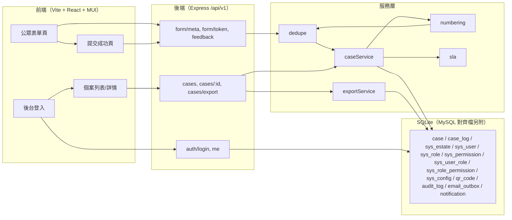

# QRCode 客戶意見反饋系統 — F-001~F-003 細部設計（含可運行骨架規格）

| 項目 | 內容 |
|---|---|
| 版本 | V1.0 |
| 日期 | 2026-09-03 |
| 母文件 | 《QRCode客戶意見反饋系統_功能規格書》V1.0（下稱「規格書」） |
| 範圍 | F-001 客戶意見提交（公眾表單）／F-002 個案自動建立與編號／F-003 個案列表、篩選與匯出 |
| 交付 | 本細部設計 + 前後端分離可運行技術骨架（`backend/`、`frontend/`） |

---

## 1. 範圍與邊界

### 1.1 骨架實作範圍（In Scope）

- 公眾表單（手機優先、繁中/EN 雙語、URL 帶 `estate`、輸入暫存、前端＋後端雙重驗證）。
- 建案與編號（即時建案、`{公司代碼}/{業務代碼}/{屋苑代碼}/{YYMMDD}{3位流水}`、資料庫唯一約束＋衝突重試）。
- 事件類型判定與 SLA 到期時間計算（`response_sla_due` / `closure_sla_due`）。
- 10 分鐘同內容防重複（回顯原案號）與 24 小時二次投訴識別（標記＋關聯原案＋優先級升 `HIGH`）。
- 個案列表（多維篩選／分頁／排序）、個案詳情（時間軸＋`allowedActions`）。
- 目前篩選結果匯出 CSV（UTF-8 BOM）與 Excel（.xlsx）。
- 後台 Demo 級認證（JWT）＋ RBAC 權限碼（`case:list` / `case:view` / `case:export`）＋數據範圍（屋苑/ALL）。
- 確認電郵以**郵件佇列 stub**（落 `email_outbox` + logger）呈現。

### 1.2 範圍外（Out of Scope，僅預留擴充點）

- F-004 分派與跟進、F-005 提醒預警、F-006 完結審核、F-007 滿意度、F-008 儀表板、F-009 完整配置 UI、F-010 完整用戶管理：不實作操作介面。
- 骨架**不提供任何「變更個案狀態」的 API**（除建案自動 `PENDING`），避免與 6.1 狀態機後續實作衝突；僅在詳情回傳由轉換矩陣推導之 `allowedActions`，作為 F-004 起之擴充契約。
- SMTP 真實寄信、CAPTCHA、附件上傳、refreshToken、批次分派、儲存常用篩選：不實作（差異見 §9）。

### 1.3 技術選型（骨架默認；規格書 1.5 節聲明技術中性）

| 層 | 選型 | 說明 |
|---|---|---|
| 後端 | Node.js 20 LTS + Express 4 + better-sqlite3 | 本機零設定即可運行 |
| 認證 | jsonwebtoken（accessToken 2 小時）＋ bcryptjs | Demo 級 |
| 資料庫 | SQLite（本機） | 另附 `backend/db/mysql_schema_alignment.sql`（摘自規格書 7.4）供投產對齊 |
| 前端 | React 18 + TypeScript + Vite 5 + MUI v5 + react-router | dev 期 Vite proxy `/api` → `http://localhost:3000` |
| 測試 | Node 內建 `node:test` | 後端單元測試 |

---

## 2. 架構與目錄



目錄結構（新增檔案皆位於工作區，不修改規格書）：

```
QRCode 客戶意見反饋/
├── docs/F001-F003_細部設計.md         本文件
├── README.md                          啟動/演示帳號/差異摘要
├── backend/（Express + SQLite）
│   ├── package.json  .env.example
│   ├── db/schema.sql  db/seed.js  db/mysql_schema_alignment.sql
│   └── src/{server,app}.js
│       ├── config/{constants,i18n}.js
│       ├── db/connection.js
│       ├── middlewares/{auth,error}.js
│       ├── routes/{public,auth,cases}.js
│       ├── services/{numbering,dedupe,sla,caseService,exportService}.js
│       └── utils/{logger,time,hash,validate}.js
│   └── test/{numbering,dedupe,sla,validation}.test.js
└── frontend/（Vite + React + TS + MUI）
    └── src/{main,App,theme}.tsx
        ├── i18n/{zh,en}.ts   api/client.ts
        ├── pages/public/{FormPage,SuccessPage}.tsx
        ├── pages/admin/{LoginPage,CaseListPage,CaseDetailPage}.tsx
        └── components/{StatusChip,FilterBar}.tsx
```

---

## 3. 資料模型（SQLite 實作）

### 3.1 表單清單（對應規格書 7.2）

| SQLite 表 | 規格書表 | 說明 |
|---|---|---|
| `case` | `case` | 個案主表（F-002~F-006） |
| `case_log` | `case_log` | 時間軸；骨架僅寫入 `CREATE` |
| `sys_user` / `sys_role` / `sys_permission` / `sys_user_role` / `sys_role_permission` | 同名 | RBAC |
| `sys_estate` | `sys_estate` | 4 屋苑（CWC/YPR/CHNG/DAHF）＋公司代碼 |
| `sys_config` | `sys_config` | KV；存放 SLA/分類映射/編號/表單選項與文案 |
| `qr_code` | `qr_code` | 種子範例（屋苑→表單 URL 映射） |
| `audit_log` | `audit_log` | 操作審計；骨架實作 EXPORT/CASE_CREATE/LOGIN stub |
| `notification` | `notification` | 站內通知；建案時通知屋苑主管（stub） |
| `email_outbox` | （規格書無此表） | **新增**：郵件佇列 stub（差異見 §9.8） |

未建表：`case_log_attachment`（F-004）、`satisfaction_survey`（F-007）、`sys_config_audit`（F-009）、`weekly_report`（F-008）。

### 3.2 `case` 欄位（與規格書 7.3.1 完全對應）

骨架依 7.3.1 之 43 個欄位全數建置，型態映射原則：

| MySQL（規格書） | SQLite | 說明 |
|---|---|---|
| ENUM(...) | TEXT + CHECK | 枚舉值一字不差照抄（見 §4 常數） |
| VARCHAR(n) | TEXT | 長度以程式驗證（validate.js） |
| TINYINT(1) | INTEGER CHECK(IN 0,1) | 布林 |
| DATETIME | TEXT `YYYY-MM-DD HH:mm:ss`（UTC） | 顯示層轉 `+08:00`；排序/區間以字串比較即可（統一格式） |
| DATE | TEXT `YYYY-MM-DD` | |
| TIME | TEXT `HH:mm` | |
| DECIMAL(6,2) | REAL | `handling_days` |
| AUTO_INCREMENT | INTEGER PRIMARY KEY AUTOINCREMENT | `user_id`、`log_id` 等 |

索引：與 7.3.1 相同——`ix_status(case_status)`、`ix_estate_status(estate_code, case_status)`、`ix_created(created_at)`、`ix_response_due`、`ix_closure_due`、`ix_assigned`、`ix_second(is_second_complaint, created_at)`，另建 `uk_submission UNIQUE(source_submission_id)`。

### 3.3 關鍵設計決策

1. **`source_submission_id`（去重鍵）**＝ `sha1(聯絡人|規範化內容|10分鐘桶)`；「10 分鐘桶」＝ `floor(epochMinutes/10)`。使唯一約束只鎖定同一時間窗內之相同提交，時間窗外之同內容可再次建立（配合規格書註解「去重鍵 hash：聯絡人+內容+時間窗」）。
2. **`intent_type`（意見性質）**：規格書公眾表單欄位未採集，屬非空欄位。骨架以「內容關鍵字＋類別」啟發式判定（COMPLAINT/FEEDBACK/INQUIRY/COMPLIMENT），規則集中於 `services/sla.js`（可為 F-009 未來規則化），差異見 §9.6。
3. **時間儲存**：一律 UTC 字串；所有對外輸出統一 `YYYY-MM-DDTHH:mm:ss+08:00`（`utils/time.js`）。
4. **時序保證**：建案、編號、查重、SLA、首筆 `case_log`、通知/郵件佇列於**同一 SQLite 交易**（`better-sqlite3` 同步交易）內完成。

---

## 4. 常數與枚舉（單一真源 `backend/src/config/constants.js`）

依規格書 6.1/6.3.1/7.3 照抄：

```js
const CASE_STATUS = ['PENDING','ASSIGNED','IN_PROGRESS','WAITING','RESOLVED','CLOSED','REOPENED'];
const EVENT_TYPE  = ['URGENT','NORMAL','COMPLEX','INSTANT','N/A'];
const PRIORITY    = ['HIGH','MEDIUM','LOW'];
const INTENT_TYPE = ['COMPLAINT','FEEDBACK','INQUIRY','COMPLIMENT'];
const CATEGORY_CODE = ['MO_SERVICE','SECURITY','MAINTENANCE','CLEANLINESS','NUISANCE','OTHER'];
const CASE_SOURCE = ['QR','CC','SITE','APP','EMAIL'];   // 骨架一律 'QR'
const LOG_TYPE    = ['CREATE','ASSIGN','REASSIGN','UPDATE','STATUS_CHANGE','RESPONSE','NOTE',
                     'RESOLVE_REQUEST','RESOLVE_APPROVE','RESOLVE_REJECT','CLOSE','REOPEN',
                     'ESCALATE','REMINDER','UPLOAD','OTHER'];
```

狀態機轉換矩陣（6.1.2，全量照抄，骨架僅觸發「→PENDING」建案；`allowedActions` 由矩陣推導）：

```js
const TRANSITIONS = {
  PENDING:    ['ASSIGNED'],
  ASSIGNED:   ['ASSIGNED','IN_PROGRESS'],            // 轉派/改派、開始處理
  IN_PROGRESS:['ASSIGNED','IN_PROGRESS','WAITING','RESOLVED'], // 轉派/更新/查詢客戶/完結申請
  WAITING:    ['ASSIGNED','IN_PROGRESS','WAITING','RESOLVED'],
  RESOLVED:   ['IN_PROGRESS','CLOSED'],              // 駁回/審核通過
  CLOSED:     ['REOPENED'],
  REOPENED:   ['ASSIGNED','IN_PROGRESS'],
};
```

> 骨架詳情 API 依目前狀態回傳「可執行之下一狀態動作」供前端呈現（如 `PENDING → assign`），惟本版不提供實際轉換端點。

---

## 5. API 契約

### 5.1 通用約定（沿用規格書 8.1）

- 基礎路徑 `/api/v1`；JSON UTF-8；時間輸出 `YYYY-MM-DDTHH:mm:ss+08:00`。
- 統一信封：`{ "code": 0, "message": "success", "data": {...} }`；錯誤時 `code≠0`，`data` 可含細節。
- 分頁：`page`（由 1 起）、`pageSize`（預設 20、上限 100），回應含 `total`。
- 語系：`Accept-Language: zh-Hant | en`（缺省 zh-Hant），影響錯誤 `message` 與表單文案。
- 後台：`Authorization: Bearer <token>`。

### 5.2 錯誤碼（沿用規格書 8.5 子集）

| code | HTTP | 使用點 |
|---|---|---|
| 0 | 200/201 | 成功 |
| 1001 | 200 | 10 分鐘內重複提交（回顯 `data.caseId`） |
| 1002 | 400 | 表單驗證失敗（`data.detail` 列各欄錯誤） |
| 1003 | 400 | formToken 無效或過期 |
| 1004 | 404 | 屋苑/表單設定不存在或停用 |
| 2001 | 401 | 未登入或 token 過期 |
| 2002 | 401 | 帳號或密碼錯誤 |
| 2004 | 403 | 帳戶已停用 |
| 2005 | 403 | 權限不足 |
| 3001 | 404 | 個案不存在 |
| 3004 | 403 | 數據範圍不符（不可操作非所屬屋苑個案） |
| 5000 | 500 | 伺服器內部錯誤 |
| 5001 | 429 | 請求過於頻繁 |

### 5.3 實作端點總表

| 方法 | 路徑 | 權限 | 對應規格書 | 狀態 |
|---|---|---|---|---|
| GET | `/form/meta?estate=&lang=` | 無 | 8.3.1/8.4.1 | ✔ |
| POST | `/form/token` | 無 | 8.3.1/8.2 | ✔（HMAC，差異 §9.4） |
| POST | `/feedback` | 無＋formToken | 8.3.1/8.4.2 | ✔ |
| POST | `/auth/login` | 無 | 8.3.2 | ✔ |
| GET | `/me` | ALL_LOGGED_IN | 8.3.2 | ✔ |
| GET | `/cases` | `case:list` | 8.3.3/8.4.3 | ✔ |
| GET | `/cases/{caseId}` | `case:view` | 8.3.3 | ✔ |
| GET | `/cases/export?format=csv\|xlsx` | `case:export` | 8.3.3 | ✔（差異 §9.7：路由優先序 `export` 置於 `:caseId` 前） |

### 5.4 重點端點規格

**GET `/form/meta?estate=CHNG&lang=zh-Hant`**
```json
{ "code": 0, "message": "success", "data": {
  "estateCode": "CHNG", "estateNameZh": "頌雅苑", "estateNameEn": "Chung Nga Court", "lang": "zh-Hant",
  "fields": ["title","name","incidentDate","incidentTime","email","phone","address","categories","content","surveyConsent"],
  "categories": [ {"code":"MO_SERVICE","labelZh":"管理處人員服務","labelEn":"Property Management Service"},
                  {"code":"SECURITY","labelZh":"保安人員服務","labelEn":"Security Service"},
                  {"code":"MAINTENANCE","labelZh":"維修事宜","labelEn":"Maintenance"},
                  {"code":"CLEANLINESS","labelZh":"衞生事宜","labelEn":"Cleanliness"},
                  {"code":"NUISANCE","labelZh":"滋擾事宜","labelEn":"Nuisance"},
                  {"code":"OTHER","labelZh":"其他","labelEn":"Others"} ],
  "titles": ["先生","女士","小姐","太太","不願透露"],
  "maxLength": {"name":50,"content":1000,"other":50},
  "promiseZh": "感謝您的反饋，我們將於三個工作天內聯繫閣下",
  "promiseEn": "Thank you for your feedback. We will contact you within 3 working days.",
  "style": {"primaryColor":"#1a5aa6","sloganZh":"..."},
  "privacyPolicyUrl": "https://example.com/privacy" } }
```

**POST `/form/token`** → 請求 `{ "estate":"CHNG" }`；回應 `{ "token":"hmac..." }`，5 分鐘有效。

**POST `/feedback`**（重複規格書 8.4.2 之成功 201 與重複 1001 兩情境）
- 成功 201：`data` 含 `caseId/status/responseSlaDue/closureSlaDue/isDuplicate/message`，另加 `isSecondComplaint` 布林。
- 重複：`code=1001`、`data.caseId`＝原案號。

**POST `/auth/login`**
```json
// req
{ "username": "chng_sup", "password": "..." }
// res 200
{ "code":0, "data": { "accessToken":"jwt...", "user": { "userId":3, "username":"chng_sup",
  "fullName":"王主管", "estateCode":"CHNG", "roles":["ESTATE_SUPERVISOR"],
  "permissions":["case:list","case:view","case:export"] } } }
```

**GET `/cases`** — 篩選參數（全可選、可組合、反映於 URL）：
`estate`、`category`(category_code)、`status`、`eventType`、`priority`、`assignedTo`(=數字或 `me`)、`secondComplaint`(1)、`dateFrom/dateTo`(提交日)、`keyword`(案號/姓名/內容 LIKE)、`sortBy`(`createdAt|responseSlaDue|caseId`)、`sortDir`、`page`、`pageSize`。
數據範圍：非 `ALL` 用戶自動附加所屬 `estate_code`；ADMIN/CC/AUDITOR 不受限（AUDITOR 僅唯讀，骨架無寫入端點故自然滿足）。
回應 `data`：`{ total, page, pageSize, items:[{ caseId, caseStatus, eventType, priority, categoryCode, estateCode, customerName, assignedTo:{id,fullName}|null, createdAt, responseSlaDue, closureSlaDue, slaOverdue, isSecondComplaint, originalCaseId }] }`

**GET `/cases/{caseId}`** — 詳情＋時間軸＋`allowedActions`：
```json
{ "case": { ...43 欄（camelCase）+ slaOverdue + allowedActions:["assign"] },
  "timeline": [ { "logId":1, "caseId":"...", "logType":"CREATE", "logContent":"...",
                  "actionBy":0, "actionByName":"SYSTEM", "actionAt":"..." } ] }
```

**GET `/cases/export?format=xlsx`（或 csv）** — 套用與列表相同篩選（無分頁）；`Content-Disposition` 帶 `feedback_cases_YYYYMMDD_HHmm.ext`；CSV 前置 UTF-8 BOM；匯出寫 `audit_log(action=EXPORT)`。

---

## 6. 核心演算法

### 6.1 編號產生（FR-002-02/03，`services/numbering.js`）

```
generateCaseId({companyCode, estateCode, date}) → "SMS/SR/CHNG/260903001"
1) 於建案交易內：SELECT seq FROM case 中 case_id LIKE 'SMS/SR/CHNG/260903%' ORDER BY case_id DESC LIMIT 1
   或維護當日計數：MAX(尾碼)+1（骨架採當日 COUNT 前先取 MAX 尾號）；無則 001。
2) 流水 3 位、跨日重設（日期為香港時區 YYMMDD）。
3) 組字串；INSERT 遇 UNIQUE/PK 衝突（併發）→ 重試 ≤ 3 次，每次重新取號。
```
規則參數（業務代碼、位數、重設頻率）自 `sys_config.numbering.*` 讀取，滿足 F-009 預留。

### 6.2 防重複與二次投訴（FR-001-05 / 6.5，`services/dedupe.js`）

```
resolveDuplicate(payload) 於建案交易內執行：
A. 10 分鐘同內容：
   聯絡人鍵 = email（若有）否則 phone（若有）否則 name+unit
   SELECT case WHERE (customer_email = :email 或 customer_phone = :phone)（依鍵）
     AND comment_content 規範化後相等（trim/全半形/大小寫）
     AND created_at >= now-10min
   → 命中：回傳 { isDuplicate:true, originalCaseId }（code 1001）
B. 24 小時二次投訴（僅在 A 未命中時）：
   SELECT 近 24h、同一聯絡人鍵、category 與本次有交集、非本提交之最新個案
   → 命中：新案 is_second_complaint=1、original_case_id=原案、priority='HIGH'
     （通知屋苑主管 stub：notification + email_outbox）
```

### 6.3 SLA 計算（FR-002-05 / 6.3 / 5.5.1，`services/sla.js`）

```
computeEventType({categories, content, isSecondComplaint})：
1) intent = guessIntent(content, categories)   // §3.3(2)
2) intent=COMPLIMENT → N/A
3) intent=INQUIRY → INSTANT
4) 任一 category 命中 URGENT 關鍵字（安全/火警/保安/漏水危險/滋擾...）→ URGENT
5) is_second_complaint（重複投訴升級）→ COMPLEX
6) 依 category 基線：MAINTENANCE→INSTANT，其餘（MO_SERVICE/SECURITY/CLEANLINESS/NUISANCE/OTHER）→NORMAL
   （SECURITY 涉安全已於 4 攔截）
   → 多選取最嚴者

SLA 時限（sys_config sla.response.*，預設）：URGENT 5m、NORMAL 30m、COMPLEX 2h、INSTANT 4h、N/A 無
response_sla_due = created_at + 時限（N/A → NULL）
closure_sla_due = created_at + 7 日曆日（sys_config sla.closure_days）
```

### 6.4 驗證規則（FR-001-03，`utils/validate.js`）

| 欄位 | 規則 | 錯誤 |
|---|---|---|
| title/name | 必填；name ≤ 50 | 1002 |
| email | 存在時須格式正確 | 1002 |
| phone | 存在時香港 8 位（`2/3/5/6/9` 開頭，容許 `+852`） | 1002 |
| email/phone | 至少一項 | 1002 |
| incidentDate | 必填、非未來 | 1002 |
| categories | 至少 1、最多 3；OTHER 需填 otherText ≤ 50 | 1002 |
| content | 必填 ≤ 1000 | 1002 |
| estate | 存在於 sys_estate 且啟用 | 1004 |

---

## 7. 頁面結構與互動（線框）

### 7.1 公眾表單頁 `/`（estate 由 URL 帶入，如 `/?estate=CHNG&lang=zh-Hant`）

```
┌──────────────────────────────┐  手機優先、單欄居中 max 480px
│ [Logo] 頌雅苑 · 客戶意見反饋   │
│ 繁中 | EN            （切換） │
│──────────────────────────────│
│ 意見種類 *                    │  多選 chips（至多 3 項）
│ (管理處人員服務) (保安人員服務) │
│ (維修事宜) (衞生事宜)          │
│ (滋擾事宜) (其他 ▸ 填寫≤50字)  │
│──────────────────────────────│
│ 稱謂 * [先生 ▾]  姓名 * [____] │
│ 事發日期 * [2026-09-03]       │
│ 事發時間   [14:30]            │
│──────────────────────────────│
│ 電郵     [chan@example.com]   │
│ 電話     [91234567]           │   (電郵/電話至少一項)
│ 座 [▾]  樓層 [__]  單位 [__]  │  選填
│──────────────────────────────│
│ 意見內容 *  0/1000            │  textarea，即時字數
│ ┌──────────────────────────┐ │
│ └──────────────────────────┘ │
│ ☑ 願意接受滿意度調查           │
│ 我已閱讀並同意《私隱政策》 *    │
│ [       提交意見 (loading) ]  │  提交中禁用
└──────────────────────────────┘
```
互動：欄位失焦即驗證＋紅字錯誤；整表內容以 `sessionStorage` 暫存（key=`qrform_{estate}`），提交成功或重設時清除；語言切換保留輸入。

### 7.2 提交成功頁 `/success?caseId=...`

```
┌──────────────────────────────┐
│             ✓                │
│  感謝您的反饋！               │
│  我們將於三個工作天內聯繫閣下。  │
│  您的個案編號：                │
│  SMS/SR/CHNG/260903001   [複製]│
│ 意見摘要： 維修事宜、滋擾事宜    │
│ 大堂冷氣機漏水，影響出入…       │
│ （確認電郵已發送至 chan@…）    │
└──────────────────────────────┘
```
重複提交（1001）時導向本頁並顯示「閣下於 10 分鐘內已提交相同意見」＋原案號。

### 7.3 後台登入 `/admin/login`

居中卡片、Demo 帳號提示條（admin / chng_sup / chng_staff）。

### 7.4 個案列表 `/admin/cases`

```
┌──────────────────────────────────────────┐
│ 個案管理        [匯出 XLSX ▾][匯出 CSV]   │
│ 屋苑[▾] 種類[▾] 狀態[▾] 事件類型[▾]      │
│ 日期[自]~[至] 二次投訴[☐] 關鍵字[____]   │
│ [搜尋] [重設]                             │
├──────────────────────────────────────────┤
│ 案號(SMS/SR/…/001) 屋苑 種類 狀態 處理人    │
│   提交時間    SLA到期    剩餘              │
│ SMS/…/001  頌雅苑 維修 ●處理中 王小明     │
│   09-03 14:30  09-03 18:30  剩3:20        │
│ SMS/…/002  頌雅苑 衞生 ●已分派 李四       │
│   09-03 14:31  09-10 14:31  〒 逾期-2天(紅)│
│ [< 1 2 3 >]  每頁 [20 ▾]  共 46 筆        │
└──────────────────────────────────────────┘
```
- 篩選即時反映至 URL query（可分享）；表格行可點入詳情。
- 狀態色簽：PENDING 灰、ASSIGNED 藍、IN_PROGRESS 橘、WAITING 紫、RESOLVED 青、CLOSED 綠、REOPENED 深灰紅。
- 逾期行淡紅底＋剩餘時間紅色；二次投訴行加 ⚑ 標記。

### 7.5 個案詳情 `/admin/cases/:caseId`

案號＋狀態橫幅 → SLA 卡（首次回應到期/7 天關閉）→ 客戶與內容卡 → 允許操作提示（依 `allowedActions`）→ 時間軸（CREATE 起，垂直線）。

---

## 8. 匯出規格（FR-003-05）

| 項目 | CSV | XLSX |
|---|---|---|
| 套用篩選 | 是（與目前列表一致、無分頁上限 5000 筆） | 同左 |
| 編碼 | UTF-8 帶 BOM（Excel 中文正常） | —（exceljs） |
| 欄位 | 案號/來源/狀態/事件類型/優先級/意見性質/事項類別/屋苑/客戶稱謂姓名/電話/電郵/座樓層單位/事發日期時間/內容/二次投訴/原案號/處理人/提交時間/首次回應到期/關閉期限 | 同左 |
| 動作紀錄 | `audit_log(action=EXPORT, target_type=CASE_LIST, detail={format, filters, by})` | 同左 |

---

## 9. 與規格書差異對照（骨架 vs 規格書）

| # | 項目 | 規格書 | 骨架 | 原因/影響 |
|---|---|---|---|---|
| 9.1 | DB 引擎 | MySQL 8.x | SQLite（本機）＋`mysql_schema_alignment.sql` | 本機零設定；欄位語意不變 |
| 9.2 | 型態 | ENUM/DATETIME/DECIMAL/JSON | TEXT+CHECK/UTC 字串/REAL/TEXT JSON | SQLite 限制；輸出格式不變 |
| 9.3 | 郵件 | SMTP 發送確認電郵 | `email_outbox` 落庫＋logger | FR-001-07 之機制 stub |
| 9.4 | formToken | JWT（8.2 精神） | HMAC-signed 一次性 token（5 分鐘） | 語意一致、免 refresh 之輕量替代 |
| 9.5 | 審計 | 完整 append-only 日誌 | `audit_log` 落庫；DB 層不強制防刪（SQLite 限制） | 投產改 MySQL |
| 9.6 | intent_type | 表單未定義採集方式 | 內容關鍵字＋類別啟發式判定 | 已集中於 `sla.js`，可規則化 |
| 9.7 | 路由 | `GET /cases/{caseId}` 與 `/cases/export` | 實作時 `export` 路由先於 `:caseId` 註冊 | 避免 `export` 被參數捕獲 |
| 9.8 | 新增表 | — | `email_outbox` | 郵件佇列 stub，規格書通知渠道 EMAIL 之落點 |
| 9.9 | refreshToken | 登入回 access+refresh | 僅 accessToken（2h） | Demo 精簡 |
| 9.10 | 附件/批次/儲存篩選/滿意度 | F-004~F-007 | 不實作 | 範圍外（§1.2） |
| 9.11 | 狀態轉換 API | 6.1 全矩陣 | 僅建案 `PENDING`；回傳 `allowedActions` | 避免與 F-004 後續衝突 |

---

## 10. 測試用例（後端 `node:test`）

| 檔案 | 用例 |
|---|---|
| `numbering.test.js` | 格式 `^[A-Z]+/SR/[A-Z]+/\d{6}\d{3}$`；同日流水遞增；跨日重設 001；模擬 PK 衝突重試後成功 |
| `dedupe.test.js` | 10 分鐘內同 email+同內容 → isDuplicate＋回原案號；同內容不同人（email 不同）→ 不重複；不同內容 → 不重複；24h 內同 email+同類別 → isSecondComplaint＋priority HIGH＋originalCaseId |
| `sla.test.js` | MAINTENANCE 一般 → INSTANT(4h)；URGENT 關鍵字 → URGENT(5m)；讚揚關鍵字 → N/A（response due 為 NULL）；二次投訴 → COMPLEX(2h)；closure=created+7d |
| `validation.test.js` | 缺姓名/內容/日期未來/電話格式錯誤/email 格式錯誤/email 與電話皆空 → code 1002 且 detail 有欄位；estate 不存在 → 1004 |

---

## 11. 驗收路徑（對應規格書 11.1 重點）

| AC | 驗證方式 |
|---|---|
| AC-01 個案自動建立 | API/表單提交後回應 ≤ 數秒並含案號 |
| AC-02 編號唯一性 | 連續 100 宗提交全部唯一；單元測試跨日重設 |
| AC-03 來源標記 | 所有案 `case_source=QR`、屋苑由參數帶入 |
| AC-04 表單驗證 | 前端＋後端驗證；錯誤時暫存內容不遺失 |
| AC-05 防重複提交 | 10 分鐘內同內容回 1001＋原案號 |
| AC-07 時間軸 | 每案首筆 CREATE 紀錄 |
| AC-14 匯出 | CSV/Excel 內容與篩選一致、中文無亂碼 |
| AC-17 二次投訴 | 24h 內識別、關聯原案、優先級 HIGH |

> 未納入：AC-06/08/09/10(部分)/11/12/13/15/16/18 涉及 F-004~F-010，屬後續模組驗收。
