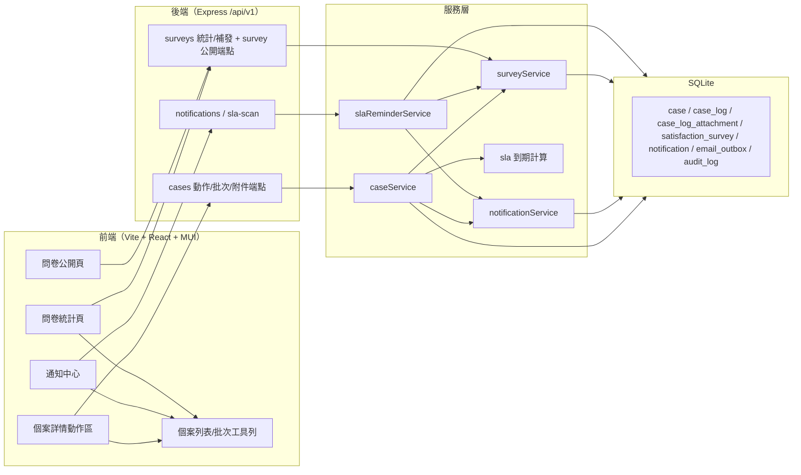

# QRCode 客戶意見反饋系統 — F-004~F-007 細部設計（含可運行骨架規格）

| 項目 | 內容 |
|---|---|
| 版本 | V1.0 |
| 日期 | 2026-09-04 |
| 母文件 | 《QRCode客戶意見反饋系統_功能規格書》V1.0（下稱「規格書」） |
| 範圍 | F-004 分派與跟進／F-005 到期提醒與預警／F-006 完結與回饋／F-007 滿意度調查 |
| 前文件 | `docs/F001-F003_細部設計.md`（沿用其技術選型、錯誤碼、信封與時間約定） |
| 交付 | 本細部設計 + `backend/` F-004~F-007 骨架補齊（API＋排程＋單元測試全綠）+ `frontend/` 對應操作介面（可 build 運行） |
| 內容基準 | 以現有 `backend/` 草稿碼之**實際行為**為事實基準，描述現況並列出本版補齊之缺口；與規格書不一致處見 §9 差異對照 |

---

## 1. 範圍與邊界

### 1.1 骨架實作範圍（In Scope）

- **F-004 分派與跟進**：分派候選人＋建議對象（屋苑主管優先）、確認分派/改派（`PENDING/REOPENED → ASSIGNED`）、轉派（原因必填，同時通知新舊處理人）、開始處理/等候客戶回覆/恢復處理、跟進時間軸（首筆由處理人員寫入自動標記 `RESPONSE`＋`first_response_at`）、附件上傳與私有下載（jpg/jpeg/png/pdf ≤ 10MB）、批次分派與批次開始處理。
- **F-005 到期提醒與預警**：程序內排程（`setInterval`，可配 1~5 分鐘等，預設 60 秒）＋手動觸發 API；臨期提醒（首次回應特急提前 10 分鐘、其餘提前 30 分鐘；7 天關閉期限提前 1 天）與逾期升級（處理人員＋直屬主管＋屋苑主管）；每（case, kind）以標記欄防重複發送；提醒/升級雙通道寫入時間軸＋通知中心；問卷到期掃描（`SENT → EXPIRED`）。
- **F-006 完結與回饋**：完結申請（處理結果分類＋摘要；`UNRESOLVED` 須填原因）`→ RESOLVED`；主管審核通過 `→ CLOSED`（自動算 `handling_days`／`closure_sla_met`，寫時間軸並通知處理人）；駁回 `→ IN_PROGRESS`（原因必填並通知）；關閉後自動寄感謝電郵，客戶同意調查者另觸發問卷；授權重開（標記「二次投訴/跟進不足」）`→ REOPENED` 並重算關閉期限。
- **F-007 滿意度調查**：一次性匿名 token 連結（14 天有效）、公開查詢（不洩客戶個資）、提交（4 題 1~5 分＋選填意見）、低分（任一題 ≤2）自動標記並通知主管、補發電郵限 1 次（僅到期前）、到期標 `EXPIRED`、按屋苑維度統計（回覆率／均分／低分數）。
- **通知中心（後端 API）**：列表、未讀數、單筆已讀、全部已讀。
- **前端操作介面四區**：個案詳情動作區、個案列表批次工具列、通知中心（頂欄徽章＋列表）、問卷公開頁（含提交完成畫面）、問卷統計頁。
- 電郵一律**郵件佇列 stub**（落 `email_outbox`＋logger，不接 SMTP），與 F-001~F-003 一致。

### 1.2 範圍外（Out of Scope，僅預留擴充點）

- F-008 儀表板/週報、F-009 配置審核 UI、F-010 完整用戶管理：不屬本版。
- **FR-005-06 個人提醒偏好設定**（P1）：不建表、不做偏好邏輯（差異見 §9.2）。
- FR-005-07「儀表板即時計數」：屬 F-008 儀表板範疇；本版僅在列表/詳情 DTO 提供 `slaOverdue` 標記供前端標紅（差異見 §9.3）。
- SMTP 真實寄信、multipart 附件串流（本版附件採 base64 JSON）、統計鑽取至個案清單。

### 1.3 技術選型（沿用 F-001~F-003 骨架默認；規格書 1.5 節聲明技術中性）

| 層 | 選型 | 說明 |
|---|---|---|
| 後端 | Node.js 20 LTS + Express 4 + better-sqlite3 | 本機零設定即可運行 |
| 認證 | jsonwebtoken（accessToken 2 小時）＋ bcryptjs | Demo 級；RBAC 權限碼＋數據範圍 |
| 資料庫 | SQLite（本機） | `backend/db/schema.sql` 為唯一建表來源；投產對齊檔另附 |
| 附件儲存 | 本機私有目錄 `backend/data/uploads/{caseId}/` | 一律經鑑權 API 下載，不開放靜態路徑 |
| 排程 | 程序內 `setInterval`（`src/scheduler.js`） | 環境變數 `SLA_SCAN_INTERVAL_MS`（預設 60000；0/無效＝停用）＋手動觸發 API |
| 前端 | React 18 + TypeScript + Vite 5 + MUI v5 + react-router | dev 期 Vite proxy `/api` → `http://localhost:3000` |
| 測試 | Node 內建 `node:test` | 後端單元測試；測試各自獨立 `:memory:` 資料庫 |

---

## 2. 架構與目錄



目錄結構（相對於 F-001~F-003 之變更，★＝本版新增/補齊）：

```
QRCode 客戶意見反饋/
├── docs/F004-F007_細部設計.md         ★本文件
├── backend/
│   ├── db/schema.sql                  表：case_log_attachment / satisfaction_survey / notification / email_outbox（F-001 起已建）
│   ├── db/seed.js                     角色×權限：case:assign/update/resolve/review/reopen、sla:run、dashboard:view
│   └── src/
│       ├── config/constants.js        LOG_TYPE/RESOLUTION_RESULT/REOPEN_TYPE/SURVEY_STATUS/STATUS_META/STATUS_ACTIONS/ERR
│       ├── db/{connection,ensureDefaults,configStore}.js
│       ├── middlewares/{auth,error}.js        requirePerm / ApiError / ok / errorHandler
│       ├── routes/cases.js            ★個案動作＋批次＋附件（含私有下載）
│       ├── routes/surveys.js          ★統計 + 補發（後台）
│       ├── routes/public.js           ★/survey/:token、/survey/:token/submit（匿名）
│       ├── routes/system.js           ★notifications + /sla/scan
│       ├── routes/{auth,qr}.js
│       ├── services/caseService.js    ★分派/轉派/狀態動作/完結審核/重開/批次/附件
│       ├── services/slaReminderService.js ★臨期提醒＋逾期升級掃描
│       ├── services/surveyService.js  ★建置/提交/過期/補發/統計
│       ├── services/notificationService.js ★通知寫入/已讀/角色查詢
│       ├── services/{sla,dedupe,numbering,qrService,exportService}.js
│       ├── scheduler.js  server.js    ★SLA 排程啟動
│       └── utils/{time,hash,validate,logger}.js
│   └── test/*.test.js                 caseAction / reminder / resolve / survey / sla …（全綠）
└── frontend/
    └── src/
        ├── App.tsx                    ★路由註冊（問卷公開頁 /admin/cases/:caseId / 統計頁）
        ├── components/NotificationCenter.tsx ★頂欄鈴鐺＋未讀徽章＋列表＋標已讀
        ├── components/{AuthGuard,StatusChip,FilterBar}.tsx
        ├── pages/admin/CaseListPage.tsx   ★批次分派工具列（行復選）
        ├── pages/admin/CaseDetailPage.tsx ★動作區/審核/重開/附件/問卷狀態卡/時間軸
        ├── pages/admin/SurveyStatsPage.tsx ★問卷統計頁（新增）
        ├── pages/public/SurveyPage.tsx     ★一次性匿名問卷頁（新增）
        ├── api/client.ts                ★API 方法補齊
        ├── admin/options.ts             ★狀態/選項 meta（或沿用 constants）
        └── i18n/dict.ts                 ★新增文案（zh-Hant/en）
```

---

## 3. 資料模型（SQLite 實作）

### 3.1 表單清單（F-004~F-007 相關）

| SQLite 表 | 用途 | 主要寫入服務 |
|---|---|---|
| `case` | 個案主表（狀態/分派/SLA/完結欄位；F-005 提醒標記欄） | caseService / slaReminderService |
| `case_log` | 時間軸（所有動作自動入檔，不可改刪） | caseService / slaReminderService / surveyService |
| `case_log_attachment` | 附件元資料（檔案在私有目錄） | caseService |
| `notification` | 站內通知（`CASE/REMINDER/ESCALATION/SURVEY/SYSTEM`） | notificationService（含 slaReminderService/surveyService 轉介） |
| `satisfaction_survey` | 一次性匿名問卷 | surveyService |
| `email_outbox` | 郵件佇列 stub | notificationService.enqueueEmail |
| `audit_log` | 操作審計（分派/審核/重開/補發等） | caseService / surveyService / routes |

### 3.2 `case` 欄位（F-004~F-007 相關欄位，其餘 43 欄對應見 F-001~F-003 §3.2）

| 欄位 | 型態 | 說明 |
|---|---|---|
| `case_status` | TEXT CHECK | `PENDING/ASSIGNED/IN_PROGRESS/WAITING/RESOLVED/CLOSED/REOPENED` |
| `assigned_to/by` `assigned_at` | INTEGER/INTEGER/TEXT | 分派對象/分派人/時間 |
| `first_response_at` | TEXT | 首筆 `RESPONSE` 時間（FR-004-11） |
| `response_sla_due` / `response_sla_met` | TEXT / INTEGER | 首次回應期限（建案時依事件類型計算）／是否於期限內回應 |
| `resolved_at` / `closed_at` | TEXT | 完結申請時間／審核通過關閉時間 |
| `closure_sla_due` / `closure_sla_met` | TEXT / INTEGER | 7 天關閉期限（建案時計算；重開時重算）／是否於期限內關閉 |
| `handling_days` | REAL | （`closed_at` − `created_at`）換算天，小數 2 位 |
| `resolution_result` | TEXT CHECK | `RESOLVED_FULL/PART/UNRESOLVED/WITHDRAWN/REFERRED` |
| `resolution_summary` | TEXT | 處理摘要（UNRESOLVED 含原因） |
| `satisfaction_consent` | INTEGER | 客戶是否同意接受調查（建案表單勾選） |
| `is_second_complaint` / `original_case_id` | INTEGER / TEXT | 二次投訴標記／關聯原案 |
| `response_reminded_at` / `response_escalated_at` | TEXT | F-005 首次回應「已提醒／已升級」水位（防重複） |
| `closure_reminded_at` / `closure_escalated_at` | TEXT | F-005 關閉「已提醒／已升級」水位；**重開時重設** |

索引沿用：`ix_status`、`ix_estate_status`、`ix_response_due`、`ix_closure_due`、`ix_assigned`、`ix_second`、`uk_submission`。

### 3.3 `case_log`（時間軸）

- 欄位：`log_id`、`case_id`、`log_type`（見 §4）、`log_content`、`old_status`、`new_status`、`action_by`（0＝SYSTEM）、`action_at`、`attachment_id`。
- **不可改、不可刪**：對外無 UPDATE/DELETE 端點；更正以新增 `NOTE` 紀錄表達。
- `attachment_id` 對應 `case_log_attachment.attachment_id`（與規格書 7.4 MySQL 對齊檔一致；FR-004-08 所述 `Case_Log.attachment_url` 以關聯表取代，差異見 §9.5）。

### 3.4 `case_log_attachment`（F-004 FR-004-08）

| 欄位 | 型態 | 說明 |
|---|---|---|
| `attachment_id` | INTEGER PK | |
| `log_id` | INTEGER FK | 同筆 `UPLOAD` 時間軸 |
| `case_id` | TEXT FK | |
| `file_name` / `file_size` / `file_type` | TEXT/INTEGER/TEXT | 原始檔名/位元組數/`jpg|jpeg|png|pdf` |
| `storage_key` | TEXT | 私有目錄檔名（`Date.now()_hex.ext`，防碰撞） |
| `uploaded_by` / `uploaded_at` | INTEGER/TEXT | 上傳人/時間 |

### 3.5 `notification`（通知中心）

`notif_id`、`user_id`(FK)、`title`、`body`、`notif_type`（CHECK：`CASE/REMINDER/ESCALATION/SURVEY/SYSTEM`）、`ref_type`（`CASE` 等）、`ref_id`（`case_id`）、`channel`（CHECK：`IN_APP/EMAIL/BOTH`）、`is_read`（0/1）、`created_at`。索引 `ix_notif_user(user_id, is_read)`。

### 3.6 `satisfaction_survey`（F-007 FR-007-01~06）

| 欄位 | 型態 | 說明 |
|---|---|---|
| `survey_id` | INTEGER PK | |
| `case_id` | TEXT FK | 結果與個案關聯（對外匿名） |
| `survey_token` | TEXT UNIQUE | 隨機 48 hex（一次性匿名連結） |
| `lang` | TEXT | `zh-Hant`/`en`（發送語系） |
| `sent_at` / `expires_at` | TEXT | 發送時間／14 天後（`SLA_SCAN` 標 EXPIRED） |
| `submitted_at` | TEXT | 提交時間 |
| `rating_overall/response/attitude/resolution` | INTEGER CHECK 1~5 | 4 題評分 |
| `feedback` | TEXT | 開放式意見（選填，≤2000 字） |
| `status` | TEXT CHECK | `SENT/SUBMITTED/EXPIRED` |
| `is_low_score` | INTEGER | 任一題 ≤2 → 1 |
| `resend_count` | INTEGER | 補發次數（≤1） |

索引：`ix_survey_case(case_id)`、`ix_survey_status(status, expires_at)`。

### 3.7 關鍵設計決策

1. **提醒/升級以「水位欄位」防重複**：每（case, kind）只發一次，重開/轉派情境僅重開會重設關閉相關水位；升級與提醒互斥（先到期先升級，逾期不再發臨期提醒）。
2. **審核關閉時計算完成**：`handling_days`、`closure_sla_met` 於 `approveResolution` 交易內一併寫入；`RESOLVED`（待審核）期間暫停關閉期限倒數掃描（避免與「審核通過才關閉」語意衝突，見 §9.4）。
3. **問卷每案一筆**：`createSurveyOnClose` 以既有紀錄防重複；token 只出一次、不可猜測（`crypto.randomBytes(24)`）。
4. **時間統一**：DB 存 UTC 字串；對外 `YYYY-MM-DDTHH:mm:ss+08:00`（`utils/time.js`）。測試／掃描函式可注入 `nowMs`，不需 mock 時鐘。
5. **附件私有化**：檔案寫 `backend/data/uploads/{caseId}/`（可用 `UPLOAD_DIR` 覆寫），DB 只存元資料；下載一律走 `GET /cases/:id/attachments/:attachmentId/download`（`case:view`＋屋苑範圍）。
6. **電郵與審計**：所有通知電郵走 `email_outbox`（SMTP stub）；關鍵動作（分派/轉派/審核/重開/補發/掃描）寫 `audit_log`，log 不含敏感欄位。

---

## 4. 常數與枚舉（單一真源 `backend/src/config/constants.js`）

```js
const RESOLUTION_RESULT = ['RESOLVED_FULL','RESOLVED_PART','UNRESOLVED','WITHDRAWN','REFERRED']; // FR-006-02
const REOPEN_TYPE       = ['SECOND_COMPLAINT','INSUFFICIENT_FOLLOWUP'];                          // FR-006-06 標記
const SURVEY_STATUS     = ['SENT','SUBMITTED','EXPIRED'];                                        // FR-007-03
const LOG_TYPE = ['CREATE','ASSIGN','REASSIGN','UPDATE','STATUS_CHANGE','RESPONSE','NOTE',
                  'RESOLVE_REQUEST','RESOLVE_APPROVE','RESOLVE_REJECT','CLOSE','REOPEN',
                  'ESCALATE','REMINDER','UPLOAD','OTHER'];
```

狀態機（沿用 §6.1.2 全量，動作端點以此把關）：

```js
const TRANSITIONS = {
  PENDING:    ['ASSIGNED'],
  ASSIGNED:   ['ASSIGNED','IN_PROGRESS'],              // 轉派、開始處理
  IN_PROGRESS:['ASSIGNED','IN_PROGRESS','WAITING','RESOLVED'], // 轉派/更新/等候/完結申請
  WAITING:    ['ASSIGNED','IN_PROGRESS','WAITING','RESOLVED'],
  RESOLVED:   ['IN_PROGRESS','CLOSED'],                // 駁回/審核通過
  CLOSED:     ['REOPENED'],
  REOPENED:   ['ASSIGNED','IN_PROGRESS'],
};
```

**動作端點許可表**（`STATUS_ACTIONS`，詳情 API 回傳 `allowedActions` 供前端渲染）：

| 目前狀態 | 動作 | 目標狀態 |
|---|---|---|
| PENDING | assign 分派 | ASSIGNED |
| ASSIGNED | reassign 轉派 / start 開始處理 | ASSIGNED / IN_PROGRESS |
| IN_PROGRESS | reassign / waiting 等候 / resolveRequest 完結申請 | ASSIGNED / WAITING / RESOLVED |
| WAITING | reassign / reply 恢復處理 / resolveRequest | ASSIGNED / IN_PROGRESS / RESOLVED |
| RESOLVED | reject 駁回 / approve 審核通過 | IN_PROGRESS / CLOSED |
| CLOSED | reopen 重開 | REOPENED |
| REOPENED | reassign / start | ASSIGNED / IN_PROGRESS |

顯示 meta（`STATUS_META`）含繁中/英文標籤與色碼（前端 `StatusChip` 對應，如 REOPENED 深紅 `#B71C1C`）。

**權限碼（本版相關）**：`case:assign`、`case:update`、`case:resolve`、`case:review`、`case:reopen`、`sla:run`、`dashboard:view`。角色綁定（`db/seed.js`）：

| 權限 | ADMIN | CC_SUPERVISOR | CC_STAFF | ESTATE_SUPERVISOR | ESTATE_STAFF |
|---|---|---|---|---|---|
| case:assign | ✔ | ✔ | ✔ | ✔ | — |
| case:update | ✔ | — | ✔ | ✔ | ✔ |
| case:resolve | ✔ | — | ✔ | ✔ | ✔ |
| case:review | ✔ | ✔ | — | ✔ | — |
| case:reopen | ✔ | ✔ | — | ✔ | — |
| sla:run | ✔ | ✔ | — | — | — |
| dashboard:view | ✔ | ✔ | — | ✔ | — |

**錯誤碼（8.5 子集，本版新增以粗體標示）**：

| code | HTTP | 使用點 |
|---|---|---|
| 0 | 200/201 | 成功 |
| 1002 | 400 | 驗證失敗（`data.detail`） |
| **2005** | 403 | 權限不足（`case:review` 等） |
| 2001/2002/2004 | 401/401/403 | 未登入／帳密錯誤／停用 |
| 3001 | 404 | 個案不存在 |
| **3002** | 409 | 狀態流轉不允許（`assertState`） |
| **3004** | 403 | 數據範圍不符（非所屬屋苑） |
| **4006** | 404 | 問卷不存在／token 無效 |
| **4007** | 410 | 問卷已過期（不重發） |
| **4008** | 409 | 問卷已提交（重複提交） |
| **4009** | 400 | 附件格式/大小不符（jpg/jpeg/png/pdf ≤10MB） |
| 5000/5001 | 500/429 | 內部錯誤／過於頻繁 |

---

## 5. API 契約

### 5.1 通用約定（沿用規格書 8.1 與 F-001~F-003 §5.1）

- 基礎路徑 `/api/v1`；JSON UTF-8；時間輸出 `YYYY-MM-DDTHH:mm:ss+08:00`。
- 統一信封 `{ code:0, message:'success', data }`；錯誤 `code≠0`。
- 後台一律 `Authorization: Bearer <token>`＋權限碼；公開問卷端點**匿名**（只憑 token）。
- 語系 `Accept-Language: zh-Hant | en`（缺省 zh-Hant）。

### 5.2 實作端點總表（F-004~F-007 相關）

| 方法 | 路徑 | 權限 | 對應 FR | 說明 |
|---|---|---|---|---|
| GET | `/cases?{篩選}` | `case:list` | F-004 | 列表（每列含 `slaOverdue` 標紅旗標） |
| GET | `/cases/:caseId` | `case:view` | FR-004-06/07 | 詳情＋時間軸＋`allowedActions`＋問卷狀態 |
| GET | `/cases/:caseId/assignees` | `case:assign` | FR-004-01/02 | 分派候選人（屋苑限定）＋`suggestedUserId` |
| POST | `/cases/:caseId/assign` | `case:assign` | FR-004-01/02 | 分派（body：`assigneeId/priority/eventType/note`） |
| POST | `/cases/:caseId/reassign` | `case:assign` | FR-004-03 | 轉派（`reason` 必填；通知新舊處理人） |
| POST | `/cases/:caseId/start` | `case:update` | 6.1 | 開始處理（→ IN_PROGRESS） |
| POST | `/cases/:caseId/waiting` | `case:update` | 6.1 | 等候客戶回覆（→ WAITING） |
| POST | `/cases/:caseId/resume` | `case:update` | 6.1 | 恢復處理（→ IN_PROGRESS） |
| POST | `/cases/:caseId/note` | `case:update` | FR-004-04/11 | 跟進紀錄（body：`content`；首筆自動 RESPONSE） |
| POST | `/cases/:caseId/priority` | `case:update` | FR-004-07 | 調整優先級（body：`priority`） |
| POST | `/cases/:caseId/resolve-request` | `case:resolve` | FR-006-01/02 | 完結申請（body：`result/summary/reason…`） |
| POST | `/cases/:caseId/approve` | `case:review` | FR-006-03/04/05 | 審核通過（→ CLOSED，感謝電郵＋問卷） |
| POST | `/cases/:caseId/reject` | `case:review` | FR-006-03 | 審核駁回（body：`reason` 必填） |
| POST | `/cases/:caseId/reopen` | `case:reopen` | FR-006-06 | 授權重開（body：`reason/reopenType`） |
| POST | `/cases/:caseId/attachments` | `case:update` | FR-004-08 | 附件上傳（base64 JSON） |
| GET | `/cases/:caseId/attachments/:attachmentId/download` | `case:view` | FR-004-08 | 私有下載（`sendFile`） |
| POST | `/cases/batch-assign` | `case:assign` | FR-004-10 | 批次分派（body：`caseIds[≤200]/assigneeId`；回 `assigned/skipped`） |
| POST | `/cases/batch-update` | `case:update` | FR-004-10 | 批次開始處理（body：`caseIds/action:'start'`） |
| GET | `/notifications` | 登入 | FR-005-04 | 通知列表（`?unread=1`） |
| GET | `/notifications/unread-count` | 登入 | FR-005-04 | 未讀數 |
| POST | `/notifications/read-all` | 登入 | FR-005-04 | 全部已讀 |
| POST | `/notifications/:notifId/read` | 登入 | FR-005-04 | 單筆已讀 |
| POST | `/sla/scan` | `sla:run` | FR-005-08 | 手動執行一次 SLA 掃描（回報摘要） |
| GET | `/surveys/stats` | `dashboard:view` | FR-007-07 | 問卷統計（整體＋按屋苑） |
| POST | `/surveys/:surveyId/resend` | `case:review` | FR-007-06 | 問卷補發（≤1 次，僅到期前） |
| GET | `/survey/:token` | 匿名 | FR-007-01/02 | 取得問卷（不洩客戶個資） |
| POST | `/survey/:token/submit` | 匿名 | FR-007-02/03/04 | 提交問卷 |

> 路由順序約定（Express）：`/export`、`/batch-assign` 等具名路由先於 `/:caseId`，避免參數吞併。

### 5.3 重點端點規格

**POST `/cases/:caseId/assign`**（`assigneeId` 必填）
```json
{ "code": 0, "message": "success", "data": { "caseId": "SMS/SR/CHNG/260904001", "caseStatus": "ASSIGNED", "assigneeId": 5 } }
```
副作用：狀態→`ASSIGNED`＋時間軸 `ASSIGN`＋通知處理人＋`audit_log`；可同時調整 `priority/eventType`（改 eventType 會重算 `response_sla_due`）。

**POST `/cases/:caseId/reassign`**
```json
{ "code": 0, "message": "success", "data": { "caseId": "…", "caseStatus": "ASSIGNED", "assigneeId": 6 } }
```
規則：僅 `ASSIGNED/IN_PROGRESS/WAITING`；`reason` 必填且不可等於現任處理人；時間軸 `REASSIGN` 內容含「轉派原因」；**同時通知新處理人與原處理人**。

**POST `/cases/:caseId/approve`**
```json
{ "code": 0, "message": "success", "data": { "caseId": "…", "caseStatus": "CLOSED", "handlingDays": 2.35, "closureSlaMet": 1, "survey": { "surveyId": 1, "token": "a1b2…", "expiresAt": "2026-09-18T11:23:00+08:00", "status": "SENT" } } }
```
規則：僅 `RESOLVED`；交易內寫 `closed_at/closure_sla_met/handling_days`＋時間軸 `RESOLVE_APPROVE`；通知處理人；若客戶有 email → 感謝電郵；若 `satisfaction_consent=1` → `createSurveyOnClose`（`data.survey` 僅在有發送時非 null）。

**GET `/survey/:token?lang=en`**（匿名）
```json
{ "code": 0, "message": "success", "data": {
  "caseId": "…", "estateCode": "CHNG", "estateNameZh": "頌雅苑", "estateNameEn": "Chung Nga Court",
  "status": "SENT", "lang": "zh-Hant",
  "questions": [ { "key": "overall", "label": "整體滿意度" }, … ],
  "expiresAt": "2026-09-18T11:23:00+08:00", "submittedAt": null, "isLowScore": false,
  "ratings": null, "feedback": null } }
```
回應**不含**任何客戶個資欄位（email/電話/地址）。

**POST `/survey/:token/submit`**
```json
{ "code": 0, "message": "success", "data": { "submitted": true, "caseId": "…", "average": 3.5, "isLowScore": false } }
```
規則：4 題 1~5 必填（缺題→1002）；已提交→4008；過期（先標 EXPIRED）→4007；任一題 ≤2 → `is_low_score=1`＋通知審核主管＋時間軸 `OTHER`。

**GET `/surveys/stats?estate=CHNG`**
```json
{ "code": 0, "message": "success", "data": { "overall": { "sent": 12, "submitted": 4, "expired": 2, "pending": 6,
  "replyRate": 33.3, "lowScoreCount": 1,
  "avg": { "overall": 4.1, "response": 4.0, "attitude": 4.2, "resolution": 4.0 } },
  "byEstate": [ { "estateCode": "CHNG", "estateNameZh": "頌雅苑", "sent": 12, "submitted": 4, "expired": 2,
                  "lowScoreCount": 1, "replyRate": 33.3, "avgOverall": 4.1 } ] } }
```

**POST `/sla/scan`**
```json
{ "code": 0, "message": "success", "data": { "scanned": 18, "responseReminders": [], "responseEscalations": ["…"],
  "closureReminders": [], "closureEscalations": [], "expiredSurveys": 0 } }
```

---

## 6. 核心演算法與排程

### 6.1 分派建議（FR-004-01/02）

`getAssignees`：候選人＝同屋苑（或 `data_scope=ALL`）之 `ESTATE_STAFF/ESTATE_SUPERVISOR/CC_STAFF`；排序使 `ESTATE_SUPERVISOR` 在前 → `suggestedUserId` 預設為該屋苑主管（FR-002-06「自動建議：屋苑主管」）。

### 6.2 首次回應標記（FR-004-11 / KPI-06）

`addCaseNote`：若該筆由**現任處理人本人**（`assigned_to === actorId`）且 `first_response_at` 為空 → 自動記 `RESPONSE` 並寫 `first_response_at`；是否於 `response_sla_due` 內 → `response_sla_met`。`resume`（WAITING 恢復）帶註記時亦適用相同規則。

### 6.3 完結關閉計算（FR-006-04）

```
handling_days   = ROUND((closed_at − created_at) 毫秒 / 86400000, 2)   // NULL 若建案時間缺失
closure_sla_met = closed_at <= closure_sla_due ? 1 : 0                 // NULL 若無期限
```
於 `approveResolution` 單一交易內完成並寫時間軸。

### 6.4 授權重開（FR-006-06）

`reopenCase`：`CLOSED → REOPENED`；必填 `reason`；`reopenType` 預設 `SECOND_COMPLAINT`；重算 `closure_sla_due`（依原 eventType）並**重設** `closure_reminded_at/closure_escalated_at`（水位歸零，供 F-005 重新倒數）；狀態 `REOPENED` 待再次分派（`assign` 許可，語意＝「重新分派」之前置）。

### 6.5 SLA 掃描（`services/slaReminderService.js`，FR-005-01~05/08）

輸入 `nowMs`（可注入）；取數＝`case_status IN (PENDING/ASSIGNED/IN_PROGRESS/WAITING/REOPENED)` 且 `closed_at IS NULL`（`RESOLVED` 待審核排除，見 §9.4）。對每案：

1. **首次回應提醒**（`eventType≠N/A`、`responseDue` 存在、`first_response_at` 為空）：
   - `remaining = due − nowMs`
   - `remaining ≤ 0` 且未升級 → **逾期升級**：通知處理人本人＋直屬主管＋屋苑主管（`ESCALATION`），寫 `response_escalated_at`，時間軸 `ESCALATE`。
   - `0 < remaining ≤ 提前量` 且未提醒 → **臨期提醒**：提前量＝`sla.reminder.responseLeadMinutes[eventType]`（URGENT 10、其餘 30 分鐘）；通知處理人＋屋苑主管（`REMINDER`），寫 `response_reminded_at`，時間軸 `REMINDER`。
2. **關閉期限提醒**（`closureDue` 存在、未關閉、非 RESOLVED）：提前量＝`closureLeadDays`（預設 1 天）；規則同上，水位欄 `closure_reminded_at/closure_escalated_at`。
3. **問卷到期**：`expireSurveys(nowMs)`（`SENT` 且 `expires_at < now` → `EXPIRED`）。

提醒/升級一律經 `notifyUser`（站內＋電郵雙通道），`channel='BOTH'`。回報摘要供手動 API 呈現。

**排程**：`src/scheduler.js` 以 `SLA_SCAN_INTERVAL_MS` 控制（預設 60000ms；`0`/無效＝停用，適合測試/CI）；`server.js` 於 listen 後啟動；`timer.unref()` 確保不阻擋程序退出。單實例、無重入保護（同步執行）；水位欄保證不重複發送。

### 6.6 問卷狀態機（F-007）

```
createSurveyOnClose → SENT ──(14 天屆滿)──→ EXPIRED（不重發）
     │                       │
     │ (token 有效)          └─ resendSurvey ≤1 次（僅到期前，更新 sent_at）
     └─ submitPublicSurvey → SUBMITTED（4 題評分＋意見；任 ≤2 → is_low_score＋通知＋時間軸）
```
- 補發規則：`status=SENT`、未過期、`resend_count < 1`；語言可指定或沿用 `survey.lang`。
- 低分通知對象＝`reviewersForCase(estateCode)`：屋苑主管＋客服主管＋管理員（`SURVEY` 類型通知）。

### 6.7 統計（FR-007-07）

`surveyStats`：範圍＝操作者屋苑（非 ALL）交疊 `filters.estate`；`overall` 由單一 SQL 聚合（`sent/submitted/expired/pending/replyRate/lowScoreCount/avg.*`），`byEstate` 依屋苑群組。`replyRate = ROUND(submitted/sent×1000)/10`。

### 6.8 通知中心

`notificationService`：`notifyUser`（合併寫站內＋`email_outbox`）、`listNotifications`（分頁、`?unread=1`）、`unreadCount`、`markRead`（僅本人）、`markAllRead`（僅本人）。通知類型圖示對應：`CASE/REMINDER/ESCALATION/SURVEY/SYSTEM`。

---

## 7. 頁面結構與互動（線框）

### 7.1 個案詳情頁動作區 `/admin/cases/:caseId`（後台）

自上而下佈局（沿用 MUI 卡片化）：

1. **狀態橫幅**：`StatusChip`（狀態色）＋優先級＋`slaOverdue` 紅色警示。
2. **SLA 卡**：首次回應期限／關閉期限＋倒數（逾時紅字）；`first_response_at`／`handling_days` 已達成顯示。
3. **動作區**：依 `allowedActions`（詳情 API）渲染按鈕＋對話框：
   - `assign`／`reassign`：候選人下拉（`GET …/assignees`，預選 `suggestedUserId`）；轉派另填**原因**（必填）。
   - `start`／`reply`（恢復處理）／`waiting`（等候註記選填）。
   - `resolveRequest`：結果下拉＋摘要＋（`UNRESOLVED` 時）原因＋客戶回覆情況＋完成日期。
   - `approve`／`reject`：審核意見；駁回**原因必填**。
   - `reopen`：原因＋重開類型（二次投訴/跟進不足）。
   - 常用 `note`（跟進/更正）與「調整優先級」。
4. **滿意度調查狀態卡**（若有問卷）：`SENT/SUBMITTED/EXPIRED`、剩餘日數、評分/均分/低分標記、「補發電郵」按鈕（`case:review` 且有權限時）。
5. **客戶與內容卡**＋**附件清單＋上傳**（拖放區，校驗 jpg/jpeg/png/pdf ≤10MB；點名稱下載）。
6. **垂直時間軸**：類型色點＋操作人＋時間；內容；標註「不可修改/刪除，更正請新增紀錄」。

按鈕與對話框即時驗證；提交中 loading；錯誤以信封 `message` 顯示。

### 7.2 個案列表批次工具列 `/admin/cases`

- 每列行首**複選框**（與「列點擊進入詳情」互不衝突）。
- 勾選後浮現工具列：「已選 N 案」＋「批次分派」（選同屋苑處理人＋指示）＋「批次開始處理」（P1 批次更新）；結果以對話框列出 `assigned/done/skipped`。
- 逾期列淡紅底色＋`slaOverdue` 圖示（FR-005-03 標紅）。

### 7.3 通知中心（頂欄）

- 頂欄鈴鐺圖示＋**未讀紅點徽章**（輪詢 `/notifications/unread-count`）。
- Popover/Drawer 列表（`/notifications?page=`），按類型圖示：`REMINDER`（鐘）、`ESCALATION`（警示）、`CASE`（審核/分派）、`SURVEY`（問卷）；未讀加粗。
- 點項 → 跳轉 `/admin/cases/:caseId`（`refId`）並 `POST …/read`；底部「全部已讀」。

### 7.4 問卷公開頁 `/survey/:token`（public，無後台導航）

- 手機優先獨立落地頁：品牌區（屋苑名）＋繁中/EN 切換＋漸變底紋。
- 內容：4 題**大觸區評分**（1~5，星形/圓形選項）＋開放意見 textarea＋提交。
- 狀態頁：已提交（顯示致謝＋「回覆已收妥」）、已過期（不重發提示）、token 無效。
- 成功提交後顯示**完成畫面**（致謝＋回覆編號＝`case_id`，不洩任何其他個資）。
- 提交前先 `GET /survey/:token` 拉題目（帶 `lang`），提交後不可再改。

### 7.5 問卷統計頁 `/admin/surveys`（後台）

- KPI 卡：已發送／已回覆／回覆率／低分數。
- 平均分（4 題）條形圖（可為純 MUI 視覺，不需圖表庫）。
- 維度：屋苑（`byEstate`）小表＋整體 `avg`；逐案明細為匿名聚合（不列客戶）。

---

## 8. 與規格書差異對照（骨架 vs 規格書）

| # | 規格書 | 骨架實作 | 說明 |
|---|---|---|---|
| 8.1 | FR-004-08 `Case_Log.attachment_url` | `case_log.attachment_id`＋`case_log_attachment` | 與 7.4 MySQL 對齊檔一致；URL 不落庫（私有下載經 API 動態構成） |
| 8.2 | FR-004-08 multipart 上傳 | **base64 JSON** 上傳（`express.json limit 15mb`） | 簡化骨架；檔名/大小/類型校驗伺服器端仍完備 |
| 8.3 | FR-005-06 個人提醒偏好（P1） | **不實作** | 無個人設定表；通知對象固定（處理人＋主管/審核人） |
| 8.4 | FR-005-07 儀表板即時計數 | 列表/詳情 DTO 提供 `slaOverdue` 旗標；計數屬 F-008 | 前端以旗標標紅，儀表板另行交付 |
| 8.5 | 逾期升級對象「本人＋直屬主管」 | 本人＋直屬主管＋屋苑主管（去重） | 規格 6.6 通知矩陣；不重複通知 |
| 8.6 | FR-006-06 重開後「重新分派」 | `REOPENED` 需經 `assign` 動作才重新分派 | 為符合狀態機，重開≠自動分派（審計報告點出文案歧義，本版修正通知文案為「已重開，待重新分派」） |
| 8.7 | RESOLVED 期間 7 天期限 | 掃描排除 `RESOLVED` | 「審核通過才算關閉」與「審核中仍受期限」二擇一，骨架採前者；重開後水位歸零重算 |
| 8.8 | FR-007-05 處理人員維度統計 | 統計僅按屋苑（`byEstate`） | 處理人/種類維度保留 SQL 擴充點（`surveyStats` 內 `base` 可加 GROUP BY） |
| 8.9 | 通知渠道（站內＋電郵＋推送） | 站內＋`email_outbox`（SMTP stub） | 推送預留；SMTP 投產接入 |
| 8.10 | FR-005-08 排程間隔 | 環境變數（預設 60 秒）＋手動 `/sla/scan` | 與規格「1~5 分鐘」相容（可設 60000~300000）；未落 `sys_config` |

---

## 9. 測試用例（後端 `node:test`）

每個測試檔獨立進程、獨立 `:memory:` DB（`applySchema + seed + ensureDefaults`）。基線實測 **57 用例 50 過 7 敗**：7 敗全數為 `survey.test.js`「helper 以駝峰別名取欄，而 `createSurveyOnClose` 讀底線欄名」之測試自身缺陷（production 呼叫路徑 `approveResolution` 傳的是 `SELECT_SQL` 底線欄名 row，實為正常）；另修 `surveyStats` `byEstate` SQL 漏 JOIN `sys_estate` 之實作 bug。本版完成修正並新增 **批次開始處理、附件上傳/下載（caseAction）與通知中心（notification）** 用例，共 **62 用例全綠**。

| 檔案 | 覆蓋 | 場景 |
|---|---|---|
| `caseAction.test.js` | F-004/F-006 | 分派建議與候選人、分派/轉派（原因必填、通知）、狀態動作、跟進首筆 RESPONSE、完結申請（UNRESOLVED 須原因）、審核通過/駁回（closure_sla_met/handling_days）、重開（重算期限）、批次分派/批次開始處理（同屋苑/狀態跳過）、附件上傳/下載（格式、大小、私有路徑、跨苑拒絕） |
| `notification.test.js` | F-005 | notifyUser 雙通道與停用帳號、列表/未讀數/單筆已讀/全部已讀（僅本人）、reviewersForCase（同苑主管＋客服主管＋管理員） |
| `reminder.test.js` | F-005 | 臨期提醒（提前 10/30 分鐘、關閉前 1 天）、逾期升級（對象＝本人＋主管）、水位防重複、重開後重設、手動掃描摘要、RESOLVED 排除 |
| `resolve.test.js` | F-006 | 完結申請審核流程、感謝電郵＋問卷觸發（含 `consent=0` 不發問卷）、駁回通知、重開標記 |
| `survey.test.js` | F-007 | 建置（每案一次、token 長度、電郵落庫）、公開查詢（無個資、4006）、提交/重複提交 4008、低分→`is_low_score`+通知+時間軸、過期 EXPIRED/4007、補發限 1 次/4006/4007、統計（sent/submitted/expired/replyRate/avg） |
| `sla.test.js` | SLA 計算 | 各事件類型 due、N/A 無 response due（F-001~F-003） |
| `dedupe/numbering/qr/validation.test.js` | F-001~F-003 | 回歸（不因本版改動而退化） |

---

## 10. 驗收路徑（對應規格書 11.1 重點）

1. `cd backend && npm test` → **全綠**（含既有 F-001~F-003 回歸）。
2. `npm --prefix frontend run build` → 通過。
3. 手動端到端：
   - 公眾表單提交建案 → 屋苑主管收到建案通知；
   - 主管分派（含建議預選）→ 處理人收通知；轉派（填原因）→ 新舊處理人均收通知；
   - 處理人開始處理 → `waiting` → 恢復；寫跟進（首筆 → 時間軸 `RESPONSE`）；
   - 提交完結申請 → 主管於通知中心見「待審核」→ 審核通過；
   - 關閉後：感謝電郵＋問卷（`consent=1`）落 `email_outbox`；問卷連結可開啟、提交、提交後顯示完成畫面；
   - 低分提交 → 主管收 `SURVEY` 通知；問卷統計頁回覆率/均分正確；
   - SLA：手動 `POST /api/v1/sla/scan` 驗證臨期提醒／逾期升級寫入時間軸＋通知中心；附件上傳後僅具權限者能下載。
