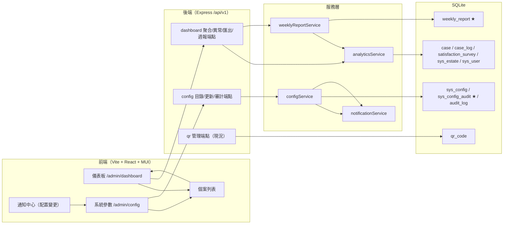

# QRCode 客戶意見反饋系統 — F-008~F-009 細部設計（含可運行骨架規格）

| 項目 | 內容 |
|---|---|
| 版本 | V1.0 |
| 日期 | 2026-09-04 |
| 母文件 | 《QRCode客戶意見反饋系統_功能規格書》V1.0（下稱「規格書」） |
| 範圍 | F-008 數據分析與儀表板／F-009 系統參數配置與 QR 管理 |
| 前文件 | `docs/F001-F003_細部設計.md`、`docs/F004-F007_細部設計.md`（沿用技術選型、錯誤碼、信封、時間與審計約定） |
| 交付 | 本細部設計 + `backend/` F-008~F-009 骨架補齊（API＋排程＋單元測試全綠）+ `frontend/` 對應操作介面（可 build 運行） |
| 內容基準 | 以現有 `backend/` 草稿碼之**實際行為**為事實基準，描述現況並列出本版補齊之缺口；與規格書不一致處見 §9 差異對照 |

---

## 1. 範圍與邊界

### 1.1 現況已交付（事實基準，非本版新增）

F-008/F-009 並非從零開始；截至本文件，`backend/` 與 `frontend/` 已包含下列主幹，本版文件與補齊皆以「沿用＋填缺口」為原則：

| 現況項目 | 位置 | 說明 |
|---|---|---|
| 系統參數表與讀取 | `db/schema.sql` `sys_config`（JSON 字串）；`src/db/configStore.js getConfig()` | seed 已內建 `sla.response`、`sla.closure_days`、`sla.rules`、`sla.reminder`、`survey.expiry_days`、`survey.questions`、`numbering`、`category.event_mapping`、`form.*` 等（見 §3.2）；`weekly_report.schedule` 為本版由 `ensureDefaults` 補入預設值 |
| QR Code 管理主幹（FR-009-03 主幹） | `routes/qr.js`、`services/qrService.js`、`frontend .../QrCodePage.tsx`（`/admin/qr`） | 每屋苑一張啟用碼；`GET /qr/overview`、`POST /qr/generate`、`PUT /qr/site-url`、`POST /qr/:qrId/status`、`GET /qr/:qrId/image?format=png\|svg&size=`；全部寫 `audit_log`；`frontend/api/client.ts` 已有 `qrImageBlob/downloadQrFile` |
| 權限碼 | `db/seed.js` + `db/ensureDefaults.js` | 已有 `dashboard:view`（ADMIN/CC_SUPERVISOR/ESTATE_SUPERVISOR）、`config:view`（ADMIN/CC_SUPERVISOR）、`qr:view`/`qr:generate`（ADMIN/CC_SUPERVISOR）、`case:export`（ADMIN/CC_SUPERVISOR/CC_STAFF/ESTATE_SUPERVISOR） |
| 匯出機制 | `services/exportService.js` | CSV（UTF-8 BOM）／XLSX（exceljs）；供 F-008 報表匯出沿用 |
| 通知與郵件佇列 | `services/notificationService.js`、`email_outbox` | F-008 週報電郵與 F-009 配置變更通知沿用（SMTP stub） |
| 審計 | `audit_log`（append-only 語意） | QR 動作與個案動作已寫入；F-009 配置變更沿用 |

### 1.2 本版骨架實作範圍（In Scope）

- **F-008 數據分析與儀表板**
  - 即時聚合儀表板 API（直接以 `case`/`case_log`/`satisfaction_survey` 現有欄位計算，不另建彙總表）：
    - KPI 卡（KPI-01~KPI-12，含對應規格書目標值；公式見 §5）＋**與上一等長期間比較**（delta）；
    - 分布（意見性質／事項類別／屋苑／狀態）；
    - 月度趨勢（按月建案數／關閉數，香港月）；
    - 處理人員績效（結案數／平均時效／滿意度）；
    - 異常清單（臨期逾時、低分問卷、二次投訴——可一鍵連往個案詳情）；
  - 期間篩選：本日／本週／本月／本季／本年／自訂區間；屋苑篩選（受數據範圍限制）。
  - CSV 匯出（FR-008-06 骨架簡化，見 §9.2）。
  - **自動週報骨架**：`weekly_report` 表＋週報產生服務（上週一至週日區間之 KPI 摘要＋異常清單），寫入單一週報記錄與 `email_outbox` 佇列（SMTP stub）；排程支援環境變數開關＋手動「產生上週週報」API。
- **F-009 系統參數配置與 QR 管理**
  - 配置目錄服務（`configService`）：唯讀列出全量參數（含 meta：群組、型態、是否可編輯、更新人/時間）；
  - 配置更新 API：僅 ADMIN；**重要參數修改即時生效**（消費端每次 `getConfig` 讀取），寫 `sys_config_audit`（新表）＋`audit_log`（`CONFIG_CHANGE`）＋站內通知（ADMIN/CC_SUPERVISOR）。
  - QR 管理：**維持現況（已交付）**，文件僅記載；新增 `config:update`/`config:approve` 權限碼與綁定。
- **前端兩頁**：儀表板 `/admin/dashboard`、系統參數 `/admin/config`；個案列表頁補上導覽按鈕。

### 1.3 範圍外（Out of Scope，僅預留擴充點）

- **FR-008-06 Excel/PDF 匯出**：骨架提供 CSV（沿用 `exportService`）；Excel（xlsx）可經由「異常清單→個案列表→既有匯出」達成；PDF 不實作（差異 §9.2）。
- **FR-008-05 圖表鑽取**：骨架提供異常清單連結至個案詳情；圖表區段點擊下鑽至個案列表（帶 query）列為 P2（差異 §9.2）。
- **FR-009-02「建議→審批」兩段流程**：骨架簡化為**直接修改即時生效＋完整審計**；`sys_config_audit` 預留 `action='PROPOSE/APPROVE/REJECT'` 之檢查約束但本版僅用 `UPDATE`（差異 §9.3）。
- **FR-009-05 編號規則調整**：`numbering` 於配置頁**唯讀**顯示（調整需審批，骨架不開放）。
- **真實排程週報（每週一 09:00）自動寄信**：骨架提供排程檢查模組與手動產生；預設停用（`WEEKLY_REPORT_CHECK_MS`，見 §7.1；差異 §9.2）。
- 儀表板圖表採用**無外部圖表庫**之 MUI 純元件近似（橫/直條、進度條），避免引入 chart.js/recharts 相依（差異 §9.2）。
- F-010 用戶／角色管理頁、審計查閱頁：不屬本版。

### 1.4 技術選型（沿用 F-001~F-007，無新增相依）

| 層 | 選型 | 說明 |
|---|---|---|
| 後端 | Node.js 20 + Express 4 + better-sqlite3 | 聚合以 SQL（參數化）於同庫執行 |
| 時間 | `utils/time.js`（UTC 存庫／+08:00 輸出） | 香港月分組以 `strftime('%Y-%m', created_at, '+8 hours')` |
| 匯出 | CSV（UTF-8 BOM）＋既有 exceljs 路徑 | F-008 報表沿用 |
| 排程 | 程序內 `setInterval`（`scheduler.js`） | 新環境變數 `WEEKLY_REPORT_CHECK_MS`（0＝停用） |
| 前端 | React 18 + TS + Vite 5 + MUI v5 | 圖表以 MUI 元件組合，無新相依 |
| 測試 | Node 內建 `node:test`（`:memory:` DB） | 新增 3 個測試檔，既有全綠 |

---

## 2. 架構與目錄



目錄結構（★＝本版新增/補齊；僅列變更）：

```
QRCode 客戶意見反饋/
├── docs/F008-F009_細部設計.md         ★本文件
├── backend/
│   ├── db/schema.sql                  ★增 sys_config_audit / weekly_report（IF NOT EXISTS，既有庫自動補表）
│   ├── db/ensureDefaults.js           ★補權限 config:update / config:approve、dashboard:view→CC_STAFF/AUDITOR、
│   │                                    週報排程參數預設、編輯白名單相關 config_type 補正
│   └── src/
│       ├── config/constants.js        ★KPI 常數（KPI_CODE/UNIT/TARGET）＋CONFIG_AUDIT_ACTION（可另立 constants 區塊）
│       ├── services/analyticsService.js   ★KPI 摘要(含上期 delta)/趨勢/分布/處理人員/異常
│       ├── services/weeklyReportService.js★週報計算＋落庫＋email_outbox＋防重
│       ├── services/configService.js      ★配置目錄/讀取/更新(驗證+審計+通知)
│       ├── routes/dashboard.js            ★/api/v1/dashboard/*（掛載 app.use('/api/v1/dashboard')）
│       ├── routes/config.js               ★/api/v1/config*
│       ├── scheduler.js                ★週報檢查排程（WEEKLY_REPORT_CHECK_MS）
│       └── routes/{qr,system,cases,surveys}.js（現況沿用）
│   └── test/                           ★analytics.test.js / config.test.js / weeklyReport.test.js
└── frontend/
    └── src/
        ├── App.tsx                     ★路由 /admin/dashboard、/admin/config
        ├── pages/admin/DashboardPage.tsx   ★儀表板（KPI 卡＋趨勢/分布長條＋處理人員＋異常清單＋匯出＋週報卡）
        ├── pages/admin/ConfigPage.tsx      ★系統參數（群組卡＋編輯對話框＋審計說明）
        ├── pages/admin/CaseListPage.tsx    ★導覽列補「儀表板」「系統參數」（按權限顯示）
        ├── api/client.ts               ★dashboard*/weeklyReport*/config* 型別與方法
        └── admin/options.ts            ★沿用 ESTATE_OPTIONS 等；不新增圖表相依
```

---

## 3. 資料模型（SQLite 實作）

### 3.1 本版新增表

**`sys_config_audit`**（對應規格書 7.2「參數變更審計」）：

```sql
CREATE TABLE IF NOT EXISTS sys_config_audit (
  audit_id    INTEGER PRIMARY KEY AUTOINCREMENT,
  config_key  TEXT NOT NULL,
  action      TEXT NOT NULL DEFAULT 'UPDATE'
              CHECK (action IN ('PROPOSE','APPROVE','REJECT','UPDATE')),
  old_value   TEXT,          -- 原值 JSON 字串
  new_value   TEXT,          -- 新值 JSON 字串
  actor_id    INTEGER,
  actor_name  TEXT,
  created_at  TEXT NOT NULL DEFAULT (datetime('now')),
  FOREIGN KEY (config_key) REFERENCES sys_config(config_key)
);
CREATE INDEX IF NOT EXISTS ix_cfg_audit_key ON sys_config_audit(config_key, created_at);
```

> `action` 值域預留兩段審批語意（PROPOSE/APPROVE/REJECT）；本版直接更新一律寫 `UPDATE`（§9.3）。

**`weekly_report`**（對應規格書 7.2「自動週報紀錄」）：

```sql
CREATE TABLE IF NOT EXISTS weekly_report (
  report_id     INTEGER PRIMARY KEY AUTOINCREMENT,
  period_start  TEXT NOT NULL,           -- 'YYYY-MM-DD'（香港週一）
  period_end    TEXT NOT NULL,           -- 'YYYY-MM-DD'（香港週日）
  period_key    TEXT NOT NULL UNIQUE,    -- = period_start（防重鍵）
  summary_json  TEXT NOT NULL,           -- 上週 KPI 摘要（結構見 §6.3.2）
  anomaly_json  TEXT NOT NULL DEFAULT '[]', -- 異常清單
  generated_by  INTEGER NOT NULL,
  generated_at  TEXT NOT NULL DEFAULT (datetime('now'))
);
CREATE INDEX IF NOT EXISTS ix_weekly_period ON weekly_report(period_start DESC);
```

> 兩表皆以 `CREATE TABLE IF NOT EXISTS` 於 `initDatabase()` 每次啟動套用（`connection.js` 已於啟動執行 `schema.sql`），既有資料庫毋須重置即可補表。

### 3.2 配置參數目錄（Config Catalog）

`configService` 內建「可編輯白名單＋meta」；非白名單鍵僅可讀。meta 值域以規格書 7.3.5 與 seed 實際鍵為準：

| config_key | 群組 | JSON 型態 | 可編輯 | 驗證規則 | 消費端 |
|---|---:|---|---|---|---|
| `sla.response` | SLA 時限 | `{URGENT,NORMAL,COMPLEX,INSTANT: 分鐘}` | ✔ | 各值整數 1–1440 | 建案計算 `response_sla_due`（F-002） |
| `sla.closure_days` | SLA 時限 | 整數（天） | ✔ | 1–30 | 建案計算 `closure_sla_due` |
| `sla.reminder` | SLA 時限 | `{responseLeadMinutes:{…}, closureLeadDays}` | ✔ | 分鐘 1–1440／天 1–7 | F-005 SLA 掃描（`slaReminderService`） |
| `category.event_mapping` | 意見種類對應 | `{CATEGORY:{base: EVENT_TYPE}}` | ✔ | `base ∈ EVENT_TYPE` | 建案事件類型判定 |
| `survey.expiry_days` | 問卷 | 整數（天） | ✔ | 1–90 | F-007 建問卷 `expires_at` |
| `weekly_report.schedule` | 週報 | `{dayOfWeek:'MON', time:'09:00'}` | ✔ | `dayOfWeek ∈ MON..SUN`；`time` HH:mm | 週報排程檢查 |
| `form.style` | 表單樣式 | `{primaryColor,sloganZh,sloganEn}` | ✔ | `primaryColor` 為 `#RRGGBB` | 公眾表單 meta |
| `numbering` | 編號規則 | `{bizCode,seqDigits,reset}` | ✘（唯讀） | — | 編號服務；調整需審批（§9.3） |
| `form.categories`／`form.fields`／`form.promise`／`form.titles`／`form.max_length`／`survey.questions`／`sla.rules` | 表單／問卷／SLA 規則 | 各式 | ✘（唯讀顯示） | — | 公眾表單／問卷／判定 |
| `form.site_base_url` | QR | 字串 | ✘（由 QR 管理頁維護） | — | `qrService`（既有） |

> 生效機制：所有消費端每次皆以 `getConfig(db, key)` 讀取（非啟動快取），故 PUT 後**即時生效**（F-005 掃描、F-007 發送、下次建案判定即套用新值）；唯已產生的個案 `*_sla_due`、已發出的問卷不回溯。

### 3.3 權限碼（本版增補）

| perm_code | 新增/既有 | 綁定角色（與權限矩陣 §4.2 對齊） |
|---|---|---|
| `dashboard:view` | 既有 | 增補 **CC_STAFF**、**AUDITOR**（矩陣 ◐/○） |
| `config:view` | 既有 | ADMIN、CC_SUPERVISOR（不變） |
| `config:update` | ★新增 | ADMIN |
| `config:approve` | ★新增 | ADMIN（兩段審批流程預留，本版未使用） |

> 新權限碼由 `ensureDefaults` 以 `INSERT OR IGNORE` 補入既有庫（與 `qr:generate` 等同一模式）。

---

## 4. 常數與枚舉

- KPI 顯示 meta（前端 KPI 卡與報表共用）集中於 `constants.js`（或 `analyticsService` 匯出）：

```js
const KPI_META = {
  KPI_01: { labelZh: '累計意見宗數', unit: '宗', target: null, good: 'down',   /* 不設目標 */ },
  KPI_02: { labelZh: '平均結案時效', unit: '天', target: 3,    good: 'down' },
  KPI_03: { labelZh: '已處理／處理中', unit: '宗', target: null, good: null },
  KPI_04: { labelZh: 'QR 提交量', unit: '宗', target: null, good: null },
  KPI_05: { labelZh: '二次投訴比率', unit: '%',  target: 2,    good: 'down' },
  KPI_06: { labelZh: '首次回應及時率', unit: '%', target: 95,   good: 'up' },
  KPI_07: { labelZh: '7 天關閉達標率', unit: '%', target: 90,   good: 'up' },
  KPI_08: { labelZh: '問卷回覆率', unit: '%',  target: 30,   good: 'up' },
  KPI_09: { labelZh: '平均滿意度', unit: '分',  target: 4.0,  good: 'up' },
  KPI_10: { labelZh: '低分個案比率', unit: '%',  target: 5,    good: 'down' },
  KPI_11: { labelZh: '逾期／升級個案', unit: '宗', target: 0,   good: 'down' },
  KPI_12: { labelZh: '分派處理時效', unit: '小時', target: 1,  good: 'down' },
};
```

- `CONFIG_AUDIT_ACTION = ['PROPOSE', 'APPROVE', 'REJECT', 'UPDATE']` 對應新表 CHECK 約束。
- 其餘狀態／事件類型／事項類別等枚舉沿用既有 `constants.js`（禁止自行增改）。

---

## 5. KPI 計算規格（`analyticsService.summary`）

通用前提：
- 期間以 `case.created_at` 為切面（即「於期間內建立的個案」）；已關閉指標以 `closed_at ∈ 期間` 統計，於文件以欄位註記。
- 屋苑篩選／數據範圍一律為 `estate_code = ?`（同 `surveyService.surveyStats` 模式，ESTATE 角色鎖定所屬屋苑）。
- 時間比較一律為 DB UTC 字串；期間起訖以 `utils/time.dateRangeUtc`（香港日）換算。
- 值域空值以 0/`null` 呈現；比例四捨五入至 1 位小數；平均分四捨五入至 2 位小數。

| KPI | 值 | SQL／計算規則（摘要） | 上期 delta 之語意 |
|---|---|---|---|
| KPI-01 | COUNT(*) | 期間內建案數 | 差值（宗） |
| KPI-02 | AVG(`handling_days`) | `case_status='CLOSED'` 且 `closed_at∈[from,to]` | 差（天） |
| KPI-03 | 各狀態 COUNT | `GROUP BY case_status`（呈現代碼/色/宗數） | — |
| KPI-04 | 按（月×屋苑）COUNT | 見 `/trend`（§6.2.2） | — |
| KPI-05 | 二次宗數＋比率 | `COUNT(is_second_complaint=1)/COUNT(*)` | 差（%） |
| KPI-06 | `SUM(response_sla_met)/COUNT(response_sla_due NOT NULL)` | 期間內建案；`event_type='N/A'`（讚揚）不納分母；`response_sla_met` 由 F-004 標記 | 差（%） |
| KPI-07 | `SUM(closure_sla_met)/COUNT(closure_sla_due NOT NULL)` | 期間內**關閉**個案（`closed_at`）；`closure_sla_met` 由 F-006 於關閉時計算 | 差（%） |
| KPI-08 | 回覆率 | 以期間內建案所關聯 `satisfaction_survey` 計：`SUBMITTED/(SUBMITTED+EXPIRED+SENT)`；`EXPIRED` 計為未回覆 | 差（%） |
| KPI-09 | `AVG(rating_overall)`（已回覆） | 同上範圍 | 差（分） |
| KPI-10 | `COUNT(is_low_score=1)/已回覆` | 同上範圍 | 差（%） |
| KPI-11 | 逾時數 | 未關閉且（`response_sla_due<now` 而 `first_response_at IS NULL`，或 `closure_sla_due<now` 而 `closed_at IS NULL`）；不隨期間切面（實時） | 差（宗） |
| KPI-12 | `AVG(首次 IN_PROGRESS 時間 − assigned_at)` | 對期間內分派且已開始之個案，取其 `case_log`（`new_status='IN_PROGRESS'`）最早 `action_at` 減 `assigned_at`；單位小時 | 差（小時） |

- 每張 KPI 卡輸出：`{ key, labelZh, unit, target, value, delta, met }`；`met` 依 `good` 方向與 `target` 判定（供前端警示色，對應 FR-008-08）。
- 「與上期比較」= 以**與本期等長**之緊接上一期間（例如本月 → 上月同日數）重新計算一次，輸出同一結構之 `prev`。

### 5.1 分布（distribution）

| 名稱 | GROUP BY | 輸出 |
|---|---|---|
| 意見性質 | `intent_type` | code＋中文標籤＋宗數＋佔比 |
| 事項類別 | `category_code` | 同上 |
| 屋苑 | `estate_code`（JOIN `sys_estate`） | code＋名稱＋宗數＋佔比 |
| 狀態 | `case_status` | code＋中文（`STATUS_META`）＋宗數 |

### 5.2 趨勢（trend）

- 香港月分組：`strftime('%Y-%m', created_at, '+8 hours')`（SQLite 支援）。
- 輸出序列 `[{ ym, created, closed }]`；`closed` 以 `strftime('%Y-%m', closed_at, '+8 hours')` 計。
- 期間預設最近 12 個月（不足則自資料最早月起）；屋苑篩選同上。

### 5.3 處理人員績效（handlers）

- 範圍：期間內**處理過**之個案（`assigned_to NOT NULL`，JOIN `sys_user`）。
- 輸出：`userId, fullName, estateNameZh, closedCount, avgHandlingDays, avgSatisfaction`（後者取其已回覆問卷 `rating_overall` 平均；該人員不限屋苑時列出其全部處理）。
- 排序：`closedCount DESC`，上限 20。

### 5.4 異常清單（anomalies）

- 三類（`type: 'OVERDUE' | 'LOW_SCORE' | 'SECOND'`）：
  - `OVERDUE`：沿用 F-003 詳情 DTO 之 `slaOverdue` 判定（未關閉且任一期限已過）；
  - `LOW_SCORE`：`satisfaction_survey.is_low_score=1` 且 `status='SUBMITTED'`；
  - `SECOND`：`is_second_complaint=1`。
- 輸出每筆：`type, caseId, estateCode, estateNameZh, caseStatus, dueAt/is_low_score, caseUrl`（前端連往 `/admin/cases/:caseId`）；上限 100。
- 異常數值同時回傳各類計數（儀表板警示 chip）。

---

## 6. API 契約

### 6.1 通用約定（沿用）

- 信封：`{ ok: true, data }`／`{ ok: false, error: { code, message } }`（`middlewares/error`）。
- 認證：`Authorization: Bearer <accessToken>`；路由層 `router.use(requireAuth)`＋每端點 `requirePerm(...)`。
- 錯誤碼沿用 `constants.ERR`（新增情境盡量復用：`VALIDATION`、`PERMISSION`、`CONFIG_KEY_NOT_FOUND` 以 `VALIDATION`+404 表之，不新增碼值）。
- 時間輸出一律 `+08:00` ISO；金額/比例四捨五入如 §5。

### 6.2 端點總表（本版新增）

| 方法 | 路徑 | 說明 | 權限 |
|---|---|---|---|
| GET | `/api/v1/dashboard/summary?range=thisMonth&estate=` | KPI 摘要（含 `prev`） | `dashboard:view` |
| GET | `/api/v1/dashboard/trend?from=&to=&estate=` | 香港月趨勢 | `dashboard:view` |
| GET | `/api/v1/dashboard/distribution?range=thisMonth&estate=` | 分布 | `dashboard:view` |
| GET | `/api/v1/dashboard/handlers?range=thisMonth&estate=` | 處理人員績效 | `dashboard:view` |
| GET | `/api/v1/dashboard/anomalies?estate=` | 異常清單（實時） | `dashboard:view` |
| GET | `/api/v1/dashboard/export?range=thisMonth&estate=` | CSV（UTF-8 BOM）：KPI＋分布＋處理人員 | `dashboard:view`＋`case:export` |
| POST | `/api/v1/dashboard/weekly-report/run` | 手動產生「上週」週報（防重：同 `period_key` 已存在時回傳現有記錄） | `dashboard:view` |
| GET | `/api/v1/dashboard/weekly-report/list` | 週報記錄（新→舊，上限 20） | `dashboard:view` |
| GET | `/api/v1/config` | 配置目錄（含 meta、群組、可編輯、更新人/時） | `config:view` |
| GET | `/api/v1/config/:key` | 單鍵配置 | `config:view` |
| PUT | `/api/v1/config/:key` | 更新（白名單＋驗證＋審計＋通知） | `config:update` |
| GET | `/api/v1/config/audit?key=&limit=` | 配置變更審計（`sys_config_audit`） | `config:view` |

> 路徑命名與既有實作一致（`/dashboard/*`、`/config`）；與規格書 8.3.4/8.3.5 之差異見 §9.1。

### 6.3 重點端點規格

#### 6.3.1 `GET /api/v1/dashboard/summary`

Query：`range=today|thisWeek|thisMonth|thisQuarter|thisYear|custom`；`custom` 需另附 `from=YYYY-MM-DD&to=YYYY-MM-DD`；`estate` 可選（ESTATE 角色強制其屋苑）。

```jsonc
{
  "ok": true,
  "data": {
    "range": { "from": "2026-08-03", "to": "2026-08-09", "labelZh": "本週" },
    "estate": "ALL",
    "kpi": [
      { "key": "KPI_01", "labelZh": "累計意見宗數", "unit": "宗", "target": null,
        "value": 12, "delta": 3, "met": null },
      { "key": "KPI_06", "labelZh": "首次回應及時率", "unit": "%", "target": 95,
        "value": 100.0, "delta": -2.5, "met": true }
      // …KPI_02~KPI_12
    ],
    "prev": { "from": "2026-07-27", "to": "2026-08-02", "kpi": [ /* 同結構 */ ] },
    "statusCounts": [{ "status": "PENDING", "count": 2 } /* … */],
    "anomalySummary": { "OVERDUE": 1, "LOW_SCORE": 0, "SECOND": 1 }
  }
}
```

#### 6.3.2 `POST /api/v1/dashboard/weekly-report/run`

- 計算「上週」（香港時區）＝ 上一個週一 00:00 至週日 23:59。
- 若 `weekly_report.period_key`（＝上週一日期）已存在：回傳 `{ duplicate: true, report }`，**不重寫**。
- 否則依 §5 統計（全屋苑）＋異常清單（上限 50），寫入：
  - `weekly_report`（`summary_json`、`anomaly_json`）；
  - `email_outbox`（每名目標收件人一筆：ADMIN＋CC_SUPERVISOR＋各屋苑 ESTATE_SUPERVISOR；template=`WEEKLY_REPORT`，subject 含期間，body 為摘要與異常清單文字版；SMTP stub 沿用）；
  - `audit_log`（`action='WEEKLY_REPORT'`）。
- 回傳 `{ report, recipients: n, emailQueued: n }`。

#### 6.3.3 `GET /api/v1/config`

```jsonc
{
  "ok": true,
  "data": {
    "groups": [
      { "key": "SLA", "labelZh": "SLA 時限", "items": [ /* per §3.2 目錄 */ ] },
      { "key": "SURVEY", "labelZh": "問卷", "items": [ /* … */ ] }
    ],
    "updatedAt": "2026-09-04T10:00:00+08:00",
    "editableOnly": true           // 前端決定顯示「編輯」按鈕
  }
}
```

每筆 item：`{ key, labelZh, type, editable, value, updatedBy, updatedAt, isAuditRequired }`。

#### 6.3.4 `PUT /api/v1/config/:key`

Body：`{ value: <新值，依型態為 object|number|string> }`

流程（`configService.updateConfig`，單一 transaction）：
1. 白名單檢查（非可編輯鍵 → `VALIDATION` 400）；鍵不存在 → 404；
2. 依 §3.2 驗證（不合法 → `VALIDATION` 400，`field:'value'`）；
3. 讀舊值 → UPSERT 新值 → `sys_config_audit(action='UPDATE')` → `audit_log(action='CONFIG_CHANGE', detail={前後值})`；
4. 站內通知 ADMIN＋CC_SUPERVISOR（`notificationService`，`notif_type='SYSTEM'`，title 如「系統參數已更新：sla.closure_days」）；
5. 回傳 `{ key, value, updatedAt }`。

#### 6.3.5 `GET /api/v1/config/audit`

回傳 `[{ auditId, configKey, action, oldValue, newValue, actorName, createdAt }]`；預設最近 50 筆，可 `?key=` 過濾。

---

## 7. 排程、審計與通知

### 7.1 週報排程（F-008 FR-008-07 骨架）

- `scheduler.js` 新增第二個可選計時器：環境變數 `WEEKLY_REPORT_CHECK_MS`（預設 **0＝停用**；啟用時建議 ≥ 60 秒）。
- Tick 邏輯：讀取 `weekly_report.schedule`（預設 `{ dayOfWeek:'MON', time:'09:00' }`）→ 以香港時區判斷「目前是否處於本次預定時段（09:00 起 5 分鐘內）且當期（上週）尚未產生」→ 是則呼叫 `weeklyReportService.generateWeeklyReport(db, { now })`。
- 與 SLA 掃描共用 try/catch＋logger；`timer.unref()` 不阻擋程序結束。
- 提供 `POST /weekly-report/run` 手動產生（演示/測試路徑）。

### 7.2 審計與通知

- `audit_log` 沿用：`CONFIG_CHANGE`、`WEEKLY_REPORT`、`QR_GENERATE/QR_DEACTIVATE/QR_REACTIVATE`（既有）為自由文字 action；無 UPDATE/DELETE 語意（append-only）。
- `sys_config_audit` 為**參數層級**審計（比 `audit_log` 更細、可回溯前後值），兩者並存：前者 per-key、後者 per-operation 總覽。
- 配置變更站內通知對象＝具 `config:view` 且角色為 ADMIN/CC_SUPERVISOR 之啟用用戶（沿用 `notificationService` 角色查詢）。

---

## 8. 頁面結構與互動（線框）

> 頁面沿用既有後台樣式（sticky Toolbar＋返回個案列表＋通知中心＋登出）；權限不足顯示警告卡片（同 SurveyStatsPage 模式）。

### 8.1 儀表板 `/admin/dashboard`

```
┌ Toolbar: [←] 數據分析儀表板    {user} 🔔 登出 ┐
│ 期間: (本日)(本週)(本月)(本季)(本年)(自訂 from~to)   屋苑: [全部▾]   [匯出CSV]  │
│ ── KPI 卡（橫向 4×3）────────────────────────────── │
│ 累計意見宗數 12(▲3) │ 平均結案時效 2.4天(▼0.1) │ … │ KPI-12 分派時效 0.8h │
│ （met=false 之卡以警示色框/箭頭，異常 chip: 逾期1 低分0 二次1）│
│ ── 趨勢（最近12個月，直條：建案/關閉）────────────── │
│ ── 分布（意見性質 / 事項類別 / 屋苑 / 狀態，長條＋百分比）│
│ ── 處理人員績效（表格：人員 屋苑 結案 均時效 平均滿意度）│
│ ── 異常清單（表格，type chip；點 caseId 連往個案詳情）│
│ ── 自動週報（卡）：上一期 2026-08-25~31（09-01 生成） │
│      [＋產生上週週報]  最近: 09-01 / 08-25 / …（詳情 Dialog）│
└───────────────────────────────────────────────┘
```

- 圖表一律 MUI 組合（`Box` 高度＋`LinearProgress`/`Paper`）繪製，不引入圖表庫（§1.3/§9.2）。
- 匯出按鈕呼叫 `downloadExport` 同款 blob 下載邏輯（`filename=dashboard_summary_YYYYMMDD_HHmm.csv`）。
- ESTATE 角色：屋苑下拉鎖定所屬屋苑（同問卷統計頁 `locked` 行為）。

### 8.2 系統參數 `/admin/config`

```
┌ Toolbar: [←] 系統參數配置（F-009）     🔔 登出 ┐
│ 說明 Alert：骨架採「直接修改即時生效＋完整審計」；完整「建議→審批」見規格書 FR-009-02（§9）│
│ [更新紀錄]（Dialog：config_key / 時間 / 操作人 / 前值→後值）│
│ ── SLA 時限 ──────────────────────────────── │
│  首次回應時限: URGENT 5分 NORMAL 30分 COMPLEX 120分 INSTANT 240分 [編輯] │
│  關閉期限: 7 天 [編輯]   提醒提前量: 回應 10/30/30/30分、關閉 1天 [編輯] │
│ ── 意見種類對應 ──────────────────────────── │
│  MO_SERVICE 管理處人員服務 → NORMAL …（6 類，每類 base 可編輯）[編輯] │
│ ── 問卷 ───────────────────────────────────── │
│  調查有效期: 14 天 [編輯]   （四題文案：唯讀）    │
│ ── 週報 ───────────────────────────────────── │
│  排程: 每週一 09:00 [編輯]                     │
│ ── 表單樣式 ───────────────────────────────── │
│  主色 #1a5aa6 [色票]  標語 zh/en [編輯]         │
│ ── 編號規則（唯讀）────────────────────────── │
│  SR / 3位 / 每日重設（調整需審批，本版唯讀）      │
└───────────────────────────────────────────────┘
```

- 「編輯」以 Dialog 呈現（型態依目錄：整數輸入、每鍵表單欄位、色票、時分）。
- 儲存後呼叫 `configUpdate(key, value)`，成功 Toast＋重新載入目錄（更新時間/人反映）。
- 僅具 `config:update` 者顯示「編輯」；`config:view`（CC_SUPERVISOR）為唯讀瀏覽。

### 8.3 導覽

- `CaseListPage` 標題列新增「儀表板」「系統參數」按鈕（`user.permissions` 判斷：`dashboard:view`／`config:view`）。
- 新頁面返回一律 `→ /admin/cases`；其餘頁維持現況。

### 8.4 `api/client.ts` 增補

型別：`RangePreset`、`DashboardKpi`、`DashboardSummaryData`、`DistributionItem`、`TrendPoint`、`HandlerRow`、`AnomalyRow`、`WeeklyReportRow`、`ConfigGroup/ConfigItem/ConfigAuditRow`。
方法（皆 `(token, …) => Promise<…>`，沿用現有 `request` 包裝）：`dashboardSummary`、`dashboardTrend`、`dashboardDistribution`、`dashboardHandlers`、`dashboardAnomalies`、`dashboardExportCsv`（blob 下載）、`weeklyReportRun`、`weeklyReportList`、`configList`、`configGet`、`configUpdate`、`configAudit`。

---

## 9. 與規格書差異對照（骨架 vs 規格書）

### 9.1 端點命名與路徑

| 規格書 8.3 | 骨架實作 | 理由 |
|---|---|---|
| `GET /api/v1/qr-codes`、`POST /qr-codes/generate`、`POST /qr-codes/{id}/invalidate` | `GET/POST/POST /api/v1/qr/overview｜generate｜:qrId/status`（既有，已交付） | 沿續 F-001~F-007 已上線命名 |
| `GET /dashboard/kpi`、`/dashboard/trend`、`/dashboard/distribution`、`/dashboard/escalation` | `GET /dashboard/summary`（含 KPI 與 prev）、`/trend`、`/distribution`、`/anomalies` | 骨架合併 KPI＋期比較為單一端點 |
| `PUT /config/{key}`＋`POST /config/{key}/approve` | `PUT /config/:key`（直接生效） | 見 §9.3 |
| `GET /config`、`GET /audit-logs` | `GET /config`、`GET /config/audit` | 配置審計收斂於 config 模組 |

### 9.2 F-008 差異

| 編號 | 規格書 | 骨架處置 | 原因／擴充點 |
|---|---|---|---|
| FR-008-01 | 12 KPI 卡＋上期比較 | ✔ 完整 | 全以現有欄位 SQL 聚合，無彙總表 |
| FR-008-02 | 五類分析維度 | ✔（性質/類別/屋苑/狀態/處理人員） | 處理人員維度於 `/handlers` |
| FR-008-03 | 柱狀/圓餅/折線/儀表盤 | 長條/直條/進度條（MUI） | 不引入圖表庫；圓餅以佔比長條近似 |
| FR-008-04 | 本日～自訂區間 | ✔ | — |
| FR-008-05 | 圖表鑽取至個案清單 | 僅異常清單連往詳情 | 圖表點擊鑽取列 P2 |
| FR-008-06 | Excel/PDF 匯出 | CSV（UTF-8 BOM） | xlsx 可經異常→列表匯出；PDF 不實作 |
| FR-008-07 | 每週一 09:00 自動寄週報 | 產生服務＋排程檢查（`WEEKLY_REPORT_CHECK_MS`，預設停用）＋手動 API | SMTP stub；避免 dev 環境自動跑 |
| FR-008-08 | 異常警示＋一鍵篩出 | ✔（警示色＋異常卡＋chip） | 篩出＝異常清單 |
| FR-008-09 | 延遲 ≤5 分鐘（排程彙總） | 即時 SQL 聚合 | 資料量 10k 以下即時可滿足；彙總表預留 |

### 9.3 F-009 差異

| 編號 | 規格書 | 骨架處置 | 原因／擴充點 |
|---|---|---|---|
| FR-009-01 | 參數配置介面（屋苑/種類/SLA/調查/週報等） | ✔ 白名單子集可編輯、全量可讀 | 屋苑名單管理屬 F-010 範圍未含；`sys_estate` 以 seed/ensureDefaults 維護 |
| FR-009-02 | 修改需建議→審批 | 直接更新＋`sys_config_audit`＋`audit_log`＋通知 | `action='PROPOSE/APPROVE/REJECT'` 與 `config:approve` 已預留 |
| FR-009-03 | QR 生成/下載/停用換發 | ✔ 已交付（現況，見 §1.1） | 本版文件記載 |
| FR-009-04 | 表單樣式參數 | ✔ `form.style` 可編輯（主色/標語） | — |
| FR-009-05 | 編號規則調整（需審批） | 唯讀顯示 | 配套 F-002 建案服務，調整風險高，留待審批流程 |
| FR-009-06 | 配置變更審計 | ✔ `sys_config_audit`＋`audit_log` | — |

### 9.4 KPI 統計時點差異

| 項目 | 規格書 6.4 | 骨架 | 影響 |
|---|---|---|---|
| 問卷 KPI（08~10） | 依問卷發送/回覆時點 | 依個案建案期間切面 | 同一期間視覺一致；差異小並於文件明示 |

---

## 10. 測試用例（後端 `node:test`，新增）

| 檔案 | 用例 |
|---|---|
| `test/analytics.test.js` | KPI-01/02 基本計數與平均；KPI-06/07 分子分母（含 `N/A` 排除）；KPI-08/09/10 問卷統計；KPI-11 逾時判定；KPI-12 平均處理時效；上期 `prev` 等長期間；期間 range=today/month/custom 邊界；ESTATE 角色數據範圍；分布/趨勢（香港月分組）/處理人員/異常清單；匯出 CSV 檔頭與 BOM；無資料時全 0／`null` |
| `test/config.test.js` | 目錄 meta（群組/可編輯旗標）；非白名單鍵更新 → 400；未知鍵 → 404；驗證失敗（字串/範圍/色票格式）→ 400；成功更新 → 值持久化＋`sys_config_audit`＋`audit_log`＋通知（ADMIN/CC_SUPERVISOR 有人收到）；非 ADMIN（ESTATE_STAFF）→ 403；`GET /config/audit` 過濾 |
| `test/weeklyReport.test.js` | 上週期間計算（週一~週日）；產生 → `weekly_report` 一列＋`email_outbox`（每收件人一筆）；重複產生 `duplicate:true` 不重寫；異常清單擷取；排程 tick 函數（到時/未到時）以可注入 `now` 測試；審計寫入 |
| 既有 | 全部維持綠（`npm test`） |

> 測試遵循既有慣例：`process.env.DB_PATH=':memory:'` 獨立資料庫、`seed`＋直接 `insertLog`/UPDATE 造數、斷言以信封 `ok:true` 與錯誤碼為主。

---

## 11. 驗收路徑（對應規格書 11.1 重點）

1. `cd backend && npm test` → 新增＋既有測試全綠；`npm start` 起服務無錯誤（自動補表）。
2. 以 `admin/Admin@2026` 登入 → 儀表板（本日/本週/本月切換、屋苑篩選、KPI 卡與警示、趨勢/分布、處理人員、異常連往詳情）；「產生上週週報」成功並於列表出現、`email_outbox` 有佇列。
3. 系統參數頁：修改 `sla.closure_days` 7→10 → 儲存成功、頁面時間/人更新、審計「更新紀錄」出現前後值；以 `cc_sup` 登入僅能檢視不能編輯；以 `chng_staff` 登入 403。
4. QR Code 管理（既有回歸）仍可生成/下載 PNG/SVG、停用啟用。
5. `cd frontend && npm run build` 零錯誤；dev server 手動瀏覽 `/admin/dashboard`、`/admin/config`。
6. 抽取既有 DB 啟動一次（確保 `sys_config_audit`/`weekly_report` 以 IF NOT EXISTS 補表成功）。
