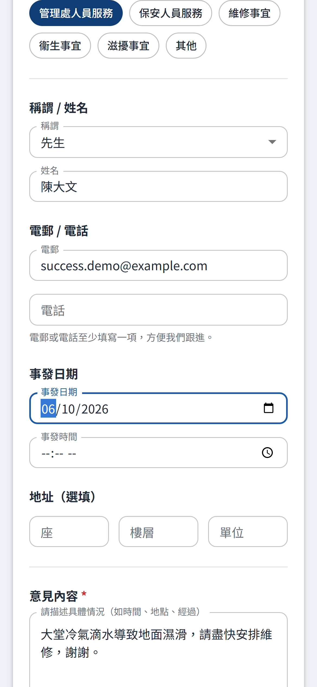
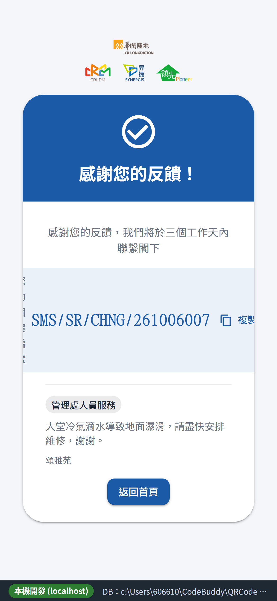
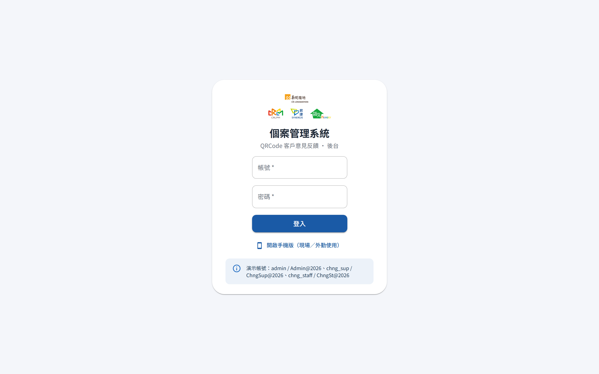
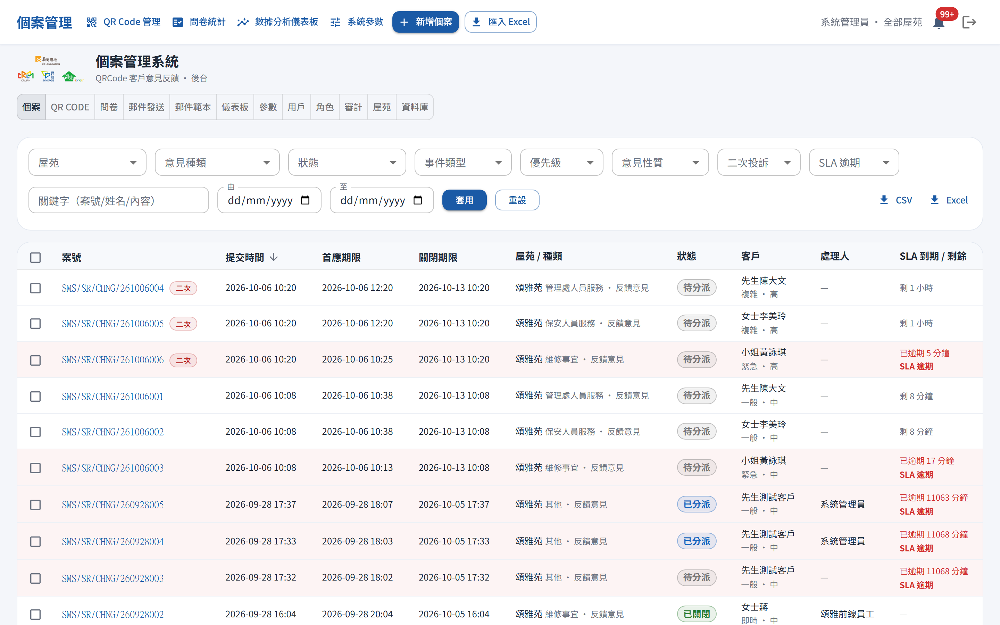
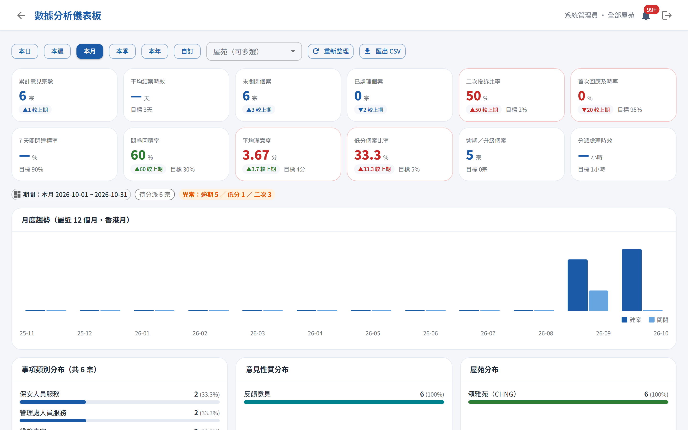
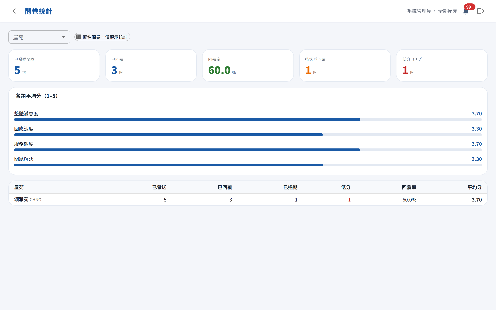

# QRCode 客戶意見反饋系統 — Quick Start 用戶手冊（快速入門）

| 項目 | 內容 |
|---|---|
| 系統名稱 | QRCode 客戶意見反饋系統（後台頂列顯示：個案管理系統） |
| 適用環境 | 測試環境（本機開發；正式環境網址由管理處另行公布） |
| 文件版本 | 1.0 |
| 更新日期 | 2026-10-06 |
| 相關文件 | 完整版《用戶手冊》、`docs/部署說明_測試環境.md` |

> 這是一份**最短路徑**入門：幫你在 5 分鐘內開始使用本系統。需要細節、欄位說明、FAQ 與進階管理（用戶／角色／審計／參數／資料庫），請參閱完整版《用戶手冊》。

---

## 0. 一句話認識系統

住戶**掃 QR Code** 用手機填寫意見 → 系統自動開**個案** → 管理處／客服在**後台**跟進到關閉 → 關閉後對同意者寄**匿名滿意度問卷** → 統計供持續改善。

系統分兩端：

| 端 | 使用者 | 網址（測試環境） | 說明 |
|---|---|---|---|
| 公用端 | 住戶／公眾 | `http://localhost:5173` | 意見表單、提交成功頁、滿意度問卷（無需登入） |
| 後台 | 管理處及客服人員 | `http://localhost:5173/admin/login` | 個案、QR Code、問卷統計、儀表板、系統管理（需登入） |

---

## A. 我是住戶：30 秒提交一宗意見

1. 用手機**相機／掃描器**掃描屋苑張貼的 QR Code。
2. 自動開啟該屋苑的「客戶意見反饋」表單，填寫：
   - **稱謂、姓名**（選填其一即可聯絡）、**電郵或電話**（至少一項）
   - **發生日期**、**類別**（點選標籤，如保安／維修／清潔）、**意見內容**
   - 如需管理處回覆，勾選「**願意接受後續滿意度調查**」
   - 勾選**私隱政策**同意（必填）後按「**提交意見**」
3. 成功頁會顯示你的**個案編號**（格式：`公司/SR/屋苑/日期+流水號`，如 `SMS/SR/CHNG/261006001`）。**請記下此編號**作為日後查詢依據。

> 小貼士：同一 QR Code 短時間重複提交會被擋（避免重複個案）；若頁面顯示「已過期」，請向管理處索取最新 QR Code。

---

## B. 我是管理處／客服：登入後台並開始處理

### B.1 登入（測試環境演示帳號）

1. 開啟 `http://localhost:5173/admin/login`
2. 輸入帳號與密碼，按「**登入**」。
3. 成功後自動進入「個案」列表。

| 帳號 | 密碼 | 角色 | 數據範圍 |
|---|---|---|---|
| `admin` | `Admin@2026` | 系統管理員 | 全屋苑 |
| `cc_sup` | `CcSup@2026` | 客服中心主管 | 全屋苑 |
| `chng_sup` | `ChngSup@2026` | 物業管理處主管 | 頌雅苑 |
| `chng_staff` | `ChngSt@2026` | 物業前線人員 | 頌雅苑 |

> 完整帳號（含各屋苑主管）見完整手冊 §2.3。正式環境請由管理員為每人建立獨立帳號，勿沿用測試密碼。

### B.2 後台每天都在做的事（三大區塊）

| 功能（頂部切換列） | 你會在這裡做什麼 |
|---|---|
| **個案** | 看見住戶提交的新個案、分派、跟進、關閉 |
| **QR Code** | 為各屋苑生成／下載／停用 QR Code，設定有效日期 |
| **問卷** | 看滿意度問卷統計（KPI、各題平均分、各屋苑比較） |
| **儀表板** | 看 12 項 KPI 與圖表，掌握整體服務表現 |
| 參數／用戶／角色／審計／屋苑／資料庫 | 系統管理（詳見完整手冊第 10 章） |

### B.3 處理一宗個案的最短路徑

1. 進入「**個案**」→ 點一宗（建議先看標紅的**逾期／接近期限**個案）。
2. 按「**開始處理**」→ 狀態由「待處理」變「處理中」。
3. 在時間軸**填寫跟進紀錄**（可上傳附件），必要時**分派**給所屬前線人員。
4. 處理完成後按「**申請完結**」→ 狀態變「待審核」。
5. 主管進入該個案按「**審核通過**」→ 個案「**已關閉**」。

> SLA 提醒：個案接近或超過處理期限時，頂列**鈴鐺**會收到橙色提醒／紅色升級通知；點通知可直接跳到該個案。

### B.4 快速生成一組 QR Code（給新屋苑／補張貼）

1. 進入「**QR Code**」→ 選屋苑 → 設定表單網址（首次由 ADMIN 設定）與**有效日期**（留空＝永久有效）。
2. 按「**生成**」→ 下載 PNG／SVG，列印張貼即可。
3. 舊碼可隨時「**停用**」；到期碼會自動失效。

### B.5 看滿意度問卷結果

進入「**問卷**」即可看：已發送／已回覆／已過期數、回覆率、各題平均分（整體／回應速度／服務態度／解決程度），以及各屋苑比較。**統計匿名，看不到個別住戶回覆。**

### B.6 用手機操作後台（選用）

後台支援 **PWA**：用手機瀏覽器開啟後台網址 →「分享 → 加入主畫面」，即可像 App 般全螢幕使用（需 HTTPS 或 localhost 才會出現安裝提示）。離線時介面可開，但**資料操作需連網**。

---

## C. 卡關了？速查

| 狀況 | 先看這裡（完整手冊） |
|---|---|
| 掃 QR 沒反應／開不到表單 | FAQ 11.1 |
| QR 顯示「已過期」 | FAQ 11.2 |
| 提交後沒記下個案編號 | FAQ 11.3 |
| 表單「已過期／重複提交」 | FAQ 11.4 |
| 問卷連結「已過期／已提交／無效」 | FAQ 11.5 |
| 忘記密碼／帳號被鎖 | FAQ 11.6、11.7 |
| 登入後看不到某功能 | FAQ 11.8 |
| 想新增／修改屋苑 | FAQ 11.16、手冊 §10.5 |
| 一次建多宗個案（Excel 匯入） | FAQ 11.17、手冊 §5.8 |

---

## D. 相關文件

- 《用戶手冊》（完整版，含所有欄位說明、權限對照、FAQ 與系統管理）
- `docs/部署說明_測試環境.md`（安裝與啟動）
- `docs/F001~F010_細部設計`（功能細節設計）
